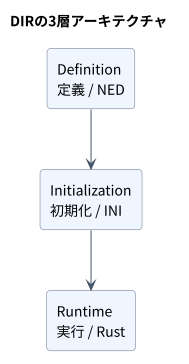

# DIR Simulator

文書バージョン：`0.1.1`
対象GitHubバージョン：`v0.1`

### 更新履歴

| 文書バージョン | 更新日 | 更新内容 |
| --- | --- | --- |
| `0.1.1` | `2026-10-03` | Classical CANのCLI・ライブラリ、結果ビューア、実行例、OMNeT++比較の利用方法を集約し、v0.1公開版を確定 |

文書ID：`readme`

公開タグは`v0.1`、Cargoパッケージ版は`0.1.0`、文書版は`0.1.1`です。

**DIR = Definition（定義）、Initialization（初期化）、Runtime（実行）**

DIR Simulatorは、CAN／CAN FD・Ethernet・SoC通信・メモリ・IPCと接続デバイスを対象としたRust製の離散イベント型シミュレータです。
次の3層モデルを採用しています。

1. **Definition（定義）** — NEDの構造記述の一部に対応
2. **Initialization（初期化）** — 必要最小限の独自INI仕様によるシナリオ設定とパラメータの上書き
3. **Runtime（実行）** — Rustネイティブのシミュレーションモジュールと実行エンジン

## 目標

CANノードと共有バスの通信を仮想時刻上で実行し、負荷・ビットレート・容量の違いによる遅延、競合、バッファ使用量と性能を比較します。
構造をNED、実験条件をINI、振る舞いをRustで記述し、時系列・集計値をCSVとJSONで取得できます。

基準モデルはClassical CANです。追加モデルとして、GWで接続する独立CANバス、AXIのManager・Interconnect・Ram、EthernetのEndpoint・Link・Switchを要件から詳細設計・検証まで規定しました。0.1.0は単一CAN、次のメジャー1.0.0はGW・複数バス、AXI・Ethernetは1.0.0以後の追加計画です。各profileの初期機能を固定し、追加機能は版付き登録契約で拡張します。
初期モデルは標準11bit・拡張29bitのClassical CANデータフレームを扱う`can.cc.ideal.v1`です。内容からCRC・stuff bitを求め、理想ACKを扱います。詳細は[CANモデル仕様](docs/specs/models/CANモデル詳細機能仕様書.md)、判断履歴は[解決済みTBD台帳](docs/要件定義書.md#6-未確定事項不足の管理)に記載しています。

## v0.1を実行する

Linux / WSLでRust 1.85.0を使用します。`rust-toolchain.toml`でツールチェーン、`Cargo.lock`で依存版を固定しています。Rust導入済みのシェルで、リポジトリのルートから実行してください。

```bash
cargo build --locked --release -p dir-simulator
./target/release/dir-simulator validate --config examples/can/baseline.ini
./target/release/dir-simulator run --config examples/can/baseline.ini --output results
```

`results`は新規または空のディレクトリを指定します。親ディレクトリは事前に作成してください。再実行時は別名を指定します。インストールする場合は`cargo install --locked --path crates/dir-simulator`を使用できます。

| サンプル | 条件 | 確認する動作 |
| --- | --- | --- |
| [baseline.ini](examples/can/baseline.ini) | 3ノード、500kbps、1ms周期、容量64 | 同時生成の仲裁と、待機解消後のアイドル |
| [contention.ini](examples/can/contention.ini) | 200us周期、容量64 | 高負荷による送信待ちとキュー増加 |
| [overload.ini](examples/can/overload.ini) | 50us周期、容量2 | キュー満杯時の新着要求破棄 |

同じNED構成を使用し、INIでビットレート・キュー容量・処理遅延、対応するJSONでID・データ・送信周期を変更できます。拡張29bitフレームはJSONの`format`に`extended`を指定します。INI/JSONの未知キーや、不正な型・単位・接続・ID所有者重複は実行前に拒否します。

出力は`manifest.json`、`results.json`、`events.csv`、`summary.csv`、`diagnostics.jsonl`です。manifestは最後に公開し、各データファイルのSHA-256を保持します。JSONの`simulation.requests`で要求ごとの状態・SOF/EOF、`receivers`で受信時刻、`records`と`summary`で37種類の指標の観測・集計を確認できます。時刻の単位はps、整数値は精度保持のため十進文字列です。

```bash
python3 - <<'PYRESULT'
import json
from pathlib import Path
result = json.loads(Path("results/results.json").read_text())
for row in result["simulation"]["summary"]:
    if row["target"] in ("$all", "Main.bus") and row["metric"] in (
        "generated", "success", "dropped", "unfinished", "received",
        "bus_utilization", "arbitration_wait_mean_ps",
    ):
        print(row["target"], row["metric"], row["value"])
PYRESULT
```

CLIの終了コードは正常0、入力・準備失敗2、実行失敗3、出力失敗4です。正常終了の`time_limit`でも未完了要求はあり得ます。`max-events`等による実行失敗時には、最後に確定した要求・受信状態を`partial=true`で出力します。準備失敗時は診断をstderrへ返し、結果ファイルは作成しません。

ライブラリは`dir_simulator::prepare(&Path)`と`dir_simulator::run(prepared, &Path)`から同じ処理を利用できます。

### 結果ビューア

結果を埋め込んだ単独HTMLを作成し、ブラウザで時系列に沿って確認できます。

```bash
./target/release/dir-simulator view \
  --input results/results.json \
  --output results-viewer.html
```

`results-viewer.html`をブラウザで開いてください。WSLからWindowsの既定ブラウザで開く場合は、次を実行できます。

```bash
explorer.exe "$(wslpath -w "$PWD/results-viewer.html")"
```

サーバー起動や追加パッケージのインストールは不要です。出力HTMLは新規ファイルを指定します。シミュレーションの結果ファイルとmanifestは変更しません。HTMLには元の結果と入力スナップショットも含まれるため、別の環境へ渡す場合も同じ記録を表示できます。

| 操作 | 表示・動作 |
| --- | --- |
| 再生・一時停止／速度変更 | 観測期間を再生。1×では全期間を約8秒で表示 |
| スライダー／時刻指定／前後のイベント時刻 | 任意時刻へ移動。ps単位の時刻を整数精度で保持 |
| ノード・バス構成図 | 送信元、バス、受信先を描画し、パケットの送信・受信進捗をアニメーション表示 |
| タイムライン／拡大・縮小 | ノード別TX/RX、バス占有・間隔、送信待ち、破棄を表示 |
| ノード状態と件数 | 選択時刻までの生成・成功・破棄・受信とキュー数を表示 |
| 要求の選択／検索／状態フィルタ | 生成・SOF・EOF・解放・受信時刻と元レコードを確認 |
| 「結果ファイルを開く」／ドロップ | 別の`results.json`に切り替え |

[ビューア本体](crates/dir-simulator/viewer/index.html)を直接ブラウザで開き、JSONを選択する使い方も可能です。この場合は同じフォルダのCSS/JavaScript一式が必要です。どちらの方法もファイルをブラウザ内で処理し、外部通信は行いません。

同時刻は、その時刻の確定済み記録をすべて反映した状態を表示します。前後ボタンは異なる記録時刻へ移動し、スケジューラ内部の同時刻イベント順を再現するものではありません。状態は到達時刻から復元し、予定EOF・予定解放を完了として扱いません。タイムラインと詳細時刻は実行全体の記録、件数と状態は選択中の時刻に対応します。部分結果には「部分結果」を表示します。

構成図の移動は論理的な送受信進捗を示します。送信はSOFからEOF、受信は観測待ちと受信処理を分けて表示し、物理的な信号の伝搬を再現するものではありません。遅延ゼロの同報受信も見えるよう、確定した送信成功・受信完了・フィルタ拒否には観測期間の1/40の残像を表示します。同じ送信元・受信先の残像は最新のものにまとめます。残像は状態集計に影響せず、一時停止・巻き戻しも再生時刻に従います。構成図の接続は要求・受信記録から復元し、単一バスで通信記録のないノードの接続は推定として区別します。

タイムラインの描画は500区間、要求一覧は1ページ75行を上限とし、省略件数を明示します。多い場合は検索・状態フィルタ・拡大を利用してください。構成図の送受信アニメーションと状態集計はこの描画上限や検索条件に依存せず、全要求を対象とします。対応入力はschema 1の`can.cc.ideal.v1`です。

ビューアの時刻・状態復元テストはNode.jsで実行できます。ブラウザ本体にはNode.jsは不要です。

```bash
node --test tests/viewer_model.test.cjs
```

ブラウザ操作の自動確認は任意で、Playwrightをテスト用に配置して実行できます。

```bash
cargo build --locked -p dir-simulator
npm install --prefix tmp/viewer-tests playwright@1.62.1
./tmp/viewer-tests/node_modules/.bin/playwright install chromium
NODE_PATH="$PWD/tmp/viewer-tests/node_modules" node tests/viewer_browser.cjs
```

### 対応範囲と検証

標準11bit／拡張29bitのClassical CANデータフレーム、CRC-15、内容依存ビットスタッフィング、優先度仲裁、理想ACK、同報、有限キュー、受信フィルタ、固定伝搬・処理遅延、明示列／周期負荷を実装しています。単一バスと2ノード以上が必要です。NEDは宣言・スカラーポート・接続・compound展開の対応サブセットを読み込みます。

この版では、汎用Registry/Envelope拡張API、診断の完全な構造化位置情報、全宣言・値の採用元を含む再現メタデータは未実装です。メタデータの不足は`metadata.implementation_coverage`にも記録します。台帳・観測行・出力はメモリに保持するため、100万要求の性能・メモリ目標は未検証です。CANエラー状態・再送、CAN FD、GW、他プロトコルは将来対象です。

```bash
cargo test --locked
cargo fmt --all -- --check
cargo clippy --locked --all-targets -- -D warnings
```

自動試験は、既存8シナリオ、9ビットベクトル、入力拒否、境界時刻、異常停止の状態保持、集計の保存則、CSV/JSON一致、manifestハッシュ、出力上書き防止を確認します。ソースは[crates/dir-simulator](crates/dir-simulator)、実行例は[examples/can](examples/can)です。

既存OMNeT++ / FiCo4OMNeT環境との比較は[CAN比較ツール](tools/omnet_comparison/README.md)で実行できます。8シナリオ・3負荷例・境界条件・フレーム時間の計43ケースを、同じ生入力から両エンジンへ投入します。FiCoの有限容量などを補うテストアダプターの範囲と、フレーム長・仲裁開始・完了時刻のモデル差を明示して比較します。

[v0.1の比較結果と証跡](docs/verification/OMNeT比較結果.md)には、全86実行の記録と、81件対90件の差を内容依存のstuff bitで説明した独立計算を保存しています。過負荷例の保存結果は[results-overload](results-overload/manifest.json)、baselineの結果をブラウザですぐ確認できる保存ビューアは[viewer.html](viewer.html)です。

## 3層アーキテクチャ



[図のソース](docs/diagrams/readme/readme--definition-initialization-runtime--component.puml)

### Definition（定義）

NEDでシステム構造、モジュール型、ポート / ゲート、接続、デフォルトパラメータを記述します。

### Initialization（初期化）

INIファイルでシミュレーションシナリオを記述し、インスタンスのパラメータを上書きします。

### Runtime（実行）

Rustモジュールで振る舞いを実装します。Module Registry（モジュールレジストリ）が、振る舞いを持つNEDのsimple module型とRust実装を対応付けます。compound moduleは子モジュールと接続に展開します。

ノードは必要なケイパビリティ（送受信、バッファリング、転送、調停など）を組み合わせて構成し、接続可否はポート単位で検証します。実行結果は時系列・集計値として記録し、CSVとJSONで出力します。

## 互換性の方針

| 項目 | 方針・範囲注釈 |
| --- | --- |
| NED | 構造記述の定義済みサブセットを採用 |
| INI | DIR独自設定を定義。注：omnetpp.ini完全互換は対象外 |
| 実行 | Rustネイティブの登録契約を採用。注：OMNeT++ C++ API、.msg、INETバイナリ/API互換は対象外 |
| 出力 | CSV・JSONを採用。注：Parquet、.vec、.scaは初期対象外 |
| 将来の対応付け | INET/NEDとの対応付けは独立した追加仕様で扱う |

NEDの構文対応と、INIによるパラメータの値解決は区別します。DIRではNED型の共通のデフォルト値をINIでインスタンスごとに上書きします。対応構文とOMNeT++との意味上の差分は要件定義で管理します。

DIRは、OMNeT++の実装コードを移植するのではなく、公開ドキュメントに記載された言語の振る舞いに基づいて独立して実装する方針です。

## ドキュメント

- [要件定義書](docs/要件定義書.md)：固定ID付き要件、受け入れ条件、未確定事項
- [要件階層（別紙HTML）](docs/要件階層.html)：全有効要件の主親・階層上の位置・分解状態（自動生成）
- [機能仕様書](docs/機能仕様書.md)：固定機能ID、入出力、正常時・境界・異常時の振る舞い、全要件から機能への対応と充足確認
- [要件トレーサビリティ一覧](docs/要件トレーサビリティ一覧.md)：要件ごとの経路を1セル1IDで横に並べた対応表と未接続項目（自動生成）。[背景色付きHTML版](docs/要件トレーサビリティ一覧.html)はローカルのブラウザで開けます。
- [アーキテクチャ設計書](docs/アーキテクチャ設計書.md)：責務分担、内部モデル、API案
- [トレーサビリティ管理規約](docs/トレーサビリティ管理規約.md)：6工程の対応記録、全経路検査、変更影響の逆引き
- [ドキュメント作成・運用規約](docs/ドキュメント作成・運用規約.md)：文書体系、要件分解・詳細化・検証の運用、記述テンプレート、文書と図の命名・配置


| 詳細仕様・方針 | 内容 |
| --- | --- |
| [NED詳細機能仕様書](docs/specs/NED詳細機能仕様書.md) | 構造・型・接続 |
| [設定詳細機能仕様書](docs/specs/設定詳細機能仕様書.md) | INI・値・単位 |
| [実行詳細機能仕様書](docs/specs/実行詳細機能仕様書.md) | 時刻・順序・終了 |
| [資源詳細機能仕様書](docs/specs/資源詳細機能仕様書.md) | 容量・占有・遅延 |
| [結果詳細機能仕様書](docs/specs/結果詳細機能仕様書.md) | 計測・集計・出力 |
| [診断詳細機能仕様書](docs/specs/診断詳細機能仕様書.md) | 失敗分類・部分結果 |
| [インタフェース詳細機能仕様書](docs/specs/インタフェース詳細機能仕様書.md) | CLI・登録・拡張 |
| [CANモデル詳細機能仕様書](docs/specs/models/CANモデル詳細機能仕様書.md) | 仲裁・CRC・負荷 |
| [品質・配布方針](docs/品質・配布方針.md) | 性能・精度・出自管理 |
| [将来拡張計画](docs/将来拡張計画.md) | v1.0.0のGW・複数バスと他プロトコルへの境界 |

16分野の詳細機能仕様、入力・結果処理を含む12詳細設計と利用フロー・品質を含む13検証仕様、各モデルの入力fixture・独立期待値を作成しました。Classical CANの動作確認用実装と自動試験を追加しました。他モデルの製品実装・実行試験、および仕様全体への対応は今後の作業です。文書の正式名とファイル名をそろえ、自動生成レポートを除く各プロジェクト文書の冒頭に更新履歴を記載し、内容差分はGitで管理します。文書バージョンと更新履歴は、[push時の運用](docs/ドキュメント作成・運用規約.md#document-version-at-push)に従い、前回push以降の変更を文書ごとに一改訂へまとめ、push準備時に一度更新してコミットします。

図の編集元（`.puml`）と表示用SVGは `docs/diagrams/<文書ID>/` に保存しています。ローカルのPlantUMLで全図を更新・確認できます。

```bash
python3 scripts/render_diagrams.py
python3 scripts/render_diagrams.py --check
```

要件から検証までの対応は次で点検できます。通常検査は未完了を報告し、`--strict` は経路に不足があれば失敗します。v0.1では全193要件を検証仕様まで接続し、構造エラー・未完了項目は0件です。これは文書の追跡経路の検査であり、全要件の製品実装・試験合格を意味しません。

```bash
python3 scripts/check_traceability.py
python3 scripts/check_traceability.py --strict
python3 scripts/check_traceability.py --impact DIR-FUNC-0008
```

トレーサビリティ一覧のMarkdown版・HTML版と要件階層の別紙HTMLは `python3 scripts/generate_traceability.py` で同時に更新できます。階層の編集元は `docs/要件階層.json` です。`--check` で3ファイルの鮮度と階層データの整合性を確認できます。HTML版は薄い背景色で工程と未割当を区別します。Markdown表示側が装飾を除去する場合も、ブラウザでHTML版を開けば背景色を確認できます。コミット時に3ファイルを自動更新する場合は、初回のみ `git config core.hooksPath .githooks` を実行します。

## 開発状況

0.1.0（CAN動作確認版）のRust CLI・ライブラリを実装しました。既存の解析期待値によるCAN 8シナリオと9ビットベクトルを製品コードに対して照合しています。仕様全体への適合完了や、実機CANとの適合認証を示すものではありません。
CANの再現範囲、NED/INIの詳細、時間と終了条件、バッファ・調停、計測定義、実行環境を詳細仕様に規定しました。要件193件、機能48件、受け入れ条件52件、TBD台帳15件（全件解決済み）を表形式で管理しています。番号付きIDは`DIR-REQ-0001`のように4桁です。

## ライセンス

DIR Simulatorのプロジェクト作成物は、別途ライセンス表示がある場合を除き、MIT LicenseまたはApache License 2.0のいずれか（利用者が選択）で利用できます。対象にはソースコード、文書、テンプレート、PlantUMLソース、生成図を含みます。ライセンス本文は [`LICENSE-MIT`](LICENSE-MIT) と [`LICENSE-APACHE`](LICENSE-APACHE)、適用範囲は [`LICENSE`](LICENSE) を参照してください。

第三者の素材・依存関係はこの許諾の対象外で、それぞれのライセンス条件に従います。配布条件と出自の確認方法は[品質・配布方針](docs/品質・配布方針.md)に規定しています。

## CAN実装の入口

| 資料 | 内容 |
| --- | --- |
| [CAN詳細機能仕様](docs/specs/models/CANモデル詳細機能仕様書.md) | 入出力・bit計算・時刻・仲裁・状態の外部契約 |
| [CAN詳細設計](docs/design/CANモデル詳細設計書.md) | BusContext、codec、シリアライズ、状態遷移と処理手順 |
| [共通実行詳細設計](docs/design/実行詳細設計書.md) | ヒープ・dirty集合・EffectBatch・確定journal・登録 |
| [CAN検証仕様](docs/verification/cases/CANモデル検証仕様書.md) | 6ケース、NED/INI/workload、bitvectorとシナリオ期待値 |
| [共通実行検証仕様](docs/verification/cases/共通実行検証仕様書.md) | 4ケース、時刻・順序・失敗・拡張 |

仕様に同梱したCAN bitvectorの照合は次で実行できます。これは期待値の確認であり、製品シミュレータの動作試験とは区別します。

```bash
python3 docs/verification/fixtures/can/verify_vectors.py
```

## 追加モデル実装の入口

| モデル | 機能仕様 | 詳細設計 | 検証仕様 |
| --- | --- | --- | --- |
| GW | [仕様](docs/specs/models/GWモデル詳細機能仕様書.md) | [設計](docs/design/GWモデル詳細設計書.md) | [検証](docs/verification/cases/GWモデル検証仕様書.md) |
| AXI | [仕様](docs/specs/models/AXIモデル詳細機能仕様書.md) | [設計](docs/design/AXIモデル詳細設計書.md) | [検証](docs/verification/cases/AXIモデル検証仕様書.md) |
| Ethernet | [仕様](docs/specs/models/Ethernetモデル詳細機能仕様書.md) | [設計](docs/design/Ethernetモデル詳細設計書.md) | [検証](docs/verification/cases/Ethernetモデル検証仕様書.md) |
| profile統合 | [仕様](docs/specs/拡張モデル共通詳細機能仕様書.md) | [設計](docs/design/複数モデル統合詳細設計書.md) | [検証](docs/verification/cases/拡張モデル統合検証仕様書.md) |

| Ethernet媒体 | 追加した評価範囲 |
| --- | --- |
| 10/100Mbps半二重 | CSMA/CDのcarrier sense、衝突、jam、backoff、再試行上限、送信待ちを評価 |
| 1000BASE-T1 | 全二重1Gbps、MASTER/SLAVEの構成、両端PHY固定遅延を評価。注：半二重はT1の動作モードには含まれない |
| v1互換 | 既存Ethernetの全二重profileを維持し、媒体別設定はethernet.l2.store-forward.v2で選択 |
| 実装資料 | [媒体詳細仕様](docs/specs/models/Ethernet媒体拡張詳細機能仕様書.md)、[詳細設計](docs/design/Ethernet媒体拡張詳細設計書.md)、[検証仕様](docs/verification/cases/Ethernet媒体拡張検証仕様書.md) |

## 当初対象の網羅

当初の15対象と追加した10BASE-T・1000BASE-T1は、0.1.0のClassical CANと[将来対応予定の16対象](docs/要件定義書.md#original-target-coverage)に分けて管理し、将来対応予定表で有効要件へ対応付けています。対象範囲と段階的な実装順序を分け、CAN FD・100BASE-T1・SoC／AHB／NoC・DDR／SRAM・共有メモリIPC／DMA／メールボックスIPCも要件から検証ケースまで規定します。

| 対象 | 仕様 | 設計 | 検証 |
| --- | --- | --- | --- |
| CAN FD・100BASE-T1 | [詳細仕様](docs/specs/models/CANFD・100BASE-T1詳細機能仕様書.md) | [詳細設計](docs/design/CANFD・100BASE-T1詳細設計書.md) | [検証仕様](docs/verification/cases/CANFD・100BASE-T1検証仕様書.md) |
| SoC・AHB・NoC | [詳細仕様](docs/specs/models/SoC・AHB・NoC詳細機能仕様書.md) | [詳細設計](docs/design/SoC・AHB・NoC詳細設計書.md) | [検証仕様](docs/verification/cases/SoC・AHB・NoC検証仕様書.md) |
| DDR・SRAM・共有メモリIPC・DMA・メールボックスIPC | [詳細仕様](docs/specs/models/メモリ・IPC詳細機能仕様書.md) | [詳細設計](docs/design/メモリ・IPC詳細設計書.md) | [検証仕様](docs/verification/cases/メモリ・IPC検証仕様書.md) |

CAN FDの初期profileは、証跡付きの位相別bit数を入力する時間評価モデルです。Classical CANの内容依存CRC・stuffing計算とは再現範囲を分けて記録します。全追加モデルの製品実装・実行試験は未実施です。
