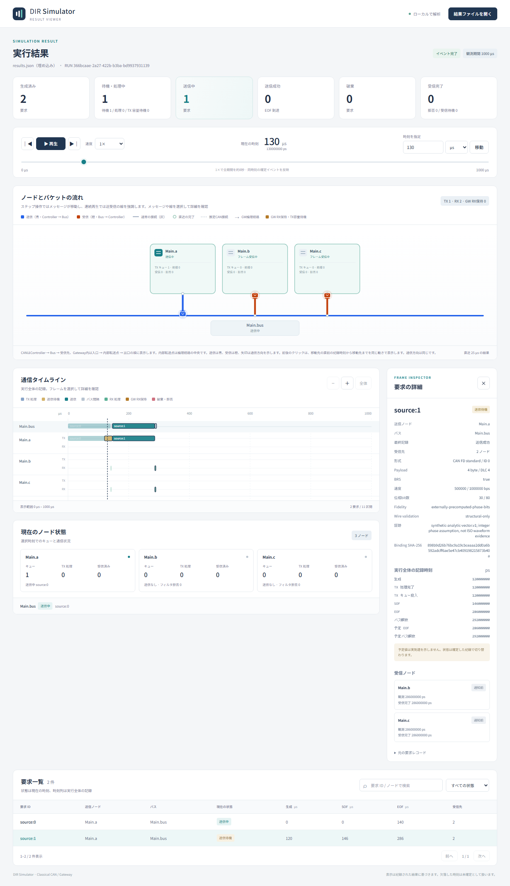
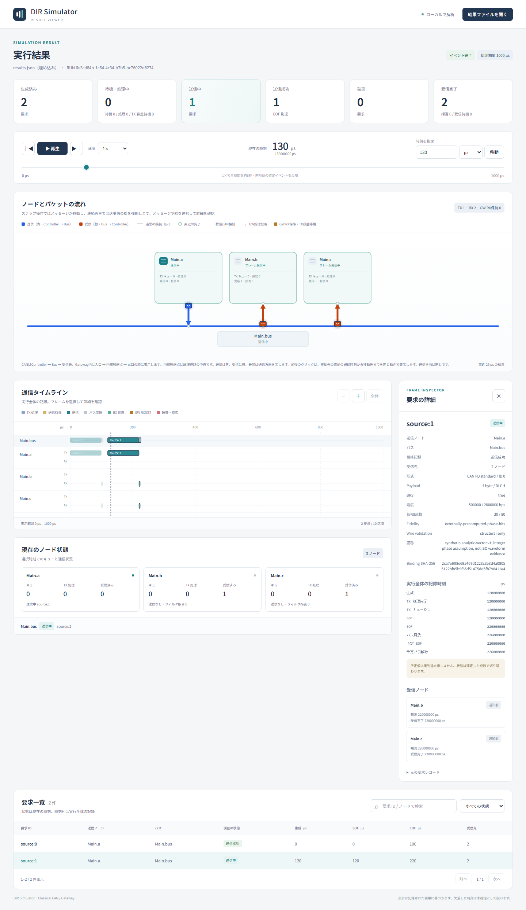

# CAN FDのデータ速度比較

文書バージョン：`1.1.1`  
対象GitHubバージョン：`v1.1.3`  
文書ID：`guide-canfd-data-rate`  
文書状態：公開用完成稿。mainへのマージ後にGitHub Pagesへ反映

### 更新履歴

| 文書バージョン | 更新日 | 更新内容 |
| --- | --- | --- |
| `1.1.1` | `2026-10-07` | 入門と同じビルド先からの実行、出力親フォルダ作成、ZIP単独展開時の絶対バイナリパス・作業フォルダを明記 |
| `1.1.0` | `2026-10-07` | 初版：CAN FDの事前計算位相bit数を固定し、データ速度3条件と送信待ち時間を比較 |

## 目的：データ速度を上げると待ち時間はどう変わるか

センサが同じバスへ続けてデータを送るとき、1フレームの時間を短くすれば、次の要求の待ちも減るでしょうか。今回は同じ4 byteフレームを0 µsと120 µsに生成し、データフェーズ速度だけを1/2/4 Mbpsへ変えます。仲裁側の速度は500 kbpsのままです。

この実習は`can.fd.precomputed.v1`です。位相別bit数を外から与える時間モデルで、任意のCAN FDフレームのCRCやstuffing、ISO準拠波形を自動生成するものではありません。使う30/80 bitは解析用のsynthetic値です。実機の送信時間を予測するには、別途信頼できる計算・計測でbit数を求め、その根拠を検証する必要があります。

## 構成と責務：何が固定で何を変えるか

| 要素 | この実習の責務・接続 |
| --- | --- |
| Main.a | 0/120 µsに同じID0の要求を生成。送信待機キュー容量64、送信処理遅延0 |
| Main.bus | FD専用の単一バス。位相別bit数と二速度からEOF・バス解放を計算 |
| Main.b / Main.c | 同報先。送信元aは自分のフレームを受信しない。全受入、受信処理遅延0 |
| Wire | Controllerのtx→Bus入力、Bus出力→同じControllerのrxを対で接続。伝搬遅延0 |
| NED / INI / JSON | NEDは型・接続、INIは実行と速度、model.jsonはprofile照合、workloadは生成時刻・フレーム・bit数 |

依存する登録型は`dir.canfd.ControllerV1`、`dir.canfd.BusV1`、`dir.link.FixedDelay`です。Classical CANのBusへ混在させる実習ではありません。全端常時activeでideal ACKが成立するモデルです。

使用の流れは「要求生成 → ready → 送信待機 → SOF → EOFで送信完了・受信到達 → バス解放 → 次要求のSOF」です。バス解放はEOFの後、nominal側3 bit分を含みます。キュー容量はreadyになった送信待機件数を数え、送信中を含めません。

## 手順：同じフレームで3条件を実行する

DIR CLIの導入は[初めてのCAN実行](初めてのCAN実行.md)を参照してください。以下はLinux/macOSまたはWindowsのWSLで使うBashコマンドです。PATHへの登録は不要です。

### リポジトリから実行する

入門で取得した`DIR-Simulator`のリポジトリルートへ移動します。[FD実習入力ZIP](downloads/canfd-guide-inputs.zip)をそのルートに展開すると、`examples/guide/canfd`に8入力ができます。このガイドを同梱したmainでは入力が既にあるため、展開は不要です。同名入力がある場所へZIPを重ねず、別の作業コピーを使ってください。

```bash
cargo build --locked -p dir-simulator
mkdir -p output
./target/debug/dir-simulator validate --config examples/guide/canfd/data1.ini
./target/debug/dir-simulator run --config examples/guide/canfd/data1.ini --output output/fd-data1
./target/debug/dir-simulator view --input output/fd-data1/results.json --output output/fd-data1-viewer.html
```

続けて`data1`を`data2`、`data4`に置き換え、出力名もそれぞれ変えて実行します。既存出力への上書きは拒否されるので、再実行時は新しい出力名を使います。Viewer HTMLはブラウザで直接開けます。

### ZIPを別フォルダへ展開して実行する

ZIPにCLI本体は含まれません。まず上記のリポジトリでビルドを完了し、`target/debug/dir-simulator`の絶対パスを確認します。その後ZIPを空の実習フォルダへ展開します。次の2行は自分の絶対パスへ置き換えてください。`cd`先は`examples`フォルダが直下にある展開先の最上位です。WSLではWSLから見えるLinux形式のパスを使います。

```bash
DIR_CLI="/absolute/path/to/DIR-Simulator/target/debug/dir-simulator"
cd "/absolute/path/to/fd-practice"
mkdir -p output
"$DIR_CLI" validate --config examples/guide/canfd/data1.ini
"$DIR_CLI" run --config examples/guide/canfd/data1.ini --output output/fd-data1
"$DIR_CLI" view --input output/fd-data1/results.json --output output/fd-data1-viewer.html
```

こちらも`data2`・`data4`へ置き換えて比較します。バイナリの位置は固定し、入力と出力は実習フォルダから指定します。NED/model/workloadの相対パスはINIの親フォルダを基準に解決されます。

3条件の共通設定は次のとおりです。

```ini
network = fd.Main
ned-path = "models"
model-profile = "can.fd.precomputed.v1"
model-config = "model.json"
sim-time-limit = 1ms
Main.bus.nominalBitrate = 500kbps
```

実験変数は`Main.bus.dataBitrate = 1Mbps / 2Mbps / 4Mbps`だけです。workloadの生成時刻、format、ID、data、BRS=true、nominal_bits=30、data_bits=80、根拠文字列は同一です。速度を含む`binding_sha256`の再計算と、対応workloadファイルへの参照だけが派生して変わります。

bindingは正規化した`format|id|data|brs(0/1)|N|D|Rn|Rd`のUTF-8 SHA-256です。速度だけをINIで編集して古いbindingを残すとvalidateが拒否します。今回のZIPは各速度に対応するworkloadを用意済みです。ハッシュの一致は入力の結び付きを確認するもので、bit数の物理的正しさを認定しません。

## 実測：フレーム時間と次要求の待ちを分けて読む

単位はµsです。両要求のgenerated/readyは常に0と120です。

| データ速度 | 1件目EOF | 解放 | 2件目SOF | 待ち | 2件目EOF |
| --- | --- | --- | --- | --- | --- |
| 1 Mbps | 140 | 146 | 146 | 26 | 286 |
| 2 Mbps | 100 | 106 | 120 | 0 | 220 |
| 4 Mbps | 80 | 86 | 120 | 0 | 200 |

全条件で生成2・送信完了2・破棄0・受信完了4です。b/cが各2件受信するため、受信数は送信数の2倍になります。EOF時点で各受信が到達・完了し、今回の遅延0条件では同じ時刻です。

時間の理由は、nominal側が30 bit ÷ 500 kbps = 60 µs、data側が80 bit ÷ Rdだからです。フレーム時間は140/100/80 µs、解放はさらに3 bit ÷ 500 kbps = 6 µs後です。実装は二つの位相の和に一度だけ切上げを適用します。

1 Mbpsでは2件目が120 µsにreadyになっても、最初の解放146 µsまで26 µs待ちます。2/4 Mbpsではその前にバスが解放済みなので、2件目は生成時刻120 µsに開始します。データ速度を倍にしてもフレーム全体が半分にはならず、nominal側60 µsと解放間隔は残ります。

### 実画面：同じ130 µsで比較する

Viewerの時刻を130 µsへ移動し、一覧の`source:1`を選びます。1 Mbpsでは送信待機、2 Mbpsでは送信中です。時刻列と詳細のSOF/EOFは実行全体の記録なので、カーソル時刻より先の確定結果も表示します。現在状態と混同しないでください。

[](assets/guide-canfd-data1.png)

[](assets/guide-canfd-data2.png)

画像を開くと大きく確認できます。Viewerの共通画面にはClassical CAN / Gatewayというラベルが残っていますが、入力結果のprofileはCAN FDです。この画面でFD位相別波形やCRCを検証することはできません。

## 制約と関連する実験

- 比較したのは合成位相長を固定したデータ速度の影響です。ペイロード変更では必要bit数・binding・外部根拠も変わるため、この表をそのまま適用できません。
- 速度の受理範囲はnominal 1〜1,000,000整数bps、dataはnominal以上〜8,000,000整数bpsです。実機や配線の対応速度を保証しません。
- BRS=falseはdata_bits=0でnominal側へ含める別条件です。今回のBRS=true比較とは分けます。
- エラーフレーム、再送、bus-off、FD/CC混在、完全なISO bitstream・物理層適合はこの実習の対象外です。
- 終了は[0,1 ms)です。今回の要求は終了前に解放・受信完了しています。終了時刻の予定イベントは実行されません。

[CANの調停](CANの調停.md)はIDによる送信順、[CANの受信フィルタ](CANの受信フィルタ.md)はECU別受入、[CAN受信処理遅延の比較](CAN受信処理遅延の比較.md)は観測後の完了時間を扱います。速度・選別・受信処理を一度に変えず、それぞれ一つずつ比較してください。
