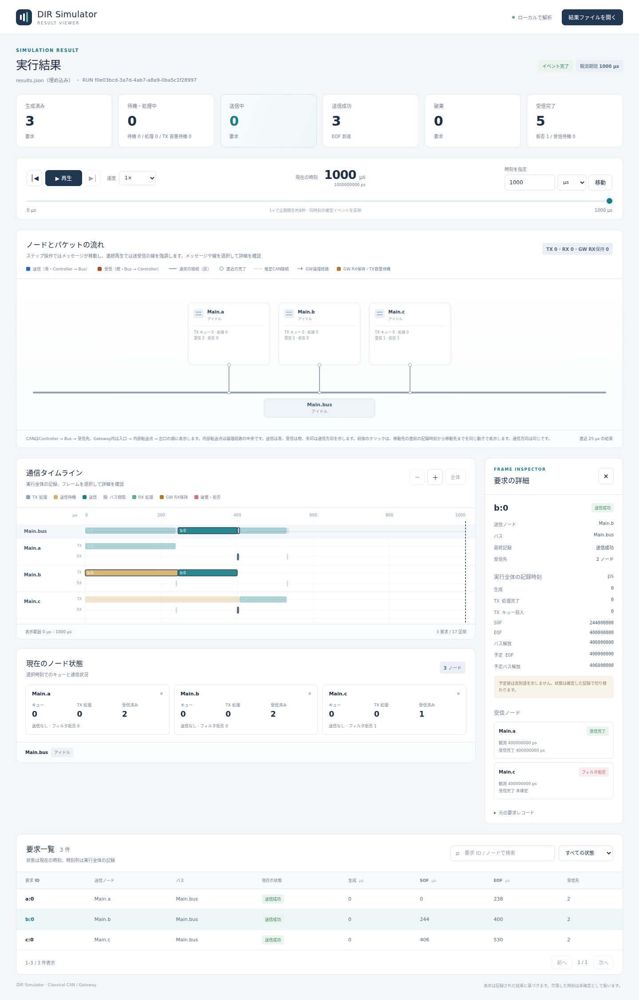

# CANの受信フィルタ

文書バージョン：`1.1.0`  
対象GitHubバージョン：`v1.1.3`  
文書ID：`guide-can-receive-filter`  
文書状態：公開用完成稿。mainへのマージ後にGitHub Pagesへ反映

### 更新履歴

| 文書バージョン | 更新日 | 更新内容 |
| --- | --- | --- |
| `1.1.0` | `2026-10-06` | 初版：ECU別の受信選択、送信成功との区別、1設定3条件の実測例を追加 |

## 目的：必要なセンサデータだけを受け取る

同じCANバスに温度センサa、状態通知b、表示ECU cがあると考えます。表示ECUが温度のIDだけを扱いたいとき、`rxFilter`を変えると、バス上で送信されたフレームをECU別に受け入れるか判定できます。

この実習では「送信は成功したのに、cでは受信が増えない」を再現します。通信失敗や送信キューの破棄と、アプリケーション側の選別を区別することが目的です。a・b・cの名称を用途に見立てていますが、サンプル自体は3つの汎用Controllerです。最初に[初めてのCAN実行](初めてのCAN実行.md)を実行してください。サイト内検索では短い語「フィルタ」でこのページを探せます。複合語で見つからない場合は語を短くするか、機能辞典と実験の目次を使ってください。

## 構成と責務

| 要素 | この実習での責務 |
| --- | --- |
| `Main.a` | standard ID 256（16進表記0x100）、8byteのデータを1回送信 |
| `Main.b` | standard ID 512（0x200）、4byteのデータを1回送信 |
| `Main.c` | 他ECUからの受信を選択。同時にID 768（0x300）、2byteを1回送信 |
| `Main.bus` | 500kbpsのClassical CAN。同じ実習の調停・直列化を処理 |
| `rxFilter` | Controllerごとに、フレームの形式とIDを受信時に照合 |

NEDの接続は既存実習と同じです。各Controllerの`tx`はBusへ、Busの対応する出力はそのControllerの`rx`へ接続します。Wireの遅延、TX/RX処理遅延はいずれも0psのままです。送信者自身への受信行は作られません。

## 接続と処理フロー

1. JSONの3要求を生成し、a・b・cの送信キューから調停します。
2. EOFで送信要求は`success`になります。送信者以外のControllerに受信側の記録を作ります。
3. 各受信経路の伝搬遅延を経て、`observed_ps`を記録します。
4. その受信者の`rxFilter`と形式・IDが一致すれば、RX処理遅延後に`received`となり`received_ps`を記録します。
5. 一致しなければ`filtered`となります。観測時刻は残り、受信完了時刻は`null`です。

フィルタは、このモデルの送信者側の調停順・EOF・バス解放時刻を変えません。拒否した受信があることだけで、送信要求を`dropped`にする処理ではありません。

## 最小実行例と設定

リポジトリのルートで実行します。[実習入力ZIP](downloads/can-guide-inputs.zip)にも、このページのINI2件と既存のNED・JSONを含めています。導入とバイナリの用意は[入門の手順](初めてのCAN実行.md)を参照してください。古いZIPを導入済みなら、追加の`filter-id.ini`・`filter-none.ini`を含む最新版を別の作業場所へ展開します。

```bash
cargo run -- validate --config examples/guide/can/filter-id.ini
cargo run -- run --config examples/guide/can/filter-id.ini --output results-guide-filter-id
cargo run -- view --input results-guide-filter-id/results.json --output guide-filter-id-viewer.html
```

`guide-filter-id-viewer.html`をブラウザで開きます。出力済みの同名ディレクトリ・HTMLは上書きされないため、再実行には新しい名前を使ってください。

`filter-id.ini`は`minimal.ini`に次の1設定を追加したものです。NED、JSON、時間、bitrate、送信キュー容量は同じです。

```ini
Main.c.rxFilter = "std:0x100"
```

| 書き方 | 意味 |
| --- | --- |
| `"*"` | 全形式・全IDを受け入れる。サンプルのNED既定値 |
| `"none"` | アプリケーション受信を全て拒否 |
| `"std:0x100"` | standard ID 256だけを受け入れる |
| `"std:0x100,std:0x200"` | standard ID 256または512を受け入れる |
| `"ext:0x100"` | extended ID 256だけを受け入れる。standard ID 256とは別 |

`std`のID範囲は0〜0x7ff、`ext`は0〜0x1fffffffです。カンマ区切りで同じ形式・IDを重複できません。空白を含む式、10進表記の`std:256`、マスクや範囲指定はこの構文に含まれません。入力ミスは`validate`で確認します。JSONの`id: 256`とフィルタの`0x100`は同じ数値です。

## 結果と実画面：bの送信成功とcの選別

Viewerで時刻を`1000µs`へ移動し、要求`b:0`を選択します。画面の要求状態は「送信成功」、受信者`Main.c`は「フィルタ拒否」です。保存JSONではそれぞれ`success`と`filtered`になります。`Main.a`は`received`のままです。



この表は画面の省略表示ではなく、保存された`results.json`の`simulation.receivers`を読み取った値です。

| 要求→受信者 | 観測時刻µs | 受信完了µs | 状態 |
| --- | ---: | ---: | --- |
| a:0→Main.b | 238 | 238 | received |
| a:0→Main.c | 238 | 238 | received |
| b:0→Main.a | 400 | 400 | received |
| b:0→Main.c | 400 | —（null） | filtered |
| c:0→Main.a | 530 | 530 | received |
| c:0→Main.b | 530 | 530 | received |

3要求すべて送信成功、受信完了5件、選別1件です。cはbを拒否しますが、c自身の送信は成功し、a・bに受信されます。受信フィルタは送信の停止設定ではありません。

## 実験：1設定を変える — 全受入・ID指定・全拒否

同じ負荷を3条件で比較します。変更変数は`Main.c.rxFilter`だけです。`minimal.ini`ではNED既定の`*`を使い、`filter-id.ini`では`std:0x100`、`filter-none.ini`では`none`を指定します。

```bash
cargo run -- run --config examples/guide/can/minimal.ini --output results-guide-filter-all
cargo run -- run --config examples/guide/can/filter-none.ini --output results-guide-filter-none
cargo run -- view --input results-guide-filter-none/results.json --output guide-filter-none-viewer.html
```

| c.rxFilter | 全体の送信成功 | 全体のreceived | 全体のfiltered | cへのreceived |
| --- | ---: | ---: | ---: | ---: |
| `*` | 3 | 6 | 0 | 2 |
| `std:0x100` | 3 | 5 | 1 | 1 |
| `none` | 3 | 4 | 2 | 0 |

3条件ともaのSOF/EOF/解放は0/238/244µs、bは244/400/406µs、cは406/530/536µsでした。受信を絞っても今回のバス占有時間は短くなりません。送信数を減らす実験では、フィルタではなく負荷の生成設定を別途変える必要があります。

## 制約と関連機能

- `can.cc.ideal.v1`ではactiveノードを前提とする理想ACKのモデルです。`filtered`をACK不在や実機の通信エラーとして解釈しません。
- `queueCapacity`は送信待機容量です。この実習は受信FIFOの深さや受信バッファあふれをモデル化したものではありません。GatewayのRX保持容量は別の機能です。
- `rxProcessingDelay`を増やすと、受入フレームの受信完了は遅れます。今回の3条件では0ps固定であり、CPU処理負荷や消費電力を実測した結果ではありません。
- 終了時刻に受信イベントが未処理のまま残る場合があります。`received_ps: null`だけでフィルタ拒否と決めず、必ず受信行の`status`を確認します。

調停順は[CANの調停](CANの調停.md)、要求と受信行の読み方は[Viewerで結果を読む](Viewerで結果を読む.md)を参照してください。モデル固有の構文と状態は[v1.1.3のCAN機能仕様](https://github.com/hideki-ozu/DIR-Simulator/blob/v1.1.3/docs/specs/models/CAN%E3%83%A2%E3%83%87%E3%83%AB%E8%A9%B3%E7%B4%B0%E6%A9%9F%E8%83%BD%E4%BB%95%E6%A7%98%E6%9B%B8.md)に基づきます。
