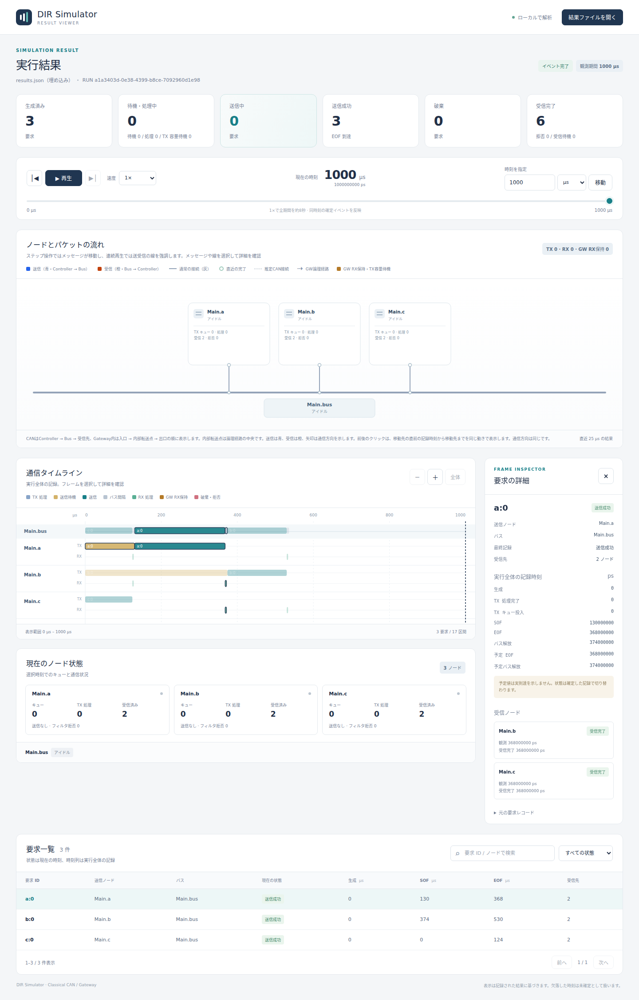

# CANの調停

文書バージョン：`1.1.0`  
対象GitHubバージョン：`v1.1.3`  
文書ID：`guide-can-arbitration`  
文書状態：公開用完成稿。mainへのマージ後にGitHub Pagesへ反映

### 更新履歴

| 文書バージョン | 更新日 | 更新内容 |
| --- | --- | --- |
| `1.1.0` | `2026-10-05` | 初版：公開サンプルの実行・実画面・条件変更実験、GitHub Pages公開とMarkdown再利用を整備 |

## 目的

同時に送信したいノードが複数あるとき、誰が先に送信するかを理解します。CAN IDを1つだけ変え、送信順と待ち時間が変わることを実験します。

## 構成と責務

Controllerは送信可能な要求をTXキューへ置きます。Busは空いているときに候補から送信権を選びます。Classical CANの同じstandard形式なら、小さいCAN IDが優先されます。これは要求一覧の`a:0`などの文字列IDや、NEDの配線順で決まる優先順位ではありません。

現行DIRは各キューを調停bit列と生成時刻・generator ID・ordinalで順序付けし、Busの候補を比較します。同じ調停bit列のときの後続キーはシミュレータの決定的な順序です。実CANの同一ID競合の安全性を保証するものとして扱わないでください。

## 接続と処理フロー

```text
送信可能な要求が集まる
 → Busが空いているか確認
 → 各Controllerの先頭候補から調停bit列の小さい要求を選ぶ
 → 選ばれた要求のSOFを記録し、TXキューから除く
 → EOFを記録（他要求はまだ待つ）
 → 3bit間隔後にBusを解放
 → 次の候補を選ぶ
```

0のdominant bitが1のrecessive bitより優先するので、同じ形式なら小さいIDが勝ちます。standardとextendedを混在させる場合は、単に11bit数値と29bit数値を並べるのでなくSRR/IDEを含む調停bit列で比較します。

すでに始まった送信を後から来た高優先度要求が途中で取り上げることはありません。勝てなかった要求は待機し、この理想モデルでは調停負けだけでエラー再送や破棄にしません。

## 最小実行例と設定

同梱の最小例ではa=256、b=512、c=768のstandard IDで、すべて0psに生成・送信可能になります。処理・配線遅延は0です。

```bash
./target/debug/dir-simulator run --config examples/guide/can/minimal.ini --output results-guide-arbitration
./target/debug/dir-simulator view --input results-guide-arbitration/results.json --output guide-arbitration-viewer.html
```

送信順はa→b→cです。INIのキュー容量が64でも、低い優先度の要求を速く送れるわけではありません。容量は待機要求を収容する上限です。

## 結果と実画面

| 要求 | CAN ID | 生成（µs） | SOF（µs） | 調停待ち（µs） |
| --- | --- | --- | --- | --- |
| a:0 | 256 | 0 | 0 | 0 |
| b:0 | 512 | 0 | 244 | 244 |
| c:0 | 768 | 0 | 406 | 406 |

今回、生成からSOFの待ちと、TXキュー受理からSOFの調停待ちは一致します。TX処理遅延がある場合は一致するとは限りません。bの待ちはaの119bit送信238µsと間隔6µsの合計です。cの待ちはさらにbの78bit送信156µsと間隔6µsを加えた406µsです。

最小例の画面は[初めてのCAN実行](初めてのCAN実行.md)に掲載しています。下の実験後の画面と、タイムラインの最初の送信元を比較します。

## 実験：1設定を変える — cのCAN IDだけを128へ

`id-swap.json`はcの`frame.id`だけを768から128（0x080）へ変えます。`id-swap.ini`はこのworkloadを参照するための別名設定です。ビットレート・配線・データ・生成時刻・回数は変えません。

```json
"frame": {"format": "standard", "id": 128, "data": "1122"}
```

これは該当フィールドの抜粋です。完全なJSONは`examples/guide/can/id-swap.json`を使います。

```bash
./target/debug/dir-simulator run --config examples/guide/can/id-swap.ini --output results-guide-id-swap
./target/debug/dir-simulator view --input results-guide-id-swap/results.json --output guide-id-swap-viewer.html
```

| 送信順 | 要求 | CAN ID | SOF（µs） | EOF（µs） | 解放（µs） |
| --- | --- | --- | --- | --- | --- |
| 1 | c:0 | 128 | 0 | 124 | 130 |
| 2 | a:0 | 256 | 130 | 368 | 374 |
| 3 | b:0 | 512 | 374 | 530 | 536 |



撮影条件：ID変更例、時刻1,000µs、先頭要求選択、幅1,440px。送信順はc→a→b、成功3要求・受信6件のままです。IDを変えるとCRCやstuff bit数も変わり得るので、時間の違いを常に順序変更だけの効果と考えてはいけません。このサンプルではcのframe bit数は変更前後とも62で、合計解放時刻536µsは同じです。

## 制約と関連機能

この例は1回の同時生成だけなので、継続的な高負荷による飢餓は証明しません。周期を短くして繰り返せば、高優先度要求が低優先度要求を長く待たせ、キュー容量で破棄が起こる場合があります。既存`examples/can/contention.ini`は競合、`overload.ini`は小容量と高負荷の別実験です。

理想ACK、Classical CANデータフレーム、固定遅延のモデルです。エラー・再送は対象外です。Gatewayには通常ControllerのRX処理とは別にRX保持とTX容量待機があり、この3ノード例には含めていません。

[Viewerで結果を読む](Viewerで結果を読む.md)で要求ごとのSOFと受信実績を確認し、[設定・用語・FAQ](設定・用語・FAQ.md)でCAN ID・要求ID・generator IDの違いを復習できます。
