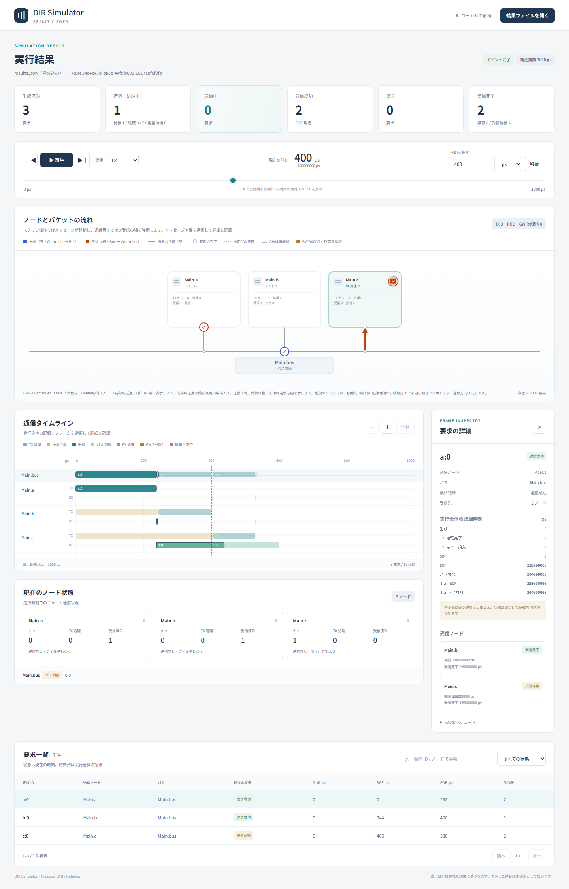
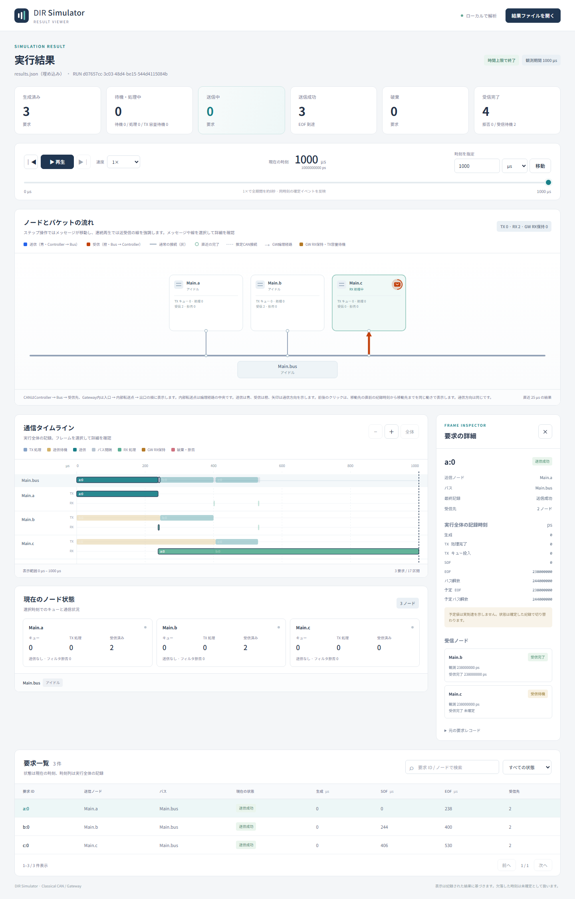

# CAN受信処理遅延の比較

文書バージョン：`1.1.0`  
対象GitHubバージョン：`v1.1.3`  
文書ID：`guide-can-rx-processing-delay`  
文書状態：公開用完成稿。mainへのマージ後にGitHub Pagesへ反映

### 更新履歴

| 文書バージョン | 更新日 | 更新内容 |
| --- | --- | --- |
| `1.1.0` | `2026-10-06` | 初版：受信処理遅延だけを変える3条件、送信・観測・受信完了の実測、Viewer実画面、終了時未完了とモデルの制約を説明 |

## 目的：送信成功と受信完了を分けて読む

「フレームの送信は終わったのに、cの受信完了が遅い」という場面を再現します。同じ3要求を送る条件で、cの`rxProcessingDelay`だけを0、200、900µsへ変えます。Busの送信時刻、cの観測時刻、cの受信完了時刻を比べ、どこで時間を使っているかを確かめます。

この実習で変えるのは受信後の処理時間です。受信フィルタは全受入のままです。CAN Controllerの受信バッファ容量や満杯による受信破棄は、このモデルにはありません。遅い受信処理を設定しても、その機能を再現したことにはなりません。

[初めてのCAN実行](初めてのCAN実行.md)の準備・出力ファイルの説明と、[Viewerで結果を読む](Viewerで結果を読む.md)の時刻移動を先に確認すると進めやすくなります。コードの基準はv1.1.3、今回の実行・ビルド基準はmain `c152840df77e5ce29c678ca8165c7c00935756fb`です。

## 構成と責務

NED・INI・JSONの3種類を使います。配線と生成入力を固定し、INIにあるcの受信処理時間だけを変えます。

| 入力・部品 | この実習で担当すること | 比較中の扱い |
| --- | --- | --- |
| `models/demo/Main.ned` | a・b・cのControllerを1つのBusへ接続する | 同じ配線、配線遅延0 |
| `minimal.json` | a・b・cに1要求ずつ、時刻0で生成する | 同じID・データ・生成回数 |
| `rx-delay*.ini` | 500kbps、実行1ms、cの受信処理時間を指定する | `Main.c.rxProcessingDelay`だけを変更 |
| Bus | 調停、送信、EOF、Bus解放を決める | 受信側の処理が終わるまでBusを占有しない |
| 受信Controller | フレームを観測し、フィルタ適合後に受信完了を記録する | cだけ処理時間を変え、a・bは0 |

送信要求は`a:0`、`b:0`、`c:0`です。例えば`a:0`はaが送る1フレームを表し、それに対するbとcの受信は別々の行に記録されます。送信元aへの自己受信はありません。

## 接続と受信までの流れ

1. aの要求がBusの送信権を得て、a.txからBusへ送信します。
2. EOFでaの送信成功が確定します。Busから送信元以外のb.rxとc.rxへ受信通知が届きます。
3. bとcは通知を観測し、各自の受信フィルタを判定します。この実習は両方とも全受入です。
4. 各Controllerは観測時刻に`rxProcessingDelay`を加えた時刻で受信完了を記録します。
5. BusはEOFから3bit間隔を終えると次の送信を始められます。cの受信処理完了を待ちません。

今回の配線遅延は0なので、`t_observed = t_EOF`です。フィルタに適合した受信については、`t_received = t_observed + rxProcessingDelay`になります。配線遅延がある構成では観測時刻も遅れるため、EOFと観測を同じものと考えないでください。

RX処理は受信ごとに独立しています。先の受信処理中でも、次の受信や自身の送信と重ねられます。1つのCPUが全受信を順番に処理する待ち行列のモデルではありません。

## 最小実行手順

リポジトリのルートで実行します。[実習入力ZIP](downloads/can-guide-inputs.zip)にも、同じ相対配置で3つのINI、共通JSON、NEDを収録しています。ZIPだけでは実行プログラムは入りません。導入・ビルド手順は[入門](初めてのCAN実行.md)を参照してください。

```bash
cargo build --locked -p dir-simulator

for delay in 0 200 900; do
  ./target/debug/dir-simulator validate \
    --config "examples/guide/can/rx-delay${delay}.ini"
  ./target/debug/dir-simulator run \
    --config "examples/guide/can/rx-delay${delay}.ini" \
    --output "results-guide-rx${delay}"
  ./target/debug/dir-simulator view \
    --input "results-guide-rx${delay}/results.json" \
    --output "guide-rx${delay}-viewer.html"
done
```

生成した3つのViewer HTMLをブラウザで開きます。繰り返すときは出力ディレクトリとHTMLを別名にしてください。既存出力の保護で拒否されることを、シミュレーション失敗と取り違えないようにします。掲載コマンドはBash/WSLで検証しています。

### 1変数だけを変える設定

3つのINIの差は次の1行だけです。cのTXキュー容量、Busの速度、workload、実行終了時刻は同じです。共通NEDの`rxFilter = "*"`も変えません。

```ini
# rx-delay200.iniで変えている行
Main.c.rxProcessingDelay = 200us
```

| INI | cの受信処理時間 | その条件で確かめること |
| --- | --- | --- |
| `rx-delay0.ini` | 0µs | 観測と受信完了が一致する基準 |
| `rx-delay200.ini` | 200µs | 観測は同じで、受信完了だけが遅れる |
| `rx-delay900.ini` | 900µs | 観測済みでも1ms終了までに受信完了しない |

## 実測：Busの送信は3条件とも同じ

| 要求 | SOF（µs） | EOF（µs） | Bus解放（µs） |
| --- | --- | --- | --- |
| a:0 | 0 | 238 | 244 |
| b:0 | 244 | 400 | 406 |
| c:0 | 406 | 530 | 536 |

3条件とも送信成功3件、送信破棄0件です。cのRX処理時間を増やしても、CAN IDやフレーム長、送信順、Bus解放時刻は変わりません。c自身の要求も406µsで送信を開始します。

## 実測：cの受信完了だけが変わる

以下はc宛ての受信だけを比べた表です。時刻値はすべてµs、右の3列は各処理時間条件での受信完了時刻です。「—」は1ms終了までに完了していないことを示します。

| 要求 | 観測 | 0µs | 200µs | 900µs |
| --- | --- | --- | --- | --- |
| a:0 | 238 | 238 | 438 | — |
| b:0 | 400 | 400 | 600 | — |

bがaを受ける238µs、aがbを受ける400µs、aとbがcを受ける530µsは3条件とも変わりません。全受信6行のうち、c宛ての2行だけが変わります。

200µs条件では、cはaの受信を238〜438µs、bの受信を400〜600µsに処理します。400〜438µsは2つのRX処理が重なり、cの送信も406µsから始まります。この重なりは、独立した固定遅延のモデルが実装している動作です。

| 実行1ms時点の記録 | 0µs | 200µs | 900µs |
| --- | --- | --- | --- |
| 送信成功 | 3 | 3 | 3 |
| 受信完了（全受信者） | 6 | 6 | 4 |
| 受信未完了（pending） | 0 | 0 | 2 |
| フィルタ拒否 | 0 | 0 | 0 |
| termination | events_exhausted | events_exhausted | time_limit |

0/200µs条件は予定したイベントが尽き、900µs条件は処理完了イベントを残して実行時間上限に達します。3条件とも`end_ps = 1000000000`、`partial = false`です。この`partial=false`だけから「すべての受信が完了した」と判断できません。受信行の状態と完了時刻を確認します。

## 実Viewerで観測と完了を見分ける

200µs条件のViewerで単位をµsにし、時刻400へ移動して`a:0`を選択します。送信は成功済みですが、cの受信はまだ「受信待機」です。cの観測は238µsで、受信完了は438µsです。



[実画面を大きく開く](assets/guide-rx-delay200-at400us.png)

撮影条件：200µs条件、選択時刻400µs、要求a:0、幅1,440px。受信者詳細の時刻欄はps整数なので、`238000000 ps = 238µs`、`438000000 ps = 438µs`です。詳細の時刻欄は実行全体で保存された時刻、状態バッジは選択した400µs時点の状態です。先の438µsが表示されていても、400µsで完了済みという意味ではありません。

438µsへ進めるとa:0 → cが完了し、600µsではb:0 → cも完了します。a:0のEOF238µsやBus解放244µsを、cの受信完了438µsへ置き換えて読まないようにします。

次に900µs条件のViewerで1,000µsへ移動し、同じ`a:0`を選択します。送信成功3件・受信完了4件ですが、cの観測時刻はあり、受信完了は「未確定」です。



[実画面を大きく開く](assets/guide-rx-delay900-at1000us.png)

撮影条件：900µs条件、選択時刻1,000µs、要求a:0、幅1,440px。`results.json`でもc宛て2行は`status = "pending"`、`received_ps = null`です。

## 終了時のpendingを欠落や破棄と混同しない

900µsを足した処理完了予定はa:0 → cが1,138µs、b:0 → cが1,300µsです。この2つは式から求めた予定で、今回の結果に保存された受信完了の実績ではありません。実行区間は`[0, 1ms)`なので、上限以後のイベントは実行されません。Viewerの時刻移動だけで、実行していない受信を完了させることもできません。

これは「受信を観測したが処理が終わる前に観測期間が終了した」結果です。フィルタ拒否、TXキュー満杯、RXバッファ破棄の証拠ではありません。出力の送信成功と、受信行の観測・完了・状態を別々に読みます。

## この実習で分かることと制約

- `rxProcessingDelay`はフィルタに適合した観測から受信完了までの固定遅延です。フレームのwire転送時間や送信側`txProcessingDelay`とは別です。
- 通常CAN Controllerの`queueCapacity`はTX待機容量です。RXバッファ容量、RX満杯の破棄、1つの受信CPUの直列処理、処理負荷による遅延増加はこのモデルにありません。
- GatewayのRX保持容量・routing処理・TX容量待機は別機能です。この例はGatewayを使いません。
- 理想ACKモデルです。受信アプリケーションの処理完了をACKの条件にしません。実CAN機器の割込み・DMA・ドライバ・CPU競合を測った結果ではありません。
- 3要求、固定配線遅延0、全受入フィルタだけの比較です。実機の受信欠落率・バッファ設計・性能受入を保証する実験ではありません。

受信先の選別を調べるフィルタ比較とは目的が異なります。このページは選別条件を固定し、時刻の違いだけを観測します。[調停実験](CANの調停.md)では送信権の順序を、[設定・用語・FAQ](設定・用語・FAQ.md)では`observed / received`と時刻単位を復習できます。ガイド内検索では短い語「受信」「遅延」でこのページを探せます。
