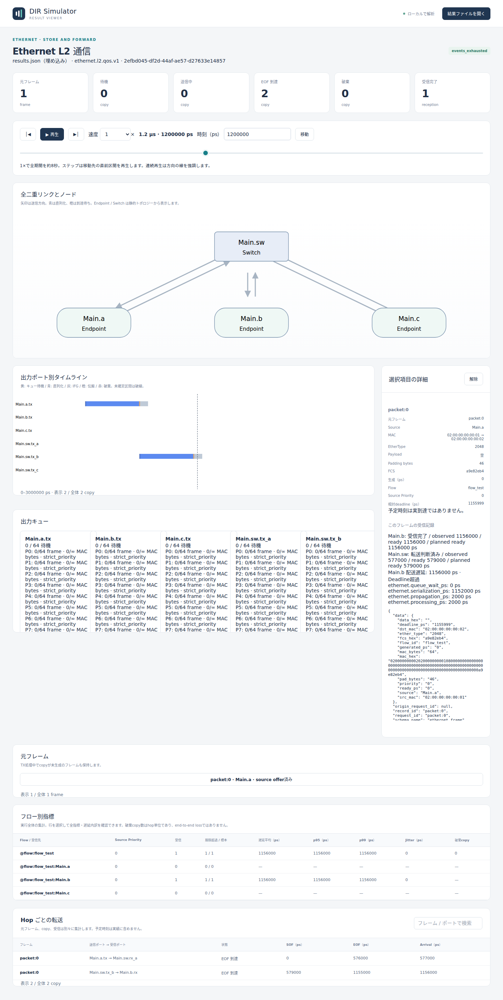
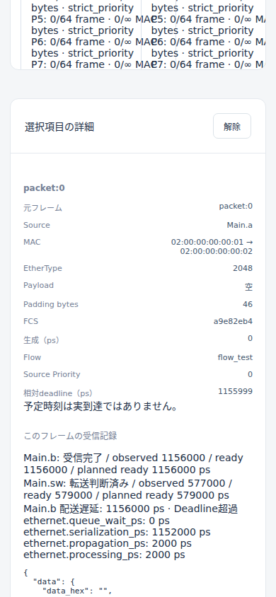
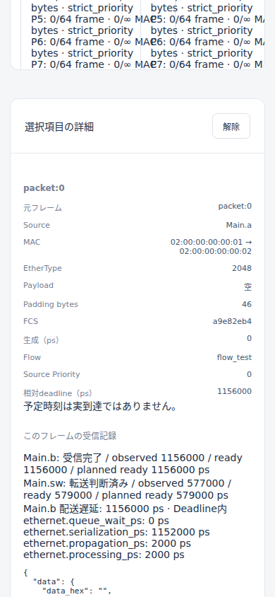

# Ethernet配送期限と遅延判定の比較

文書バージョン：`1.1.1`  
対象GitHubバージョン：`v1.1.4`（実測）。入力の基礎は`v1.1.3`  
文書ID：`guide-ethernet-deadline`  
文書状態：公開用完成稿。CLI実測・実Viewer画像付き

### 更新履歴

| 文書バージョン | 更新日 | 更新内容 |
| --- | --- | --- |
| `1.1.1` | `2026-10-10` | 第2push。統合作業の状況を検証資料へ移し、実測済み記事への公開入口を追加 |
| `1.1.0` | `2026-10-10` | 初回push。3条件とZIP単独の18操作、全record・指標・hash・実Viewer4画像を掲載。実測版v1.1.4と入力基礎v1.1.3を区別 |

## 目的：期限の設定と、通信を速くする設定を区別する

配送期限を短く設定しても、このモデルのフレームが自動的に速く送られるわけではありません。`deadline_ps`だけを1psずつ変えると、配送遅延は3条件とも1,156,000psのまま、期限超過の判定が変わりました。期限と等しい場合は達成です。

本記事の数値はCLI実測です。解析の基礎にした公開版v1.1.3のQoS入力を派生させ、実行にはv1.1.4の固定source `b45515644dfc65c205216d564d5bf7ef00280622`を使いました。v1.1.3自体を実行した結果ではありません。版と実測の根拠は[検証資料](https://github.com/hideki-ozu/DIR-Simulator/tree/b6d3ccf6443fda45aabf1c6c23bfd8331797fe0e/docs/verification/results/ethernet-deadline-2026-10-10)に保存しています。

## 構成と責務

`ethernet.l2.qos.v1`を使います。基本L2 profileとは異なり、`flow_id`・`priority`・`deadline_ps`を持つQoS入力です。

| 要素 | 固定条件と役割 |
| --- | --- |
| Main.a | 0psにpacket:0を1件生成。b宛、空payload、priority 0、flow_test |
| Main.b | MAC 02:00:00:00:00:02。RX処理遅延0ps |
| Main.c | 接続を保持するEndpoint。今回の宛先ではない |
| Main.sw | 静的FDBでbへ転送。全受信後2000ps処理 |
| Link | 各方向1Gbps、伝搬1000ps、全二重 |
| 出力queue | strict_priority、8クラス各capacity_frames=64、capacity_bytes=null |
| workload JSON | 生成条件、宛先、flow、priority、相対期限 |
| model JSON / NED | MAC・FDB・出力設定、部品と接続 |
| INI | QoS profile、入力参照、実行上限3µs |

経路はa.tx → sw.rx_a → sw.tx_b → b.rxです。NEDの登録型は`dir.ethernet.Endpoint`、`dir.ethernet.Switch`、`dir.ethernet.Link`です。

実行処理が配送時刻を計算し、flow計測が完了受信の遅延と期限を比較します。deadline_psは生成から受信処理完了までの相対期限です。絶対時刻、シミュレーション終了時刻、送信中断時刻ではありません。

## 一変数の入力

[実習入力ZIP](downloads/ethernet-deadline-inputs.zip)は8入力だけを含み、CLI・結果・画像は含みません。リポジトリ内の入力は`examples/guide/ethernet-deadline/`です。

| 条件 | deadline_ps | 実測遅延との関係 |
| --- | --- | --- |
| short | `"1155999"` | 期限が1ps短い |
| equal | `"1156000"` | 期限と遅延が等しい |
| long | `"1156001"` | 期限が1ps長い |

唯一のgeneratorのdeadline_psだけを変えます。payload、生成時刻、送信元、宛先、priority、flow_id、回数は同一です。model JSONとNEDも共通で、INIのworkload名だけを条件選択のために変えます。期限は正規の非負整数を表す十進文字列です。nullは期限なし、0はゼロ時間の期限で、別の値です。本比較ではどちらも使いません。1ps差は整数時刻の境界を調べるためであり、実機の測定精度が1psあるという意味ではありません。

## 実行する

実測環境はOMEN35LのWSL2 Ubuntu 24.04.4 LTS x86_64、Rust/cargo 1.85.0です。v1.1.4のsourceを使ってCLIを別途ビルドします。既存作業は保持し、新しい出力先を使ってください。

```bash
cargo build --locked -p dir-simulator
mkdir -p output
./target/debug/dir-simulator validate --config examples/guide/ethernet-deadline/short.ini
./target/debug/dir-simulator run --config examples/guide/ethernet-deadline/short.ini --output output/deadline-short
./target/debug/dir-simulator view --input output/deadline-short/results.json --output output/deadline-short-viewer.html
```

shortをequal、longへ置き換え、出力名も条件別に変えて繰り返します。runの出力は新規または空ディレクトリ、Viewer HTMLは新規ファイルです。再実行には未使用の名前を使います。

ZIPを新規空フォルダへ展開する場合は、展開先を作業ディレクトリにし、別途ビルドしたCLIの絶対パスを指定します。

```bash
DIR_CLI="/absolute/path/to/DIR-Simulator/target/debug/dir-simulator"
mkdir -p output
"$DIR_CLI" validate --config examples/guide/ethernet-deadline/short.ini
"$DIR_CLI" run --config examples/guide/ethernet-deadline/short.ini --output output/deadline-short
"$DIR_CLI" view --input output/deadline-short/results.json --output output/deadline-short-viewer.html
```

通常入力とZIP単独入力の両方で3条件のvalidate/run/view、計18操作を実行し、全てexit 0でした。ZIP展開の8ファイルはbyte一致し、通常・ZIPのsimulation全体も各条件8,025 scalar leavesを除外なしで比較して一致しました。ZIP SHA256は`c1804e30b74f50f4f43c6f8ce738f928fe367b0bb0dfd9e28db38130c1bac570`です。

## 実測：配送遅延は変わらない

全条件で以下の確定時刻は同じでした。単位はpsで、1,156,000psは1156nsです。

| 境界 | 実測時刻ps |
| --- | --- |
| packet:0生成・aのSOF | 0 |
| aのEOF / 出力解放 | 576000 / 672000 |
| Switch到着 | 577000 |
| Switch処理完了・出力SOF | 579000 |
| Switch出力EOF / 解放 | 1155000 / 1251000 |
| b受信処理完了 | 1156000 |

空payloadでもMAC 64byte、preamble/SFD込み576bitなので、1Gbpsの直列化は1hopにつき576000psです。2hopと伝搬各1000ps、Switch処理2000psを合わせます。

| 内訳 | 実測ps |
| --- | --- |
| queue_wait | 0 |
| serialization | 1152000 |
| propagation | 2000 |
| processing | 2000 |
| 合計 | 1156000 |

IFGは出力の再使用を制限します。今回1件の終端受信へ独立の追加遅延として足しません。各条件はgenerated 1、transfer_offered 2、serialized 2、forwarded 1、received 1、filtered 0、dropped 0でした。shortも受信済みで、期限超過を理由に途中で捨てる実験ではありません。

## 実測：期限と等しければ達成

`@flow:flow_test:Main.b`の完了受信を対象に比較します。

| 条件 | 配送遅延ps | deadline_sample_count | deadline_missed | deadline_miss_ratio |
| --- | --- | --- | --- | --- |
| short | 1156000 | 1 | 1 | 1（100%） |
| equal | 1156000 | 1 | 0 | 0（0%） |
| long | 1156000 | 1 | 0 | 0（0%） |

metric名には`ethernet.flow.`が付きます。判定は「受信処理完了−生成 > deadline_ps」で、等号は超過に含みません。生成時刻が0以外の実験でも、絶対受信時刻だけを期限と比較しないようにします。

各条件の標本は1件だけです。1件が間に合っても将来の全通信の期限保証にはなりません。未完了の受信や期限nullの受信はdeadline_sample_countの対象外です。超過率を全送信の成功率と解釈せず、完了数と標本数を一緒に読みます。全体flowとEndpoint別は同じ標本を含むため、両行を足して2件にしないでください。

## recordと実Viewerで照合する

1条件のmodel recordはframe 1、transfer 2、reception 2です。`ethernet.frame`/2のflow_id・priority・deadline_ps、`ethernet.transfer`/2のqueue_id・priority、`ethernet.reception`/1のreceivedを確認しました。予定plannedではなく、確定したreceivedと実到達時刻から判断しています。全155 metric recordsと373 summary metricsも条件ごと検査し、manifest hashとinput snapshotを照合しました。

Chromium 151.0.7922.34でshortとequalを共に1200ns（入力欄1200000ps）へ移動し、packet:0を選択して撮影しました。経路・受信完了・遅延内訳は同じで、期限判定が変わります。全体画面のflow行でもshortはmiss/sample 1/1、equalは0/1です。




390pxで撮影した選択詳細です。shortの相対deadlineは1155999ps、equalは1156000psで、どちらもMain.bのreadyは1156000psです。





これらは実結果の元PNGを加工せず掲載し、開いて目視したものです。Viewer 390pxでは詳細欄を読め、document全体の横overflowは0でした。内部パネルの横スクロールはあります。Viewer画像の確認と、このガイド本文の390px表示確認は別の検証です。

表示に丸めがある場合、1psの境界は結果JSONの整数文字列で照合します。上の画像ではdeadlineとreadyがpsで表示されていますが、タイムラインの位置やµs表示だけから1ps差を推定しません。

## 制約と根拠

- deadlineは評価用属性です。EDF scheduler、帯域予約、TSN送信gateを自動設定しません。
- 低負荷の1frameのみで、混雑・周期負荷・分位遅延・ジッタ分布を評価しません。
- EtherType 2048でも空のopaque bytesです。実IPv4 packetや上位アプリの締切を再現しません。
- 実機の時計精度、IEEE全文適合、hard real-time保証は未検証です。

[v1.1.3 QoS仕様](https://github.com/hideki-ozu/DIR-Simulator/blob/v1.1.3/docs/specs/models/Ethernet負荷・QoS詳細機能仕様書.md)、[公開QoS例](https://github.com/hideki-ozu/DIR-Simulator/tree/v1.1.3/examples/ethernet)、[実測版のflow実装](https://github.com/hideki-ozu/DIR-Simulator/blob/b45515644dfc65c205216d564d5bf7ef00280622/crates/dir-simulator/src/output/ethernet/flow.rs)を参照できます。公開入力4ファイルは両版で同一でした。flow実装にはpoint収集やindex経路の差があり、deadlineの比較式は当該差分で変わりません。全実装の同一性を主張するものではありません。

結果のmetadata.runtime_versionはCargo package版の0.1.0です。Git Release版とは別であり、版はsource commitとbinary hashでも照合しています。元checkerが1.1.4を期待して失敗した記録を保持し、コピーの期待literal1箇所だけを0.1.0へ変更して再確認しました。他の検査は弱めていません。
