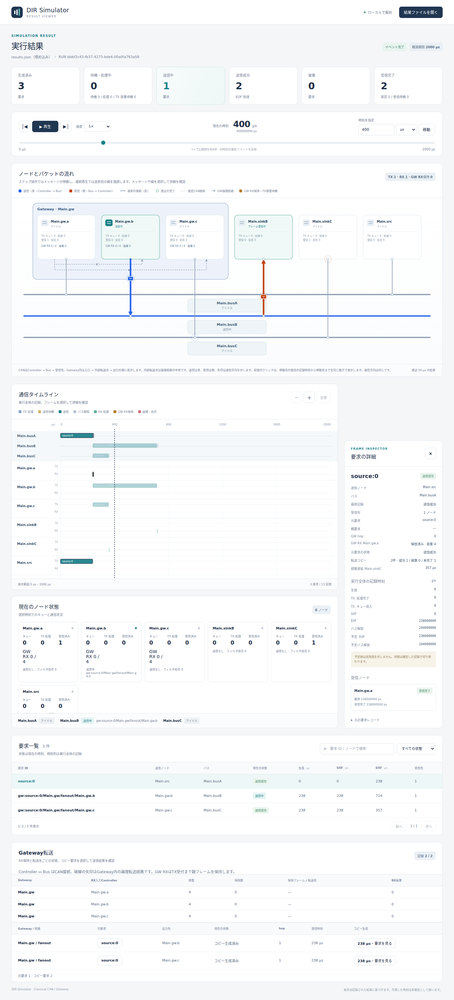
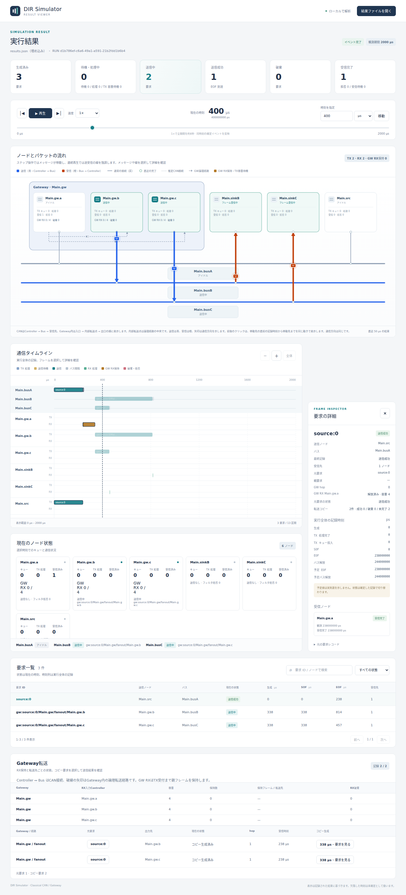
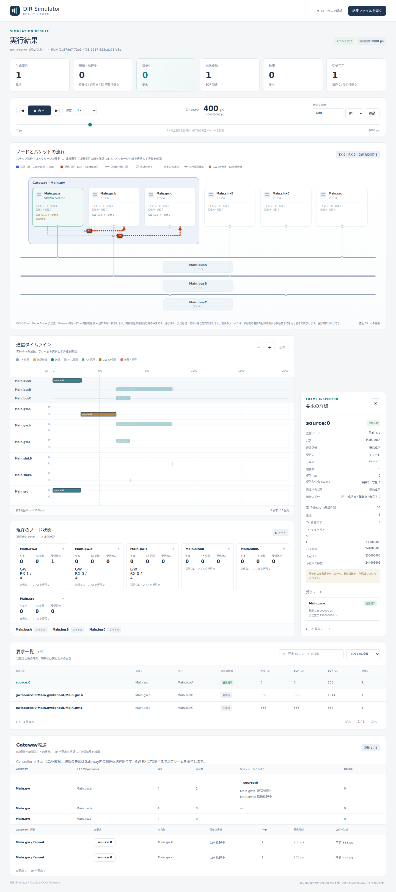

# Gateway処理遅延と複数CANバスの中継

文書バージョン：`1.1.0`  
対象GitHubバージョン：`v1.1.4`  
文書ID：`guide-gateway-delay`  
文書状態：公開用完成稿。CLI実測・実Viewer画像付き

### 更新履歴

| 文書バージョン | 更新日 | 更新内容 |
| --- | --- | --- |
| `1.1.0` | `2026-10-11` | 初回push。3バス分岐の処理遅延1変数比較、9入力ZIP、CLI実測と400µsの実Viewerを追加 |

## 目的：元の送信成功と、中継先への到着を区別する

あるECUが送ったCANフレームを、別の速度で動く二つのCANバスへ届けたいとします。元バスの送信が成功しても、中継先への配送はまだ終わっていません。Gatewayが受信を完了し、処理を経てコピーを送信するからです。

この実習では、Gatewayの`processing_delay`だけを0、100、300µsへ変えます。元要求はすべて238µsで送信を終えました。一方、中継先の送信開始は238、338、538µsへ移りました。まずこの差を読み、元通信・中継処理・コピー送信の責務を分けて考えます。

| 確認したい要求 | 結果の読み方 |
| --- | --- |
| 元通信を確定させる | `source:0`のSOF/EOFとGateway入口の`received_ps`を見る |
| 受信後の処理だけを比較する | `gw.forward`の受信とコピー生成の差を見る |
| 二つのバスへ配送する | 親が同じコピー2件と、各末端Receiverの受信完了を見る |
| 時点の状態を区別する | Viewerの現在状態と、実行全体を示す時刻列を分けて読む |

## 構成と責務：三つのバスと一つのGateway

公開版v1.1.4の`can.cc.multibus.v1`を使います。既存`examples/gateway/fanout.ini`を基礎に、送信を1件へ絞り、別送信者の負荷を外した入力です。Classical CANの理想バスと、全フレームの受信後に転送するstore-and-forward Gatewayを組み合わせます。

```text
Main.src → busA (500kbps) → gw.a
                              ↓ Main.gw: 経路照合・固定処理遅延
                     gw.b → busB (250kbps) → sinkB
                     gw.c → busC (1Mbps)   → sinkC
```

| ファイル・部品 | 担当すること |
| --- | --- |
| `models/gateway/Main.ned`、`Types.ned` | 部品と接続。Controller、Bus、遅延0psのWireを宣言 |
| `delay*.ini` | profile、2msの実行上限、入力参照、バス別bitrate、出口TX容量8 |
| `workload.json` | srcから0psに標準ID256、8byte `0102030405060708`を1件生成 |
| `delay*.json` | gw.aのID256～271をgw.b/cへ分岐する静的経路、処理遅延、RX容量4、hop上限16 |
| `Main.busA/B/C` | それぞれ独立してCAN送信と仲裁を進める |
| `Main.gw` | 入口の受信完了後に経路を照合し、遅延後に出口ごとのコピーを作る |

ControllerのTX/RX処理遅延、Wire伝搬遅延は0です。受信フィルタは`*`、他の送信者はいません。Bus B/Cの速度は条件間で固定します。RX容量は受信した親フレームの保持枠、TX容量は出口Controllerの待機キューです。今回は容量不足を起こさないため、処理遅延の差だけを観察できます。

元要求IDは`source:0`です。コピーIDは`gw:source:0/Main.gw/fanout/Main.gw.b`と末尾`.c`の2件です。いずれも`origin_request_id`と`parent_request_id`は`source:0`、`gw_hops`は1です。送信先ごとのコピーを元の1件と混同しないでください。

## 再現手順：一つの設定だけを変えて実行する

[実習入力ZIP](downloads/gateway-delay-inputs.zip)にNED 2、INI 3、経路JSON 3、workload JSON 1の計9入力を収録しています。CLI、結果、画面画像は含みません。mainのソースには同じ入力を`examples/guide/gateway-delay/`へ同梱します。

実測には[正式v1.1.4](https://github.com/hideki-ozu/DIR-Simulator/releases/tag/v1.1.4)の固定source `b45515644dfc65c205216d564d5bf7ef00280622`を使いました。確認環境はWSL Ubuntu 24.04 LTS x86_64、Rust 1.85.0です。新しい作業ディレクトリへ正式タグを取得し、そのルートで次を実行します。

```bash
git clone --branch v1.1.4 --depth 1 https://github.com/hideki-ozu/DIR-Simulator.git
cd DIR-Simulator
cargo build --locked --release -p dir-simulator
```

タグのソースには今回の実習入力がまだありません。ZIPをリポジトリルートに展開し、`examples/guide/gateway-delay/delay0.ini`があることを確認してください。mainの入力を利用する場合も、以下の相対パスと同じ配置にします。

```bash
unzip gateway-delay-inputs.zip
mkdir -p results-gateway-delay
for name in delay0 delay100 delay300; do
  ./target/release/dir-simulator validate \
    --config examples/guide/gateway-delay/$name.ini
  ./target/release/dir-simulator run \
    --config examples/guide/gateway-delay/$name.ini \
    --output results-gateway-delay/$name
  ./target/release/dir-simulator view \
    --input results-gateway-delay/$name/results.json \
    --output results-gateway-delay/$name-viewer.html
done
```

出力親フォルダは事前に作ります。CLIは既存の結果やHTMLを上書きしないため、再実行は別の出力名にしてください。`view --input`にはディレクトリではなく`results.json`を渡します。生成したHTMLはローカルのブラウザで開けます。

3経路JSONの意味上の差は`gateways[0].processing_delay`のみです。INIは対応するJSONの参照名だけを変えています。送信データや速度まで一緒に変更すると、以下の比較にはなりません。

```json
"processing_delay": "300us"
```

## 実測：処理遅延がコピーへ加わる

以下はCLIが保存した確定時刻です。元バスのSOF=0、EOF=238µs、gw.aの受信完了=238µsは全条件で同じです。

| 処理遅延 | コピー生成・B/CのSOF | sinkB受信完了 | sinkC受信完了 | GW RX保持期間 |
| --- | --- | --- | --- | --- |
| 0µs | 238µs | 714µs | 357µs | 238→238µs |
| 100µs | 338µs | 814µs | 457µs | 238→338µs |
| 300µs | 538µs | 1014µs | 657µs | 238→538µs |

狭い画面では表の中を横へスクロールすると、右側の受信時刻と保持期間も読めます。

保存されたフレーム長は119bitです。Aは119/500kbps=238µs、Bは119/250kbps=476µs、Cは119/1Mbps=119µsを送信に使います。この入力では、末端への遅延は「Aの238µs + GW処理遅延 + 出口バス送信時間」です。B/Cは独立バスなのでコピーを同時に開始でき、Bを待ってCを送る構成ではありません。

全条件で元要求1件・コピー2件は送信成功、Receiver3件は受信完了です。`gw.forward.status=submitted`はコピーを生成したことを示します。末端への配送成功は参照先`can.request`と`can.receiver`で確認します。RX枠の解放もTX受理時なので、コピーEOFを意味しません。

schema2出力は`simulation.model_records`へ保存されます。Pythonで確定値を取り出せます。JSONの時刻は精度を保つ十進文字列のpsです。µsへ直すときは整数値を1,000,000で割ります。

```python
import json
from pathlib import Path
result = json.loads(Path("results-gateway-delay/delay300/results.json").read_text())
for row in result["simulation"]["model_records"]:
    if row["schema_name"] in ("can.request", "can.receiver", "gw.forward", "gw.rx_buffer"):
        print(row["schema_name"], row["data"])
```

## 実Viewer：同じ400µsで比べる

生成した各Viewerで表示単位µsのまま「時刻を指定」に`400`を入力して移動し、要求一覧の`source:0`を選びます。以下は同じ操作から撮影した実画面です。

### 処理遅延0µs



元送信は成功、Bのコピーは送信中、Cのコピーは送信成功です。GW RX保持は0。Cは357µsで受信を終えています。

### 処理遅延100µs



B/Cは338µsに送信を開始したため、400µsでは両方とも送信中です。TX受付済みなのでGW RX保持は0です。

### 処理遅延300µs



gw.aは親フレームを1/4枠保持し、両転送行はGW処理中です。コピー2件は「生成前」。一覧の538µsや1014µsは実行全体の確定記録で、400µsに到達済みという意味ではありません。Gateway転送欄のコピー生成はこの時点では「予定538µs」です。

## 制約と次の読み方

これは固定経路・1件・競合なしの処理遅延実験です。複数要求、TX満杯待ち、RX満杯破棄、hop超過、終了境界を検証した実習ではありません。競合があればコピー生成とSOFは一致しない場合があります。`[0,T)`で終了するため、T以降の処理や送信を完了扱いにしません。

profileは理想Classical CANです。物理層、通信エラー、動的経路、ID変換、完全な規格適合は評価対象外です。Gateway処理は固定の独立タイマで、一般的なCPUの逐次サービス時間モデルではありません。

単一バスの仲裁は[CANの調停](CANの調停.md)、Controller側の受信処理は[CAN受信処理遅延の比較](CAN受信処理遅延の比較.md)、基本操作は[Viewerで結果を読む](Viewerで結果を読む.md)を参照してください。[ガイドの入口](index.md)から既存のCC/FD/Ethernet実習へ戻れます。

