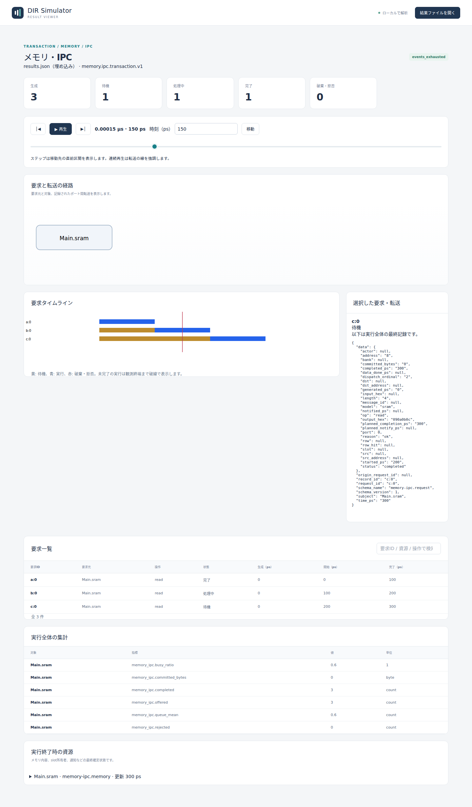
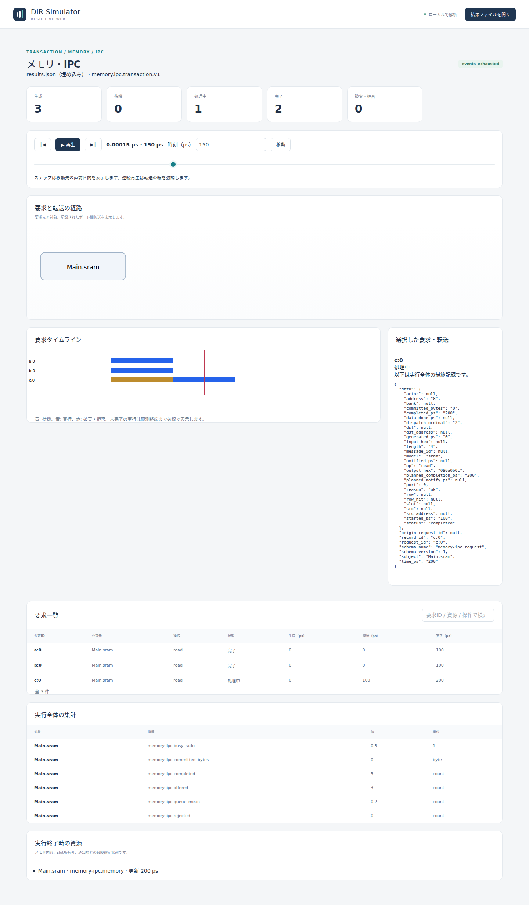
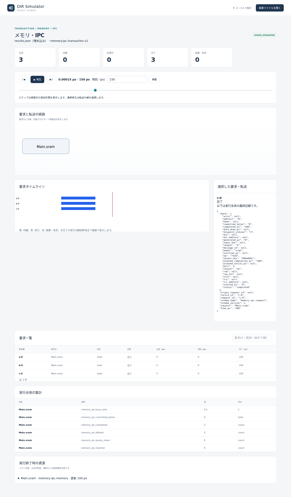

# SRAMのポート数と読み出し待ち時間

文書バージョン：`1.1.0`  
対象GitHubバージョン：`v1.1.4`  
文書ID：`guide-sram-ports`  
公開状態：公開用記事。CLI実測・実Viewer画像付き

### 更新履歴

| 文書バージョン | 更新日 | 更新内容 |
| --- | --- | --- |
| `1.1.0` | `2026-10-11` | 初回push。SRAMポート数の1変数比較、8入力ZIP、正式版CLI実測と150 psの実Viewer画像を追加 |

## 目的：同時に読む要求が、どこで待つかを調べる

三つの処理が同じメモリを同時に読みたいとします。1件の読み出しに100 psかかるとき、3件とも100 psで返ってくるでしょうか。DIR SimulatorのSRAMモデルでは、同時に処理できる件数を`ports`で指定します。1ポートなら順番待ちが生じ、3ポートなら3件を同時に処理できます。

この実習では、0 psに発生する読み出し3件を固定し、`ports`だけを1、2、3へ変えます。1件の処理時間と、要求の発生から完了までの応答時間を分けて読みます。100 psは違いを見やすくする例示値で、実機SRAMの性能測定値ではありません。psはピコ秒で、1 µs = 1,000,000 psです。

| 確認したい要求 | 観察する値 |
| --- | --- |
| 3件とも正しい4バイトを読める | 完了件数3、拒否件数0、要求ごとの`output_hex` |
| 待ち時間がポート数で変わる | `started_ps - generated_ps` |
| 1件の処理時間は変わらない | `completed_ps - started_ps = 100` |
| 最後の要求がいつ完了するか | 3件の`completed_ps`の最大値 |

## 構成と責務：要求、待ち行列、ポート、メモリ内容

公開版v1.1.4の`memory.ipc.transaction.v1`を使います。NEDには`@class("dir.memory.SramV1")`を持つ`Main.sram`を一つ置きます。これはバスの送受信モデルではなく、トランザクション要求を資源へ直接渡すモデルです。CAN用Viewerとは異なるメモリ・IPC画面が結果から選ばれます。

| ファイル／要素 | この実習での責務 |
| --- | --- |
| `models/sram/Main.ned` | SRAM資源の配置と登録クラスを宣言 |
| `ports1.json`など | 16バイトの初期内容、待ち行列容量4、ポート数、読出し100 psを設定 |
| `workload.json` | `a:0`、`b:0`、`c:0`を0 psに生成。アドレス0、4、8から各4バイトを読む |
| `ports1.ini`など | 上記ファイル、観測終端500 ps、集計窓100 psを選択 |
| モデル内部 | 受付、FIFOの待ち行列、空きポートへの割当て、完了時の読出しを処理 |
| CLI／Viewer | 確定結果の保存と、その時刻における要求状態の表示 |

同時刻の要求は受付前に集められ、生成器IDと序数の順で処理されます。このサンプルでは`a:0`、`b:0`、`c:0`の順です。受付と実行開始は別の段階です。容量4に対して要求は3件なので、容量不足による拒否を避けてポートの競合だけを観察できます。容量0や大量要求の実験へ、そのまま結果を一般化しないでください。

初期内容は`0102030405060708090a0b0c0d0e0f10`です。読出しだけなので、最終メモリ内容も同じです。`write_ps=150`は設定にありますが、書込み要求は発生しません。

## 再現手順：サンプルを展開して3条件を実行する

[公開入力ZIPをダウンロード](downloads/sram-ports-inputs.zip)し、空の作業ディレクトリへ展開してください。ZIPにはモデル・設定・負荷の8入力が含まれます。生成結果やViewer HTMLは含めていません。[リポジトリの同じ入力](https://github.com/hideki-ozu/DIR-Simulator/tree/main/examples/guide/sram-ports)も利用できます。

CLIの導入は[初めてのCAN実行](初めてのCAN実行.md)の導入手順を参照してください。ここでは正式タグ`v1.1.4`（`b45515644dfc65c205216d564d5bf7ef00280622`）からビルドした`dir-simulator`をPATHに置きます。以下は展開先をカレントディレクトリとしたコマンドです。出力先が既に存在するときは別名を使ってください。

```sh
dir-simulator validate --config examples/guide/sram-ports/ports1.ini
dir-simulator run --config examples/guide/sram-ports/ports1.ini --output out/ports1
dir-simulator view --input out/ports1/results.json --output ports1-viewer.html

dir-simulator validate --config examples/guide/sram-ports/ports2.ini
dir-simulator run --config examples/guide/sram-ports/ports2.ini --output out/ports2
dir-simulator view --input out/ports2/results.json --output ports2-viewer.html

dir-simulator validate --config examples/guide/sram-ports/ports3.ini
dir-simulator run --config examples/guide/sram-ports/ports3.ini --output out/ports3
dir-simulator view --input out/ports3/results.json --output ports3-viewer.html
```

JSON設定の差は`sram[0].ports`だけです。INIの差は対応するJSONのファイル名だけです。モデル、負荷、初期値、観測時間、待ち行列容量は共通です。

## 実測：短くなるのは待ち時間

上記正式タグのCLIをWSL Ubuntu 24.04で実行した結果です。各行の3個の値は`a:0 / b:0 / c:0`の順です。時刻と時間の単位はすべてpsです。

| ポート数 | 生成時刻 | 開始時刻 | 完了時刻 | 待ち時間 | 応答時間 |
| --- | --- | --- | --- | --- | --- |
| 1 | 0 / 0 / 0 | 0 / 100 / 200 | 100 / 200 / 300 | 0 / 100 / 200 | 100 / 200 / 300 |
| 2 | 0 / 0 / 0 | 0 / 0 / 100 | 100 / 100 / 200 | 0 / 0 / 100 | 100 / 100 / 200 |
| 3 | 0 / 0 / 0 | 0 / 0 / 0 | 100 / 100 / 100 | 0 / 0 / 0 | 100 / 100 / 100 |

全条件で3件が`completed`、理由は`ok`、拒否は0件でした。`a:0`は`01020304`、`b:0`は`05060708`、`c:0`は`090a0b0c`を返します。各要求の処理時間は常に100 psです。増えたポートは並行処理の枠を増やし、後続要求の待ち時間を減らしました。

`results.json`の`simulation.model_records`から`schema_name="memory-ipc.request"`を選ぶと、`data`の`generated_ps`、`started_ps`、`completed_ps`、`output_hex`を確認できます。時刻は精度を失わない10進文字列です。`simulation.summary`の`memory_ipc.offered`、`completed`、`rejected`は`Main.sram`の実行全体の集計です。

全条件の終端は500 ps、終了理由は`events_exhausted`、`partial=false`でした。最後のイベント時刻300／200／100 psと、観測終端500 psは別の値です。[測定記録と検証手順](https://github.com/hideki-ozu/DIR-Simulator/tree/main/docs/verification/results/sram-ports)には入力・バイナリのハッシュと結果を残しています。

## Viewer：150 psで現在状態を見る

生成したHTMLをブラウザで開き、時刻（ps）に`150`を入力して「移動」を押します。要求一覧の`c:0`を選択してください。以下は実際のv1.1.4 ViewerをChromiumで表示した画像です。

1ポートでは、`a:0`が完了、`b:0`が処理中、`c:0`が待機です。



2ポートでは、`a:0`と`b:0`が完了し、`c:0`が処理中です。



3ポートでは100 psにすべて完了しているため、150 psでは完了3件です。



上部カウンタと要求一覧の「状態」は表示時刻の状態です。一方、「選択した要求・転送」のJSONは実行全体の最終記録です。1ポートの150 psで`c:0`は待機中でも、そのJSONには将来確定した`started_ps=200`、`completed_ps=300`が載ります。また下部の集計と資源内容も実行終了時の情報です。画面を時間移動しても、過去時点のメモリ内容を復元する表示にはなりません。

## 制約と次に試すこと

これはFIFOと固定処理時間を持つ抽象SRAMモデルです。CPU命令、キャッシュ整合性、AXI信号、実機の配線・電力・ポート実装を再現するものではありません。ポートの番号はモデル上の割当てを表します。この読出し例から、同時書込みの可視性や実機デュアルポートメモリの衝突規則は判断できません。

要求生成は観測区間`[0,T)`に従います。この例はT=500 psより十分前に全件が完了します。Tを短くした場合は、未完了要求の予定時刻を実際の完了と取り違えないでください。今回の画像は実装済みのメモリ・IPC Viewerだけを使っています。

次は1ポートを固定し、`read_ps`だけを変えてください。ポート数の比較と異なり、処理中の区間そのものが伸び縮みするはずです。詳しい設定と確定順序は[メモリ・IPC詳細機能仕様書](https://github.com/hideki-ozu/DIR-Simulator/blob/v1.1.4/docs/specs/models/メモリ・IPC詳細機能仕様書.md#sram)を参照してください。

[ガイドの入口へ戻る](index.md) / [設定・用語・FAQ](設定・用語・FAQ.md)
