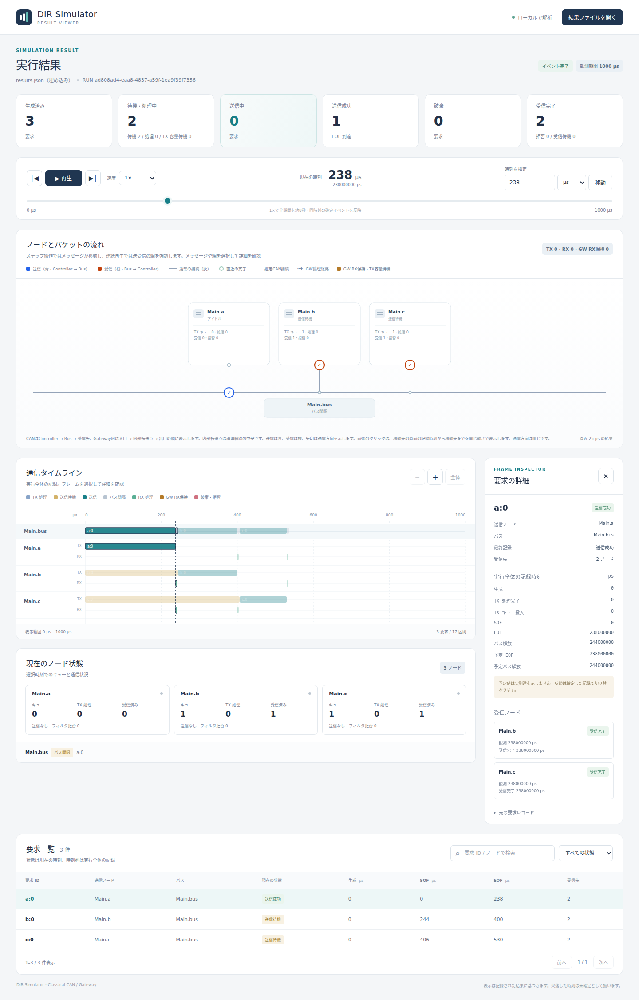

# Viewerで結果を読む

文書バージョン：`1.1.0`  
対象GitHubバージョン：`v1.1.3`  
文書ID：`guide-viewer`  
文書状態：公開用完成稿。mainへのマージ後にGitHub Pagesへ反映

### 更新履歴

| 文書バージョン | 更新日 | 更新内容 |
| --- | --- | --- |
| `1.1.0` | `2026-10-05` | 初版：公開サンプルの実行・実画面・条件変更実験、GitHub Pages公開とMarkdown再利用を整備 |

## 目的

生成した結果から「どの要求が、いつ送られ、誰が受信したか」を読めるようにします。最終結果と選択時刻の状態を区別し、予定のEOFを実際の完了と取り違えないことが目標です。

## 構成と責務

| 領域 | 何を読むか |
| --- | --- |
| 再生・時刻操作 | 観測期間の中で現在見る時刻を選ぶ |
| ノードとパケットの流れ | ControllerとBusの接続、通信方向 |
| 通信タイムライン | 実行全体の送信、待機、間隔、RX処理 |
| 現在のノード状態 | 選択時刻までに確定したキューと通信状態 |
| 要求一覧 | 要求ID、送信元、現在の状態、実行全体の時刻 |
| 要求の詳細 | 選択要求の生成・SOF・EOF・解放・受信と元レコード |

Viewerは保存結果を読むツールです。設定を変えて新しい通信結果を生成する処理は`run`の責務です。画面内で時刻を変えても結果ファイルは変わりません。

## 接続と処理フロー

```text
run → results.json → view → 結果とCSS/JSを埋め込んだ単独HTML
                              → ブラウザ内で読込と状態復元
                              → 時刻選択 → 確定済み状態と通信方向を表示
```

ブラウザ表示にRustやNode.jsは不要です。単独HTMLだけを渡しても同じ保存記録を読めます。ただし結果と入力snapshotがHTMLに入るので、共有前に内容を確認します。ここで使うデータは公開サンプルだけです。

## 最小実行例と設定

[初めてのCAN実行](初めてのCAN実行.md)で作成した結果を使います。

```bash
./target/debug/dir-simulator view --input results-guide-minimal/results.json --output guide-read-viewer.html
```

`guide-read-viewer.html`を開きます。既存ファイルは上書きしないので、新しい名前にしてください。「結果ファイルを開く」または1ファイルのドロップで別の`results.json`へ切り替えられます。

## 結果と実画面：238µsを読む

1. 時刻の表示単位をµsにします（初期値）。
2. 「時刻を指定」に`238`を入力し「移動」を押します。
3. 要求一覧で`a:0`を選びます。SOFは0µs、EOFは238µsです。
4. 要求詳細でMain.bとMain.cの受信が238µsと確定したことを確認します。
5. `b:0`はまだSOFに達していません。Busは3bitの間隔中で、次のSOFは244µsです。



撮影条件：最小例、238µs、画面幅1,440px。選択時刻で確定する状態と、タイムラインに保存された全体記録を分けて読みます。例えば`b:0`のEOF列に400µsが見えても、238µs時点でbの送信が完了した意味にはなりません。

「次のイベント時刻」で244µsへ進むとbが送信を開始します。「前のイベント時刻」でも移動先の直前区間を同じ通信方向で再表示します。時間を戻す操作が、逆方向の物理通信を作るわけではありません。

「▶ 再生」は線を青（Controller→Bus）・橙（Bus→Controller）で強調します。ステップではメッセージが移動します。1×は観測期間全体を約8秒で表示する画面速度で、CANの実時間ではありません。同時刻の内部イベント順を逐次再現するものでもありません。

## 実験：1設定を変える — 表示単位をµsからnsへ

シミュレーション入力を変えず、Viewerの「時刻の表示単位」だけをnsへ切り替えます。同じ238µsが238,000nsとして表示され、ps欄は238,000,000psのままです。要求の送信・受信状態も同じです。

この実験で変わるのは単位表示です。入力する数値にも選択単位が適用されるので、nsを選んだあとに`238`を入力すると238nsへ移動します。238µsを指定するなら`238000`を入力します。ps整数へ換算できない値や観測期間外の入力はエラーになります。

ビットレート変更の別結果は「結果ファイルを開く」で`results-guide-fast/results.json`を選びます。これが設定変更を結果へ反映する手順です。

## 制約と関連機能

タイムライン描画は最大500区間、要求一覧は75行ずつです。省略表示やページ移動は母数を変えません。未到達の予定EOF・解放・受信を実績として補いません。`partial: true`の結果では「部分結果」を確認し、未確定時刻を完了として数えないでください。

現行v1.1.3はCAN/GatewayのほかEthernet各profile、CAN FD外部位相bit数、AXI/SoC/AHB/NoC/メモリ・IPC初期transaction profileへも対応しています。モデルにより専用画面とレコードが切り替わります。このページの操作と数値の検証はClassical CAN最小例です。

接続の読み方は[初めてのCAN実行](初めてのCAN実行.md)、送信順の理由は[CANの調停](CANの調停.md)、エラーへの対処は[設定・用語・FAQ](設定・用語・FAQ.md)を参照してください。
