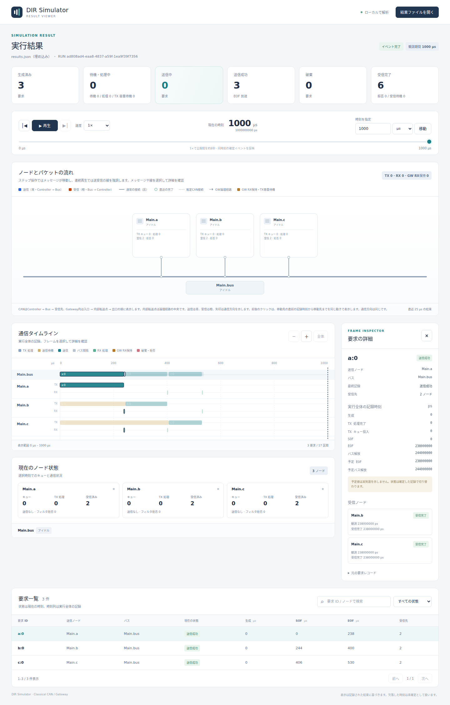
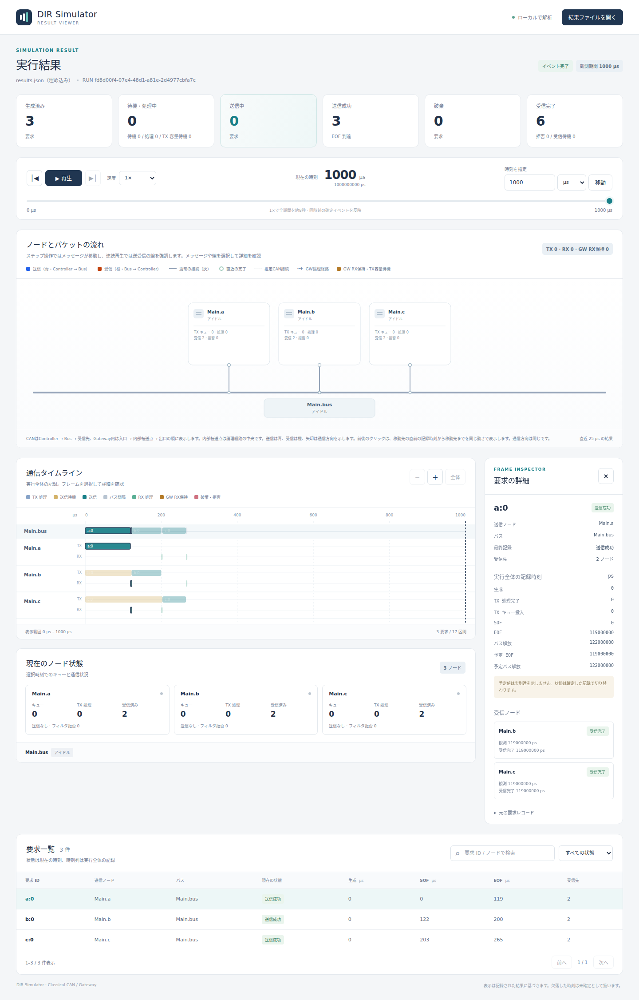

# 初めてのCAN実行

文書バージョン：`1.1.0`  
対象GitHubバージョン：`v1.1.3`  
文書ID：`guide-first-can`  
文書状態：公開用完成稿。mainへのマージ後にGitHub Pagesへ反映

### 更新履歴

| 文書バージョン | 更新日 | 更新内容 |
| --- | --- | --- |
| `1.1.0` | `2026-10-05` | 初版：公開サンプルの実行・実画面・条件変更実験、GitHub Pages公開とMarkdown再利用を整備 |

## 目的

3つのControllerから1つのBusへ同時に送信要求を出し、どの順番で送られるかを確認します。1回だけの送信に絞るため、最初の通信を数値と画面で追えます。最後にビットレートだけを変え、時間がどう変わるかを確かめます。

## 構成と責務

| 要素 | 責務 | 今回の設定 |
| --- | --- | --- |
| `Main.a / b / c` | 生成された要求をTXキューに置き、Busへ送る。受信フィルタとRX処理を持つ | キュー64、処理遅延0、全ID受信 |
| `Main.bus` | 送信権を選び、フレームと3bitの送信間隔を管理 | 500kbps、理想Classical CAN |
| `Wire` | ControllerとBusを接続し、固定遅延を与える | 遅延0 |
| NED | ノード・型・ポート・接続の構造を定義 | `models/demo/Main.ned` |
| INI | 構造の選択、時間、パラメータの上書き、入力ファイル参照 | `minimal.ini` |
| workload JSON | いつ、どのノードが、何を送るかを定義 | `minimal.json` |

送信は`Controller.tx → Bus.rx_*`、受信は`Bus.tx_* → Controller.rx`です。NEDの`input/output`はそのモジュールから見た向きです。Busの`rx`はBusへの入力なので、Controllerの送信と接続します。

## 接続と処理フロー

```text
Main.a.tx ──→ Main.bus.rx_a   Main.bus.tx_a ──→ Main.a.rx
Main.b.tx ──→ Main.bus.rx_b   Main.bus.tx_b ──→ Main.b.rx
Main.c.tx ──→ Main.bus.rx_c   Main.bus.tx_c ──→ Main.c.rx

JSONで生成 → TX処理 → TXキュー → 調停 → SOF → EOF
                                      → 受信観測 → フィルタ → RX処理完了
                               EOF → 3bit間隔 → Bus解放 → 次の調停
```

同じフレームを複数Controllerが受信できます。送信要求数と受信件数は一致しません。この例では送信元自身へ返さず、他の2ノードが受信するので、送信3要求に対して受信は6件です。

## 最小実行例と設定

このガイドを同梱したmainには、`examples/guide/can`の実習入力も入っています。リポジトリを取得して、そのルートから以下のコマンドを実行します。

```bash
git clone https://github.com/hideki-ozu/DIR-Simulator.git
cd DIR-Simulator
```

公開タグv1.1.3の作業コピーから始める場合は、[実習入力ZIP](downloads/can-guide-inputs.zip)をダウンロードしてリポジトリルートに展開します。ZIPは`examples/guide/can`以下のNED・INI・JSONだけを含みます。既存の同名ファイルがある場合は、別の作業コピーを使ってください。


Rust 1.85.0が使えるLinux/macOS、またはWindowsのWSLで、リポジトリのルートから実行します。初回ビルドにはRust依存の取得が必要です。以下はBashのコマンドです。

```bash
cargo build --locked -p dir-simulator
./target/debug/dir-simulator validate --config examples/guide/can/minimal.ini
./target/debug/dir-simulator run --config examples/guide/can/minimal.ini --output results-guide-minimal
./target/debug/dir-simulator view --input results-guide-minimal/results.json --output guide-minimal-viewer.html
```

出力ディレクトリとViewerファイルには未存在の名前を指定します。再実行は新しい名前へ出力してください。`validate`の`status: valid`は入力検証の成功、`run`の`exit_code: 0`・`partial: false`は今回の実行成功です。Viewer HTMLをブラウザで開きます。ブラウザはCLIから自動起動しません。

`examples/guide/can/minimal.ini`は次の設定です。

```ini
[General]
network = demo.Main
ned-path = "models"
sim-time-limit = 1ms
metrics-window = 1ms
Main.bus.bitrate = 500kbps
Main.a.queueCapacity = 64
Main.b.queueCapacity = 64
Main.c.queueCapacity = 64
workload = "minimal.json"
```

`ned-path`と`workload`はINIのあるディレクトリから解決します。JSONの送信者は次の3つです。`id`欄のCAN IDは10進数で、0x100は256です。`data`は16進数文字列で、2文字が1byteです。

| generator ID | node | CAN ID | data | start / period / count |
| --- | --- | --- | --- | --- |
| a | Main.a | 256（0x100） | 0102030405060708 | 0ps / 1ms / 1 |
| b | Main.b | 512（0x200） | aabbccdd | 0ps / 1ms / 1 |
| c | Main.c | 768（0x300） | 1122 | 0ps / 1ms / 1 |

1つのgeneratorの書式は以下です。完全なJSONには同じ形でbとcも入り、`schema_version: 1`と`generators`配列を持ちます。リポジトリに完全な実行入力を同梱しています。

```json
{
  "id": "a", "kind": "can.periodic.v1", "node": "Main.a",
  "start": "0ps", "period": "1ms", "count": 1,
  "frame": {"format": "standard", "id": 256, "data": "0102030405060708"}
}
```

## 結果と実画面

実行で生成された要求をµsへ換算した値です。内部時刻はps整数で、1µs = 1,000,000psです。

| 要求 | frame bit数 | SOF（µs） | EOF（µs） | Bus解放（µs） |
| --- | --- | --- | --- | --- |
| a:0 | 119 | 0 | 238 | 244 |
| b:0 | 78 | 244 | 400 | 406 |
| c:0 | 62 | 406 | 530 | 536 |

3要求はすべて`success`、受信6件、破棄0件です。`a:0`はgenerator aの最初の要求で、CAN IDとは別の識別子です。最後のイベントは536µsですが、集計の観測終了は設定の1msです。`events_exhausted`は後続イベントがなくなった終了を表し、障害ではありません。

119bitを500,000bit/sで送る時間は238µsです。ここにはCRCや内容依存のbit stuffingを含み、8byteのpayloadを64bitだけとして計算してはいけません。3bitの間隔は6µsで、次のSOFはEOF直後ではなくBus解放時です。



撮影条件：同梱最小例、時刻1,000µs、先頭要求を選択、Chromium、画面幅1,440px。画面は実際のViewer出力で、説明用の作図ではありません。

`results.json`は要求・受信・計測の正本、`events.csv`と`summary.csv`は分析用、`diagnostics.jsonl`は診断、`manifest.json`は出力ファイルのサイズとSHA-256です。CLIの終了だけでなく、manifestと結果を保存すると再確認できます。

## 実験：1設定を変える — 500kbpsから1Mbpsへ

`fast.ini`は`Main.bus.bitrate = 1Mbps`だけを変えています。workloadと配線は同じです。

```bash
./target/debug/dir-simulator run --config examples/guide/can/fast.ini --output results-guide-fast
./target/debug/dir-simulator view --input results-guide-fast/results.json --output guide-fast-viewer.html
```

| 要求 | SOF（µs） | EOF（µs） | Bus解放（µs） |
| --- | --- | --- | --- |
| a:0 | 0 | 119 | 122 |
| b:0 | 122 | 200 | 203 |
| c:0 | 203 | 265 | 268 |

bit数と送信順は同じで、送信時間・間隔・待ち時間が半分になります。固定遅延や処理遅延が0なので、この例では全時刻がきれいに半分です。遅延を設定した別モデルへ、この比例関係をそのまま当てはめないでください。



撮影条件：速度変更例、時刻1,000µs、先頭要求を選択、幅1,440px。

## 制約と関連機能

理想ACKのClassical CANデータフレームを扱う例です。エラー状態・再送や実配線の電気特性は再現しません。キュー64で生成各1回のため、過負荷や低優先度の飢餓は観測しません。容量実験は既存`examples/can/overload.ini`、複数バス/Gatewayは`examples/gateway`が別の入口です。

次は[Viewerで結果を読む](Viewerで結果を読む.md)で送信と受信の時刻を追い、[CANの調停](CANの調停.md)で優先順位だけを変えます。
