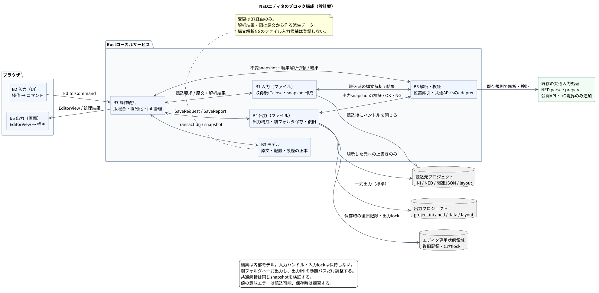
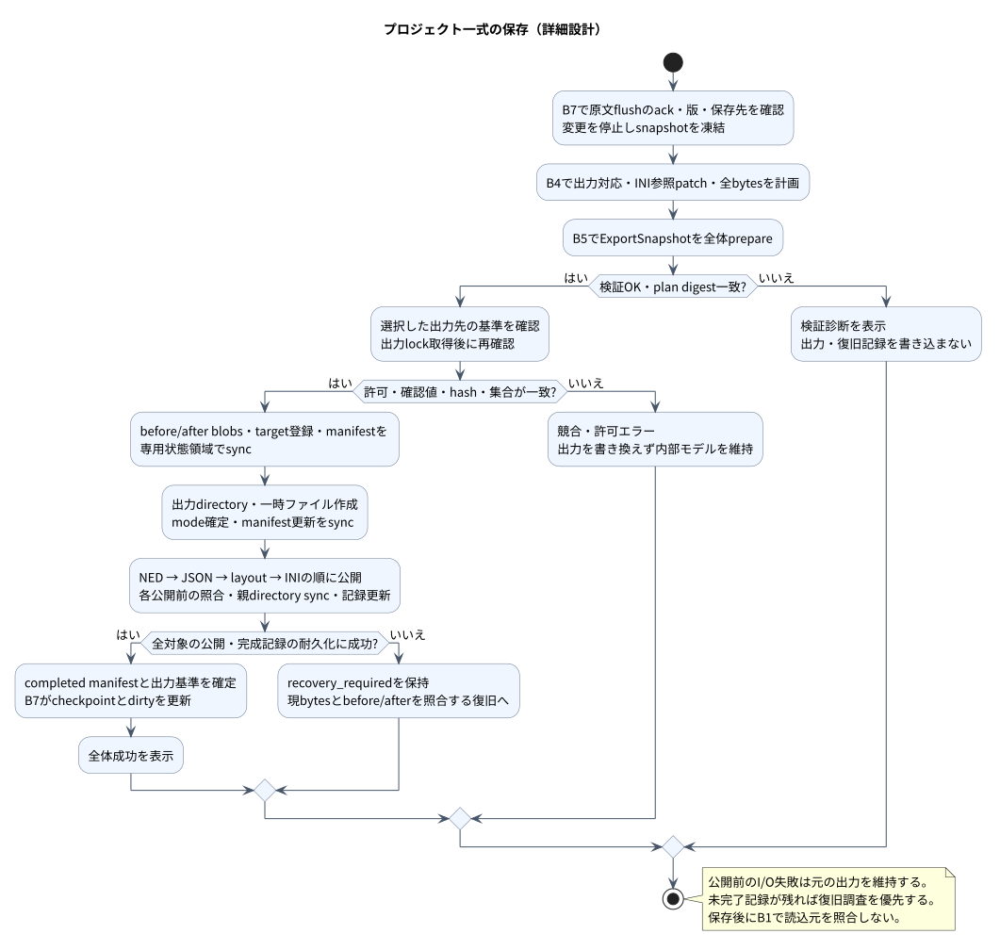
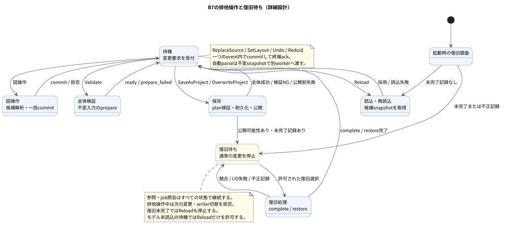
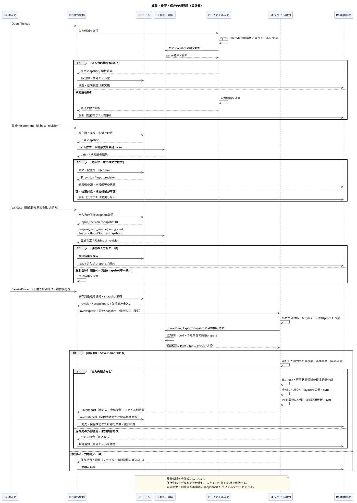

# NED-editor仕様書

文書バージョン：`1.0.1`
対象GitHubバージョン：`v1.0.0`

### 更新履歴

| 文書バージョン | 更新日 | 更新内容 |
| --- | --- | --- |
| `1.0.1` | `2026-10-04` | PRレビューに基づき、保存先登録のwriter契約・復旧投影・入力互換性・操作表示を補正。追加変更の検証状態を区別 |
| `1.0.0` | `2026-10-04` | 初版。共通パーサーを使う7ブロック、内部テンプレート・全標準部品、UIでのmodule組立・Gateway／送信設定、原文・履歴・保存／復旧と実装試験を記載 |

文書ID：`tool-ned-editor-spec`

文書状態：実装とレビュー補正に対応。第1節は合意済み方針、第2節以降はその方針に基づく設計。ブロック別に型・API・状態遷移・処理手順・異常時の契約まで詳細化した。7ブロックを実装し、実装試験の証拠と適用範囲を第15節へ記録する。文書版は初回push準備時に確定した。

文書版はレビュー補正を含む。対象タグは既存パーサーの参照基準であり、エディタの提供版ではない。

本書は機能仕様、内部設計、設計判断、受入条件を一冊で管理する。[取扱説明書](NED-editor取扱説明書.md)は提供状況と利用手順を管理する。

## 1. 目的と合意済み方針

NEDの構造を図とソースで確認・編集し、DIR Simulatorへ渡す入力を作成する。

| 項目 | 合意済み方針 |
| --- | --- |
| 実装配置 | エディタ固有の実装は`crates/dir-simulator/src/tool/ned-editor/`に配置する |
| 文書配置 | `docs/tools/ned-editor/`の本書と取扱説明書で管理する。設計資料は本書へ集約する |
| 共通解析 | 現在のNEDパーサーをシミュレータと共用する |
| 許容する共通側の変更 | 解析関数の公開、結果の参照API、入力の受け渡しなど、共用に必要な変更を認める |
| 共通側の維持範囲 | エディタを理由に既存の文法・受理条件・解析／検証ロジック・CLIの挙動を変更しない |
| エディタ側の追加機能 | 原文、編集位置、編集中の構造、配置、Undo／Redo、保存を別管理する |
| ファイル入力の採用条件 | 構文解析に失敗した入力候補は破棄する。構文解析が成功すれば、数値範囲などの意味上のエラーがあっても読み込む |
| ファイル出力の条件 | 保存前の全体検証にエラーがあれば書き出さず、診断を表示する |
| 編集と保存 | 読込後はファイルを閉じ、内部モデルを編集する。通常はINI・関連JSONを含むプロジェクト一式を別フォルダへ保存し、上書きは明示的に選ぶ |

NED文法は[NED詳細機能仕様書](../../specs/NED詳細機能仕様書.md)、実験条件は[設定詳細機能仕様書](../../specs/設定詳細機能仕様書.md)、GWの経路は[GWモデル詳細機能仕様書](../../specs/models/GWモデル詳細機能仕様書.md)を参照する。本書でこれらの文法や結果schemaを再定義しない。新しい要求・機能IDの割当と正式な工程別追跡は未整備であり、既存トレーサビリティ検査の合格を本ツールの仕様完備・実装合格と扱わない。

## 2. 設計の前提と初期版

本書の型・状態名は責務を示す設計表現であり、private型の逐語的な定義ではない。公開共通APIとCLIは実装済みで、内部実装への対応は第15節に記載する。既存の[入力処理](../../../crates/dir-simulator/src/input.rs)と[NED解析](../../../crates/dir-simulator/src/input/ned.rs)を参照して設計する。

| 項目 | 本設計で採る方式 |
| --- | --- |
| 提供形態 | RustのローカルサービスとブラウザGUI。UI資産を同梱し、外部サービスを必要としない |
| 起動 | `dir-simulator ned-editor [--config PATH]`で1プロジェクトを開く。config省略時は内部Multibusテンプレートから新規作成する。`--export-root PATH`は保存先の許可親（省略時は起動cwd）、`--state-root PATH`は復旧・lock領域の指定（省略時は第8.3節の既定値）。loopbackの空きポートで待ち受け、URLを表示する。ブラウザの自動起動は行わない |
| プロジェクト | 既存INIの読込または内部テンプレートからの新規作成。1プロセス1プロジェクト、1編集クライアント。新規作成時は現在のモデルを明示確認して置き換える |
| 編集対象 | B3に取り込んだNED・INI・workload・model-config JSONの原文と配置情報。入力参照パスの変更は外部変更とReloadへ分離する。別フォルダ出力では現在JSONを複製し、出力INIの参照パスだけ調整する |
| 図の操作 | 型内の子配置・削除、gate間の結線・削除・再接続、module型・境界ポート・Bus gate組の追加、パラメータdefault編集、移動・整列。対応NED全体はソースでも編集できる |
| 型操作の境界 | paletteは読込済みsimple/moduleと全標準部品。新規module型は現在のNEDへ追加する。型名／package変更・ファイル移動・共有祖先の複製は図操作の範囲外 |
| CAN補助 | 空きgateがある場合にTX/RXの2接続を一操作で作る。Bus型へのgate自動増設は行わない |
| 保存 | 基本操作は別フォルダへのプロジェクト保存。未編集のNED・INI・関連JSONも含めて出力し、保存前のチェックに合格した内容だけ書き出す。元または既存の出力プロジェクトへの上書きは別操作とする |
| 正式判定 | 共通パーサーと既存の実行準備処理を正とする。図の表示成功と実行可能性は別に表示する |
| 設定フォーム | 実行制限、実体別INI上書き、Gatewayのports/routes・容量・遅延、explicit/periodic送信定義。通常のINI/JSONに反映し履歴へ含める |
| 後段へ分離 | 任意の新規ファイル作成、実体固有の型複製、一括リネーム、シミュレーション実行とviewer連携 |

初期の動作確認対象はLinux／WSL2上のサービスとChromium系ブラウザとし、ブラウザの検証版を実施記録へ残す。HTTPライブラリ等の具体的な依存版は実装時にRust 1.85.0との適合を確認して固定する。これは配信実装の選定であり、下記のブロック責務・保存契約を変える理由にはしない。

<a id="block-architecture"></a>

## 3. ブロック構成とインタフェース



[図のソース](../../diagrams/tool-ned-editor-spec/tool-ned-editor-spec--editor-blocks--component.puml)

| ID・ブロック | 入力 | 出力 | 責任・境界 |
| --- | --- | --- | --- |
| [B1 入力（ファイル）](#file-input-design) | INIパス、再読込要求 | `LoadedProject`（原文snapshotと解析結果）、読込診断 | ファイルを取得して閉じ、B5へ構文解析を依頼。成功した入力候補だけ返す |
| [B2 入力（UI）](#ui-input-design) | キー・マウス・フォーム・ソース編集 | `EditorCommand` | 操作を意味のあるコマンドへ変換。ファイルや正本モデルを直接変更しない |
| [B3 モデル](#model-design) | snapshot、編集transaction、解析結果、保存結果 | 不変snapshot、履歴、dirty状態 | 原文・編集構造・配置・版番号の正本を一元管理 |
| [B4 出力（ファイル）](#file-output-design) | `SaveRequest`、復旧指示 | `SaveReport`、保存ファイル、復旧記録 | B5への保存前検証依頼、競合確認、段階保存、失敗・再起動時の復旧 |
| [B5 解析・検証](#analysis-design) | B1/B4/B7からの依頼、原文snapshot、project context | `AnalysisResult`、編集位置対応 | 共通解析・実行準備を呼び出す。編集用位置索引のみエディタ側で追加 |
| [B6 出力（画面）](#view-design) | `EditorView` | 構成図・ソース・プロパティ・診断 | モデルの投影を描画。NEDの意味を独自に確定しない |
| [B7 操作統括](#controller-design) | command、各ブロックの応答 | 編集transaction、解析依頼、SaveRequest、EditorView | 操作の直列化、版照合、ジョブ管理、ブロック間の調停 |

機能ブロックは初期案の7つとする。B1/B4はファイルシステム境界、B2/B6はブラウザ境界、B3は状態の正本とする。B5は解析中にB3を書き換えず、B7が結果の版を照合してから採用する。B7を独立させることで、モデルへHTTP・ファイルI/O・非同期ジョブを持ち込まない。

### 3.1. 共通データ契約

| データ | 主なフィールド・意味 |
| --- | --- |
| `ProjectSnapshot` | project/session ID、INI論理パス、cwd、許可パス、探索ルート順、ファイル集合、取得内容・hash、ディレクトリ情報、snapshot ID |
| `LoadedProject` | 構文解析に成功した`ProjectSnapshot`と`AnalysisResult`。B1がB7へ返す入力候補 |
| `EditorCommand` | `command_id`、`session_id`、`client_id`、`writer_epoch`、単調増加`client_sequence`、`base_revision`、`kind`、payload。command IDはclient IDとsequenceの組。revision・sequence・byte位置などの64 bit整数はJSONでは十進文字列 |
| `EditTransaction` | 原文patch群、配置の差分、影響対象、逆操作、適用前の版。全patchを検査した後に一括commitする |
| `TextPatch` | `file_id`、`expected_hash`、`start_byte`、`end_byte`、置換UTF-8文字列。範囲は半開区間で同一旧版を基準とする |
| `AnalysisResult` | `input_revision`、snapshot ID、ファイル別parse結果、編集位置索引、構造投影、診断、prepare結果 |
| `OutputTarget` | 入力のfile IDとは別の保存先ID、許可出力親、保存先、`new_project/source_project/managed_export`、出力側の基準集合・hash |
| `SaveRequest` | `save_id`、固定revision・snapshot IDと取得済み不変snapshot、保存先ID、`save_as/overwrite`、上書き確認値とそのauthorized plan digest。B7からB4への依頼 |
| `SavePlan` | B4が構築する入力ID→出力パス対応、出力INI・NED・JSON・layoutのbytes、新hash、各対象の`before=absent \| present(hash, mode)`、出力snapshot ID、plan digest |
| `ExportSnapshot` | SavePlanの全入力bytesと予定ディレクトリ情報、出力INIパス・cwd。ディスク書込前にB5へ渡す検証対象 |
| `SaveReport` | `save_id`、全体状態、検証対象版・診断、ファイル別`unchanged/saved/conflict/failed/not_attempted`、実際のhash、復旧記録のID。検証NGなら全対象は`not_attempted` |
| `EditorView` | revision、input_revision、ファイルと型一覧、現在の図、プロパティ、dirty/解析/保存状態、診断、利用可能コマンド |

通常のブロック間呼出しはRust内で行う。HTTPを通るのはB2からの操作・照会要求と、B6向けEditorView・処理結果である。ブラウザから絶対パスを指定して保存するAPIは作らず、サーバーが発行したfile ID・保存先IDを使う。

HTTPのstatusは200=完了、202=非同期jobの受領、400=要求形式不正、403=権限不正、409=版・保存競合、410=照会結果の期限切れ、413=入力上限、422=適用できない操作、500=I/O等の処理失敗、503=未受領の混雑とする。失敗応答にもcommand/job IDと構造化codeを含める。202は変更完了のackではなく、同じクライアントの次の変更はjobの終端応答まで待つ。

初期のHTTP要求body上限は64 MiBとし、EditorViewに上限値を含める。UIはJSON符号化後のbyte数を確認し、超過時はローカル入力を保持して送信を止める。履歴上限とは別の通信上限であり、どちらも共通NEDパーサーの受理条件へ追加しない。

### 3.2. 代表処理

| 操作 | 処理の流れ |
| --- | --- |
| 起動・再読込 | B7→B1でファイル取得→B1→B5で構文解析→B1→B7へ応答。成功時だけB7→B3へ原文と解析結果を登録→B6表示。失敗候補は破棄 |
| 図による結線 | B2→B7→B3の旧版確認→B5の索引を用いてpatch作成・候補再解析→B3へ一括適用→旧prepare結果を失効→B6更新。全体検証は明示Validate／保存で実施 |
| ソース編集 | B2→B7→B3へ原文変更→B7→B5で遅延解析→B7が対象版を確認してB3へ反映→B6へ診断・図更新。構文エラーでも原文を保持 |
| 配置変更 | B2→B7→B3の配置だけ変更→B6更新。input_revisionと正式判定は維持 |
| エラーチェック | B2→B7→B5へ依頼→B5がB3の固定snapshotを検証→B7へ応答→B3へ診断反映→B6表示 |
| 別フォルダ保存 | B2→B7がモデルを凍結→B4へSaveRequest→B4が出力構成を作成→B5で出力snapshotを検証。NGならB7→B6、OKならB4が出力先確認・書込→B7がB3へ結果反映→B6表示 |
| 上書き保存 | B2→B7が保存先と上書き確認値を照合→B4で同じ版の検証・選択した出力先の競合確認・書込→B7→B6。元入力への書込はこの明示操作だけ |

### 3.3. コントロール部と解析依頼の分担

B7はB2の要求を受け付け、B1へのファイル入力、B4へのファイル出力、B5へのエラーチェック、B3へのモデル変更を指示する。各処理の成功・失敗を受け取り、B6へ表示内容を渡す。

B1は読込手順の中でB5へ構文解析を依頼し、原文と解析結果をB7へ返す。B7がB3へ登録し、B3が内部モデル化する。B4は保存手順の中でB5へ全体検証を依頼する。保存前の検証ではB4がB3の固定版から出力先の構成を作り、B5がそのExportSnapshotを検証してB4へ結果を返す。読込候補の解析ではB1が渡したsnapshotを使う。B5からB3への書込やB6への直接通知は行わない。

B7からB5への明示エラーチェックも同じ検証入口を使う。B7は対象版を確認して診断をB3へ反映し、B6で表示する。B4の保存後にB1へ入力を再照合する呼出しは設けず、保存時は選択した出力先の競合だけをB4で確認する。読込元は自動監視・自動再読込せず、明示的なReloadでのみB1から再取得する。

<a id="detailed-design-map"></a>

### 3.4. 詳細設計項目と内部呼出しの契約

次の`NE-D`は本書内の固定識別子とし、正式な要求・工程traceのIDには数えない。根拠は第1〜3節の機能・責務と各ブロックの規則である。

| 設計ID | 担当 | 具体化する契約 | 主な確認先 |
| --- | --- | --- | --- |
| [NE-D01](#dd-input-snapshot) | B1 | 入力所有権、二回収集、候補採用、Reload | NE-C01・02・17・19 |
| [NE-D02](#dd-ui-buffer) | B2 | 入力バッファ、flush、UTF-8／UTF-16対応 | NE-C03・05・22 |
| [NE-D03](#dd-model-state) | B3 | 状態型、版、dirty、transaction、履歴 | NE-C04・08・09・23 |
| [NE-D04](#dd-output-plan) | B4 | 出力計画、競合、公開、復旧schema | NE-C10〜13・18〜21・27 |
| [NE-D05](#dd-analysis-api) | B5 | 共通API、snapshot I/O、索引とpatch | NE-C06〜08・17・18・24・25 |
| [NE-D06](#dd-view-projection) | B6 | 表示DTO、状態優先順位、gateと階層の投影 | NE-C07・14・26 |
| [NE-D07](#dd-controller) | B7 | コマンド受付、job、書込権限、応答 | NE-C05・08・15・16・22・28 |

サービス内は`Arc<ProjectSnapshot>`を渡し、B5にB3への参照を持たせない。B1は候補snapshot、B7は採用済みsnapshot、B4はExportSnapshotを渡す。B5の入力と出力には同じ対象識別子を付ける。snapshot取得は依頼側の責任とし、B5からモデルを読み直す呼出しを設けない。

`FileId/SessionId/ClientId/TargetId/JobId/SaveId/SnapshotId`は混同を防ぐnewtypeとし、外部へは不透明な文字列で返す。`Revision/InputRevision/WriterEpoch`は`u64`のnewtype、`ContentHash/PlanDigest`はSHA-256の32 bytesとし、JSONでは64桁の小文字hexにする。snapshot IDは内容digestと別で、同じbytesでも異なる採用を識別する。byte数・位置はRustでchecked変換し、上限超過・加算overflowを正常値へ丸めない。

内部エラーは`EditorError { code, http_status, message, target, retryable, current_revision }`とし、`target`はfile/element/target/jobの任意の識別子を持つ。共通`Diagnostic`は別フィールドに元の値を保持する。I/Oや共通判定の失敗を空の成功結果へ置換しない。

<a id="model-design"></a>

## 4. B3 モデルの詳細設計

### 4.1. 状態と所有権

B3はRust側の`EditorSession`に所有させ、B7だけが変更権限を持つ。ブラウザのソース入力欄は送信前バッファを持つが、永続モデルの別正本にはしない。

| モデル | 保持内容 |
| --- | --- |
| `ProjectContext` | INI・関連JSONの読込snapshot、選択network、NEDルート、profile、読込元の来歴。出力先へ保存してもこの読込contextを置換しない |
| `SourceDocument` | file ID、不変の読込元論理パス・読込bytes/hash、現在原文UTF-8、最後の完全な保存内容のhash、BOM、改行情報、parse状態 |
| `TypeCatalog` | 共通parse結果の型名・種別・子・gate・パラメータ・接続の読取projection。原文から再構成可能な派生データ |
| `EditIndex` | 要素キーとtoken/statement/bodyのbyte範囲、空白・コメントの位置、該当input_revision |
| `DraftGraph` | 型単位の直下構造と未解決参照。未接続や型不一致を表現できる表示用構造 |
| `LayoutDocument` | 型と子宣言をキーにした座標・折り畳み状態、schema版、読込／保存hash |
| `AnalysisState` | ファイル別構文状態、内部モデルの全体検証と出力plan検証を区別した状態、診断、結果の対象版・snapshot ID／plan digest |
| `History` | 原文と配置のforward/reverse transaction、Undo／Redo cursor、保持量 |
| `SaveState` | idle/saving/conflict/recovery_required、ファイル別保存結果、最後の完全な出力先・出力context・基準集合/hash、未出力状態 |

原文が意味情報の正本、layoutが表示位置の正本である。ASTやDraftGraphから原文全体を再生成しない。`PreparedSimulation`は検証成功時の派生結果であり、編集中モデルを置き換えない。読込元パスと出力先パスは別管理し、通常保存の成功を「元ファイルを変更した」と表示しない。B3は取得済みbytesとmetadataだけを保持し、入力ファイルやディレクトリのハンドル、mmap、入力lockを保持しない。

### 4.2. 識別子・版・dirty

- `file_id`はセッション内の不変IDとし、クライアント入力のパスから作らない。
- 要素キーは`(file_id, 型完全名, 種別, 宣言名)`を基本とする。接続は親型・始点・終点・channelと出現番号を使い、同じ記述の重複も識別する。
- 実体パスは表示・検証用の派生値であり、型定義を編集するキーと区別する。循環や未解決型はplaceholderで止め、無限に展開しない。
- `revision`は原文・配置・contextの実変更とUndo／Redoのcommitごとに単調増加する。Undoで過去のrevisionへ戻さない。
- `input_revision`はNED原文またはINI/JSON/探索集合の採用変更で増加する。配置・選択・保存済み印の変更では増やさない。
- dirtyは現在bytesと読込時または最後の完全な保存内容のhash比較で求める。Undoでその内容へ戻ればdirtyは解消できる。別名保存済みか、元内容と異なるか、最後の出力先は別の情報として保持する。dirtyがなくても新しい保存先への一式出力は可能とする。
- 選択・zoom・スクロールはクライアント表示状態とし、revisionを増やさない。node座標の確定操作はlayout編集として増やす。

同一完全名の型が重複している場合は宣言出現番号も表示上の識別に加え、曖昧な型参照を必要とする図操作は停止する。

ソース編集後は同じキーを一意に照合できた要素だけ選択・配置を引き継ぐ。曖昧な場合は選択を解除する。名前変更を推測して別の型へ配置を割り当てない。古いlayoutエントリは未対応項目として保持し、明示的な整理操作まで捨てない。

### 4.3. 原文patchと履歴

`apply_transaction(base_revision, transaction)`は、版・file ID・旧hash・範囲境界・patch非重複をすべて確認する。UTF-8コードポイントの途中を範囲境界にせず、UIからのUTF-16サロゲート途中の指定も拒否する。同一ファイルへのpatchはbyte位置の降順で適用する。失敗時は原文・配置・履歴のいずれも変更しない。

図操作の候補原文は共通パーサーで構文解析してからcommitする。意味上の不整合はcommitを許可し、正式検証で診断する。編集中のソース編集は構文不正でもcommitを許可する。この扱いはファイル入力候補の採用条件とは別であり、保存時は構文不正を拒否する。削除した子に直接接続する同じ親型の辺は同一transactionで削除し、ほかの型・INI・JSONは自動変更しない。標準型追加に伴う明示確認済みのプロファイル移行は、第16節の例外として関連NED・INIと新しいmodel-configを一括変更する。

Undo／Redoは原文patchと配置差分を一緒に適用し、原文が変わった場合だけ入力の解析結果を失効させる。配置だけのUndo／Redoは正式判定を維持する。実変更のある新規編集でRedo側を破棄する。初期上限は200操作かforward/reverseの原文・配置payload合計32 MiBの早い方とし、超過時は古い履歴から除去して保持範囲を表示する。単独操作が上限を超える場合は送信前に拒否し、黙ってUndo不能な編集を成立させない。

### 4.4. 解析状態

| 状態 | 表示・編集 |
| --- | --- |
| `pending` | 原文の最新版を表示し、図は解析版を明示。当該ファイルの索引を必要とする図操作を一時停止 |
| `syntax_error` | 編集中のソース修正が可能。保存は拒否。対象ファイルの直前図を古い図として表示 |
| `parsed` | 現行原文から図を構成可能。意味不正・未接続を含んでも図編集を許可 |
| `prepare_failed` | 同じ入力snapshotに対する既存prepareの失敗を表示。ソース・図の編集は継続 |
| `ready` | 同じinput_revisionの全体prepareが成功。「実行準備OK」を表示 |
| `output_conflict` | 選択した保存先の状態が確認済み基準と不一致。内部モデルは維持し、その保存を拒否 |

表は状態表示の一覧であり、一つの排他的enumではない。構文状態はファイル単位、prepare状態はプロジェクト単位、dirty・出力先競合・保存状態は独立した軸として保持する。別ファイルの構文不正だけで解析可能な型の編集まで一律に止めず、不明な参照先を必要とする操作のみ拒否する。

<a id="dd-model-state"></a>

### 4.5. NE-D03 実装状態と版の契約

以下の型・メソッドは責務と前提条件を示す設計スケッチである。実装は`EditorSession`と`ProjectSnapshot`の固定コピー、およびhash/epoch付きの解析結果を使用する。B3の可変参照を所有するのはB7だけとし、workerへは`FrozenProject`のみ渡す。snapshotには取得済みbytes／metadataだけを含み、入力handleを含めない。

```rust
struct InputStamp { revision: InputRevision, snapshot: SnapshotId, digest: ContentHash }
struct ModelStamp { revision: Revision, input: InputStamp }
struct FrozenProject { stamp: ModelStamp, snapshot: Arc<ProjectSnapshot> }
struct EditorSession {
    stamp: ModelStamp,
    context: Arc<ProjectContext>,
    documents: BTreeMap<FileId, SourceDocument>,
    layouts: BTreeMap<FileId, LayoutDocument>,
    analysis: AnalysisState,
    history: History,
    checkpoint: ContentCheckpoint,
    last_complete_output: Option<OutputCheckpoint>,
    outputs: BTreeMap<TargetId, OutputBaseline>,
}
struct FileStamp { file: FileId, source_hash: ContentHash, context_epoch: u64 }
enum SyntaxState {
    Pending(FileStamp),
    Parsed { stamp: FileStamp, projection: Arc<ParsedProjection>, index: Arc<EditIndex> },
    Error { stamp: FileStamp, diagnostics: Arc<[EditorDiagnostic]> },
}
enum PrepareState {
    Unchecked,
    Running(JobTicket),
    Failed { stamp: InputStamp, diagnostics: Arc<[EditorDiagnostic]> },
    Ready { stamp: InputStamp, prepared: Arc<PreparedSimulation> },
}
```

`SourceDocument.text: Arc<str>`はBOMを含む原文であり、改行を正規化しない。ファイル別に`SyntaxState`と表示専用`last_good`を分ける。古い図の索引を編集に使わない。`context_epoch`はpackage解釈・論理パス対応・入力context変更時に増やし、ファイル索引は原文hashとcontext epochが一致する場合だけ再利用する。型集合projection・参照解決は入力版ごとに更新し、未変更ファイルの索引再利用で古い参照解決を流用しない。

| 状態値 | 更新規則 |
| --- | --- |
| `revision` | bytes/layout/contextの実変更、Undo/Redoでchecked_add。no-op、選択、解析反映、保存済み印では増やさない |
| `input_revision`／入力snapshot ID | 原文/context/入力集合の実変更でinput_revisionを増やす。snapshot IDは入力変更と成功Reloadで新規発行。layoutのみでは両方維持 |
| 全体prepare | input_revision＋snapshot ID＋digest一致の結果だけ現行採用。原文変更で失効、layoutのみでは維持 |
| 出力検証 | input stampに加えExportSnapshot IDとplan digestへ結び付ける。layoutを変えた古いplanを再利用しない |
| 読込来歴 | 元論理パス・取得bytes/hash。別フォルダ保存では置換しない |
| `checkpoint` | 初回取得内容、または最後に完全保存した原文／採用配置の内容digest。dirtyはこれとのキー集合・内容差で判定 |
| `outputs[target]` | 当該出力先だけの集合／hash／出力context。別targetの成功で変更しない |

layoutはディスク原bytesのhashと採用配置の内容digestを分離する。後者は規定の固定キー順直列化で比較し、読込時の空白差をdirtyとしない。出力INIの参照書換えhashは出力基準へ保持し、内部contextのdirty比較に混ぜない。`differs_from_origin`・`never_exported`・`dirty`は独立表示する。部分保存・restoreではcheckpointを更新しない。revision等のu64整数はwire上十進文字列、overflowは無変更のエラーとしwrapしない。

<a id="dd-transactions"></a>

### 4.6. transaction・履歴の適用アルゴリズム

```rust
struct TextPatch { file_id: FileId, expected_hash: ContentHash,
                   start_byte: usize, end_byte: usize, replacement: Arc<str> }
struct EditTransaction { source: Vec<TextPatch>, layout: Vec<LayoutDelta>, origin: EditOrigin }
struct HistoryEntry { forward: EditTransaction, reverse: EditTransaction, retained_bytes: usize }
struct History { entries: Vec<HistoryEntry>, cursor: usize, retained_bytes: usize }
impl EditorSession {
    fn freeze(&self) -> FrozenProject;
    fn apply_transaction(&mut self, base: Revision, tx: EditTransaction) -> Result<CommitReceipt, EditorError>;
    fn undo(&mut self, base: Revision) -> Result<CommitReceipt, EditorError>;
    fn redo(&mut self, base: Revision) -> Result<CommitReceipt, EditorError>;
}
```

1. revision・file ID・旧hash・UTF-8境界・範囲・patch非重複・layout旧値を検査。同位置の複数挿入は一つへ正規化できなければ拒否する。
2. side bufferへ降順patchを適用し、逆patchの範囲を**適用後**の文字列上で計算する。逆patchのexpected_hashは適用後のファイル全体hashであり、同じファイルの全逆patchで共有する。ReplaceSourceの差分はUTF-8境界上の最長共通prefix/suffixを残した一つの連続置換と定義する。
3. 図操作はB5が候補parseと期待構造差分を確認してからcommitする。未変更ファイルの既存syntax errorだけでは拒否せず、当該操作の編集箇所／型参照に必要な索引を要求する。ソース操作は構文不正も保持する。
4. forward/reverseの原文payloadとlayout旧新値の規定直列化byte数の総量を計算し、単独32 MiB超なら無変更で拒否する。UI事前見積りに加えサーバーが強制する。
5. 全検査後に原文・配置・履歴を一括swap。新編集ならRedoを破棄しentryを追加、200件／32 MiBを超える古いentryを除去する。拒否／no-opでRedoを消さない。
6. Undo/Redoはhashと旧値を事前条件として逆／順txを適用し、新履歴を作らずcursorを動かす。過去revisionへ戻さない。原文が変われば新input stampで解析失効、layoutだけならprepareを維持する。構文不正な過去原文へのUndoも許可する。


<a id="file-input-design"></a>

## 5. B1 入力（ファイル）の詳細設計

### 5.1. 入力集合と読込契約

`load_project(config_path, cwd) -> Result<LoadedProject, Diagnostic>`を入口とする。INIは共通の読取APIを使い、パス解釈・引用符・profileをエディタ独自の規則にしない。設定が壊れて探索ルートを取得できない場合は診断してopenを失敗させ、元ファイルは変更しない。B1は取得したNED原文をB5へ渡し、共通parseが失敗した場合は読込候補全体を破棄して診断をB7へ返す。既存のB3・履歴・保存基準は変更しない。初回起動ならプロジェクト未読込の状態を維持する。「破棄」はメモリ上の入力候補の不採用を意味し、ディスクのファイルは削除しない。数値範囲・型／接続の整合性など、構文解析後の意味検証で判定するエラーは読込を拒否する理由にしない。

| 入力 | 取得・用途 |
| --- | --- |
| INI | 原文を保持し、選択network、探索ルート、関連JSONの参照を取得。実行設定と実体別上書きはフォーム・原文で編集可能。入力参照先は固定 |
| NED集合 | ルート指定順・各ルート相対パス順で収集。全`.ned`を対象とし、packageとディレクトリの検査は共通解析へ渡す |
| 関連JSON | workloadとmodel-configを読取専用snapshotとして取得。全体検証時はこの取得内容を使う |
| 配置 | 各NEDに隣接する`<NEDファイル名>.layout.json`。存在しなければ既定配置で開く |
| 復旧記録 | 入力フォルダ外のエディタ専用状態領域を起動時に調べ、未完了の保存があれば編集の前に復旧状態を通知 |

NED根・子ディレクトリ・ファイルのsymlink、ルート重複、UTF-8、通常ファイルの条件は既存入力処理と同じ判定を使う。UIのfile IDへ対応付ける前に検査する。読込範囲はINIから解決した根・関連ファイルに限定するが、INI親の外を指す正当なned-pathは明示された根として扱える。この範囲は読込の許可であり、出力先の許可とは別に管理する。各read・列挙・安定性確認に使ったハンドルは処理終了時に閉じ、成功・失敗どちらの場合もB1の応答時に残さない。

### 5.2. snapshotの作成と再読込

1. INIと依存先一覧を取得する。
2. 各パスの祖先情報、NED根配下の全entryの名前・種別、対象ファイルbytes・hashを取得する。非NEDの通常ファイルは列挙上の情報だけ保持し、原文を読む対象にしない。
3. 収集集合と内容をもう一度照合し、変化していれば再読込を要求する。上限3回で安定しなければ`E-EDITOR-INPUT-CHANGING`とする。
4. 取得済み内容を不変snapshotとしてB5へ渡して構文解析する。snapshotにないパスを解析途中でディスクから補完しない。失敗なら候補を破棄し、部分的な型集合をB3へ登録しない。
5. B1が成功した原文snapshotと解析結果をB7へ返し、B7がB3へ一括登録する。B3は原文と構造を保持し、意味検証は未実施と表示する。
6. エディタの原文変更はこのsnapshotへ重ね、エラーチェックと保存時の全体検証に同じ入力集合を渡す。

これは全ファイルのOSレベルの同時snapshotを保証する方式ではない。収集後の不変コピーを検証単位とし、外部変更の再照合と区別する。読込完了後は取得済みsnapshotを編集・検証の基準とする。読込元が外部で変更・削除されても自動で追従せず、内部モデルを維持する。B1による再取得は利用者が指示するReloadだけで行う。通常の別フォルダ保存では元のディスクを再照合しない。上書き保存時だけ、選択した保存先をB4が一時的に開いて競合確認する。

入力の同一性を表すdigestは、設定・関連JSONの内容、NEDルート順、NEDファイル集合と各原文から求める。layout・一時ファイル・lock・復旧記録など通常の非NEDファイルの追加はinput_revisionを変える理由にしない。ただし再探索でsymlinkや不正なパス種別を検出した場合は、非NEDでも既存の探索規則に従って診断する。layoutの保存競合は別のhashで確認する。

明示Reloadでは外部の新規NED追加・削除も集合差分として扱う。再読込はdirtyがあればプロジェクト全体の破棄内容を示し、確認後にのみ差し替える。context変更やプロジェクト全体再読込は履歴境界とし、旧snapshotを跨ぐUndoを提供しない。layoutだけの不正はNEDを開けなくする理由にせず、自動配置で表示して当該layoutを保存対象から外す。

<a id="dd-input-snapshot"></a>
### 5.3. NE-D01 B1が返す所有データと入口

以下の型名は共用APIに合わせて実装時に調整するが、所有権・内容・結果条件は固定する。B1の返却型へFile、ReadDir、mmap、lock、ディスク読込closureを含めない。

```rust
// IdはUUIDまたはセッション内連番のnewtype。ContentHashはSHA-256の32bytes。
struct CapturedFile { id: FileId, logical: PathBuf, roles: Vec<FileRole>,
    bytes: Arc<[u8]>, hash: ContentHash, stat: CapturedStat }
struct CapturedStat { mode: u32, dev: u64, ino: u64, nlink: u64 }
struct CapturedDir { path: PathBuf, entries: Vec<DirEntryData> }
struct DirEntryData { name: OsString, kind: InputKind } // File/Directory/Symlink/Other
struct NedMember { file: FileId, root_index: usize, relative: PathBuf,
    expected_package: String }
struct LayoutCapture { ned: FileId, path: PathBuf, raw: Option<CapturedFile>,
    adopted: Option<LayoutDocument>, diagnostic: Option<EditorDiagnostic> }
struct ProjectSnapshot { id: SnapshotId, input_digest: ContentHash, cwd: PathBuf,
    config: PathBuf, header: ProjectHeader, files: BTreeMap<FileId,CapturedFile>,
    directories: BTreeMap<PathBuf,CapturedDir>, ancestors: BTreeMap<PathBuf,InputKind>,
    ned: Vec<NedMember>, layouts: Vec<LayoutCapture>, source_baseline: OutputBaseline }
struct LoadedProject { snapshot: Arc<ProjectSnapshot>, analysis: AnalysisResult }
fn load_project(config: &Path, cwd: &Path, b5: &AnalysisService)
    -> Result<LoadedProject, LoadFailure>;
fn reload_project(config: &Path, cwd: &Path, b5: &AnalysisService)
    -> Result<LoadedProject, LoadFailure>; // 同じ入口、全体差替えの採否はB7
```

`cwd`は起動時に一度取得した絶対論理パス。configはこれを基準に既存absolute/normalizeと同じ解決を行う。INI参照は絶対configの親基準であり、B1内でprocess cwdを変更しない。探索ルートの指定順、全NEDのルート相対パス順を保持し、expected_packageは相対親directoryのidentifierを`.`連結する。root直下のNEDは現行parseの空package拒否を維持する。ディレクトリは空directoryも収集する。非NEDの通常ファイルは名前・種別だけ取得し、その内容を読まない。指定INI/JSONと隣接layoutは例外として原文を取得する。

`inspect_config`はINIの既存構造と参照値の字句を読むだけとし、unsupported profile・数値範囲・必須実行値・型参照解決を判定しない。workload/model-configは取得UTF-8を保持し、JSON構造/schema/意味の正式判定はprepareに任せる。INI/参照の字句不正、取得不能、共通NED parse失敗は候補全体を不採用とする。layout不正だけは警告と自動配置で続行する。無効layoutのraw bytes/hashは保護対象として保持するが、採用・新規exportは行わない。

### 5.4. 三回までの取得と安定性確認

1. 一attemptで独立した`collect_once(A)`、`collect_once(B)`を順に実施する。各回はINIから開始し、参照・root順・directory集合・各entry名/種別・対象bytesを取り直す。各File/ReadDirは呼出し内でdropし、B5を呼ぶ前に閉じる。
2. A/BのINI/JSON/NED/layout bytes/hash、参照対応、directory集合、entry名/種別、原文取得対象のmode・dev/ino/nlinkを照合する。非NED通常ファイルのmtime/size/contentは照合しない。layout変化は入力意味digest外だが取得の安定性には含める。
3. 同attemptで存在を観測したentryの取得中の消失、Fileの前後metadata不一致、A/B不一致はそのattemptの変動として扱う。直ちに最大三attemptまで再取得する。三回とも変動なら`E-EDITOR-INPUT-CHANGING`。安定している通常I/O失敗、symlink、不正path種別、UTF-8不正は対応する診断で即失敗し、繰り返しで隠さない。
4. 安定したBだけを採用候補とする。共通検査に沿って全NEDをB5へ渡し、各ファイルの最初のparse診断を収集する。一件でも失敗なら全候補を破棄する。成功なら意味未検証のLoadedProjectを返す。B3への部分登録は行わない。
5. input_digestはdomain/schema付きでINI、JSONの役割とbytes、root順、各NED論理相対pathとbytesを長さ付き符号化してhashする。layout、mode、一般entry、一時ファイルはこのdigestに入れない。snapshot IDは取得インスタンスごとに新しい値とし、input_revisionの判定はinput_digestで行う。成功Reloadでは同じ内容でも新snapshot IDを採用し、旧prepareは未検証へ戻す。file IDは同じ役割・論理パスの既存IDへ照合して引き継ぎ、新規パスには未使用IDを発行する。

これはOS同時snapshotではなく、二回の観測が一致した不変コピーである。B5が未知pathをディスクから補完する処理は禁止する。成功・失敗ともB1応答時の開放を必須とし、外部変更への追従は明示Reloadだけとする。Reload失敗は旧B3・履歴・保存基準を保持する。取得source_baselineは後日のsource overwrite用であり、SaveAsProjectは照合しない。


<a id="ui-input-design"></a>

## 6. B2 入力（UI）の詳細設計

### 6.1. 操作とコマンド

| 操作 | コマンド | 処理・前提 |
| --- | --- | --- |
| 子型を配置 | `AddChild(parent_type, child_name, type_name, position)` | 一意な名前と配置可能なsimple/module型を指定。未接続を許容 |
| 子を削除 | `DeleteChild(element_key)` | 同じ親の関連接続を同時削除。利用実体数と外部参照への影響を表示 |
| gateを結ぶ | `Connect(parent_type, from, to, channel?)` | 同じ階層の直下gateまたは自身の境界gate。既存使用側・方向を操作補助として確認 |
| 接続変更・削除 | `Reconnect(connection_key, endpoint)` / `Disconnect(connection_key)` | 古い接続を特定し、削除と追加を一transactionで適用 |
| CAN一組を結ぶ | `ConnectCanPair(controller, bus, input_gate, output_gate, channels)` | 未使用の2経路を同時生成。複数候補は利用者が選択し、名前から推測しない |
| default変更 | `SetDefault(parameter_key, literal?)` | 型定義の既存パラメータが対象。単位付き数値をfloatへ変換せず字句で保持 |
| ソース編集 | `ReplaceSource(file_id, expected_hash, text)` | 初期版は当該ファイル全文を送る。上限は履歴に収まる範囲。サーバーで最小差分を計算 |
| 移動・整列 | `SetLayout(type_key, positions)` | drag中は画面だけ更新、終了時に一操作で確定 |
| 履歴 | `Undo` / `Redo` | 原文・配置を一緒に変更 |
| 検証 | `Validate` | 現在の内部モデルを全体検証し、結果を表示 |
| 別フォルダ保存 | `SaveAsProject(destination_id)` | 基本の保存操作。取得済み一式から新しい出力プロジェクトを作る。保存前に入力flushと全体検証 |
| 上書き保存 | `OverwriteProject(destination_id, overwrite_ack)` | 元プロジェクトまたは管理済み出力先を明示指定し、対象・基準集合・版に結び付いた確認を照合 |
| 再読込 | `Reload(discard_ack)` | 初期版はプロジェクト全体のみ。dirty破棄の確認と復旧状態をB7が照合 |
| 復旧 | `Recover(recovery_id, action)` | actionは`complete`または`restore`。復旧中はこの操作と参照・結果照会だけを許可 |

すべてのモデル変更にbase_revisionを付ける。共有型の変更は利用箇所を提示し、利用者が見たrevisionと影響範囲に結び付いた確認値を送る。状態が変われば確認もやり直す。compound内部を開いているときも「型定義の編集」と表示し、単一実体だけの変更に見せない。

### 6.2. テキスト入力と座標

IME変換中は送信を保留し、compositionend後300 msの無操作でReplaceSourceを送る。保存・検証・図操作へ切り替える際は即時flushして応答を待つ。未送信原文がある間は構造を変える図操作を禁止し、ローカル入力とサーバー正本の競合を避ける。

ReplaceSourceは変更コマンドを一件ずつ送信する。送信中の追加打鍵は新しいローカル世代として保持し、ackされたrevision/hashを基準に次の全文を送る。受信EditorViewで未送信バッファを上書きしない。flushは最後のローカル世代がackされるまで完了にせず、失敗時は原文を保持して図操作・保存への移行を止める。

未送信のローカル世代がある間は、サーバーのreadyが返っても画面には「未検証の入力あり」を優先表示する。visibleな原文に適用できない過去の正式判定を「現在の編集内容は実行準備OK」と表示しない。

サーバーの範囲はBOMを含むUTF-8 bytes、UIのcaretはUTF-16 code unitsで扱う。表示用の改行正規化・BOM非表示を行う場合は境界の対応表を持ち、byte offsetをJavaScript文字列のindexへ直接代入しない。全文送信時も改行・BOMを勝手に統一せず、現在の原文表現を復元して送る。日本語・補助平面文字・CRLFの往復を必須試験にする。

Enter/削除/ショートカットは入力欄とcanvasで文脈を分ける。ソース欄のUndoもB3の履歴へ接続し、ブラウザ独自Undoと二重適用しない。送信前のIME・入力まとまりはローカルで取り消せるが、commit済み操作のUndoは必ずサーバーへ送る。

### 6.3. 失敗時のUI

版競合・接続切断・応答不明時は未送信テキストとcommand IDを保持する。最新EditorViewを取得し、同じIDの処理結果を問い合わせる。同じ操作を新IDで自動再送しない。保存中は変更操作を無効化し、ソース入力前に画面で保存中を表示する。close時は未送信／未保存があれば通知する。強制終了時の未保存編集の自動復元は初期版の保証対象外である。

<a id="dd-ui-buffer"></a>

### 6.4. NE-D02 入力バッファの実装契約

| UI内データ | フィールド・所有権 |
| --- | --- |
| `ClientState` | session/client ID、writer epoch、次sequence、ack済みrevision、一件のin-flight command、次に実行する操作 |
| `TextBuffer`（file IDごと） | ack済みraw原文/hash、現在raw原文、表示文字列、`local_generation`、送信した世代、IME状態、byte↔caret境界表 |
| `Gesture` | 要素キー、開始revision、開始座標、表示中の候補座標。pointerupで一つのSetLayoutへ変換 |

入力の状態は`clean → composing/local_dirty → in_flight → clean/local_dirty`とする。in-flight中の入力は世代を進めて保持し、完了応答は送信世代のackだけを更新する。送信後に新しい世代があれば、そのraw原文を残して次のReplaceSourceを送る。失敗は`blocked`にして元commandとraw原文を保持する。

`flushAll()`はIME終了を待ち、変更のあるバッファをfile ID順で一件ずつ送る。すべての最後の世代が終端ackされたときだけ解決するPromiseとし、その後に図操作・Validate・保存・サーバーUndoを送る。IMEが継続中なら実行を待機表示し、composition文字列を確定したと仮定しない。別操作を先に送るためにsequenceを飛ばさない。

DOMのtextareaはLF表示として使い、非表示BOMと改行表現はraw原文側へ保持する。表示文字列の前後共通部分をUTF-16サロゲート境界で区切り、変更部分だけをrawへ写す。境界表は各code pointのUTF-8 byte開始・UTF-16開始を持ち、CRLFは表示LF一文字に対応させる。BOMは表示位置0の前に保持する。既存の改行と範囲外bytesは再符号化で統一せず、新規改行だけ近傍の方式（なければ優勢、同数ならLF）で挿入する。全文送信はこのrawから行う。診断範囲は表示中バッファのhashが一致する場合だけcaretへ変換する。

beforeinput/composition/paste後に同じ変換を通し、単独サロゲートや不正な範囲は送信前に拒否する。HTTP 64 MiBはJSONのUTF-8符号化後に計数する。通信上限、履歴上限、図の表示上限は別項目としてEditorViewから取得する。

図操作のpayloadはpixel hit testの結果として得た要素キーを使い、名前やDOMの表示文字列からサーバーパスを組み立てない。SetDefaultは数値をJavaScript Numberへ変換せずliteral文字列を渡す。Reconnectは`endpoint_side=start/end`と新端点を指定し、channelの変更も明示する。共有型・上書き・dirty破棄の確認値はサーバー発行値をそのまま返す。

<a id="analysis-design"></a>

## 7. B5 解析・検証の詳細設計

### 7.1. 共通側へ追加するAPI

以下は実装済みの共通入口である。共通側は既存処理への入口と読取projectionを追加し、字句・文法・意味検証の判定を変えない。

```rust
// input側。実装済み共通API（戻り型の説明用表記）。
fn inspect_config(text: &str, path: &Path, cwd: &Path)
    -> Result<ProjectHeader, Diagnostic>;
fn parse_ned(text: &str, path: &Path, expected_package: &str)
    -> Result<ParsedNed, Diagnostic>;
fn prepare_with_source(config: &Path, cwd: &Path, source: &dyn InputSource)
    -> Result<PreparedSimulation, Diagnostic>;
```

`inspect_config`は既存Ini解析とpath/profileの解釈を利用し、network、ned-path、workload/model-configの参照を返す。時間・容量・NED構造が有効という判定は行わない。`parse_ned`は現行`ned::parse(content,path,expected_package)`を呼び、Declarationの名前・kind・implementation・parameters・gates・children・connectionsを不変のgetterで参照できるようにする。可変フィールドの公開、表示属性・編集spanのパーサーへの追加は行わない。

`prepare_with_source`は現行prepareの順序と判定を維持し、I/O入口だけを差し替える。既存`prepare(path)`は現在のcwdと`FsInputSource`を使うwrapperとして公開契約を保つ。InputSourceは次の3種を提供する。

| 入口 | 必要な契約 |
| --- | --- |
| `metadata(path)` | 各祖先・根・対象の存在と種別（通常ファイル・directory・symlink等）を返す。symlink判定をreadだけで代替しない |
| `read_dir(path)` | 名前・型の列挙。共通側が既存と同じ順序・UTF-8検査・再帰条件を適用する |
| `read_utf8(path)` | 指定論理パスの原文。snapshotへの記録と読み込み順序は共通側の責任 |

`FsInputSource`は既存fs呼出しに委譲し、`SnapshotInputSource`はB1で取得したdirectory/file情報に編集原文を重ねる。snapshot版は既知のパスだけ返し、未知のパスは欠落として失敗させる。path normalization、root overlap、symlink、package、schema、値解決、CAN/GW条件のロジックは共通側に残す。I/Oの抽出によって既存の最初のエラー、診断code、列挙順、`common.inputs`の取得順を変えないことを回帰条件とする。

この共用変更は`input.rs`周辺の入口整理を含むが、NED parser/resolverの規則変更を含まない。全体検証用に別のvalidatorをエディタへ移植しない。

### 7.2. 解析段階

| 依頼元 | 入口・検査範囲 | 結果の利用 |
| --- | --- | --- |
| B1 | 入力候補の構文解析・編集位置対応 | 構文解析NGなら候補を破棄。OKなら原文と構造をB7経由でB3へ登録 |
| B7 | 指定版の構文解析・全体エラーチェック、図編集の候補解析 | 結果をB7へ返し、採用した診断・構造をB6で表示 |
| B4 | 出力先へ配置したExportSnapshotの全体エラーチェック | 結果をB4へ返し、NGなら書込せずB7へ診断を返す |

構文と意味の区分は共通parse／prepareの境界を用いる。例えば文法として読める数値字句の範囲外はprepareで診断し、B1での読込を許可する。共通parseが既に検査するpackage対応や字句条件は維持する。

1. 各原文を共通parseへ渡す。既存parserは最初のエラーを返すため、ファイルごとの先頭構文診断を集約する。エラー回復parserの追加はしない。
2. 成功したParsedNedから型単位の直下構造を作る。未解決型はplaceholderにし、正式なresolve結果を図の必須入力にしない。
3. 編集側scannerで原文位置を対応付け、ParsedNedの宣言・子・gate・接続と一意に照合する。
4. 「検証」操作で不変project snapshotに対してprepare_with_sourceを呼ぶ。自動実行するのは構文解析までとし、全体検証はB7からの明示操作とB4からの保存前依頼で行う。
5. B5は依頼元へ対象input_revisionとsnapshot ID付きで結果を返す。B7は表示・モデル反映前、B4は書込前に対象版を照合する。不一致の結果は採用しない。

GUIで未知型・方向の候補を示すことは操作支援であり、意味検証の合格を表さない。正式な型・接続・実体値・モデル適合は既存prepareの判定だけを表示する。

### 7.3. 原文対応とpatch生成

scannerは文字列のescape、行／blockコメント、括弧・brace深さ、記号を区別して範囲を得る。文法の受理は共通parseに任せ、scannerの読み取りだけで「有効なNED」と判定しない。`@display`・`@description`はこの索引で位置と原文を保持するが、初期版で描画指示として実行しない。

| 操作 | patchの作り方 |
| --- | --- |
| 子／接続の追加 | 既存節の末尾へ挿入。節がなければ既存文法の節順を守る位置に節を追加する |
| 子／接続の削除 | 識別tokenから終端`;`までを削除し、範囲内のコメントは元の順に残す。前後のコメント・改行は削除しない |
| default編集 | literal範囲だけを置換。新設は`;`の前へ`= default(...)`を挿入し、削除時も属性を保持する |
| 再接続 | 指定端点またはchannelのtoken範囲だけ置換し、周辺コメントは保持する |
| ソース編集 | 元テキストと新テキストの差分を履歴化。共通解析に失敗しても原文を捨てない |

新規挿入部分の改行は同じ節の近傍を優先し、なければ文書の優勢な形式、同数ならLFとする。indentも近傍を優先し、なければ4 spacesを用いる。既存の混在改行・indentは整形しない。範囲内のコメント保持や構文要素との対応を確定できない場合は、その図操作を拒否してソース位置へ案内する。候補原文を再parseし、期待する構造差分以外が生じていないことも照合する。

### 7.4. 診断と有効値

出力snapshotの診断パスはSavePlanの対応表で入力file IDへ戻し、編集画面から該当原文へ移動できるようにする。

診断は`origin=common/editor/io`、code、severity、input_revision、message、任意のfile/byte range/element keyを持つ。共通Diagnosticのcode・messageを保持し、文字列から行列を推測して必須位置にしない。正確な位置が共通APIで得られない場合はfile／project単位で表示する。scannerから一意に対応が分かる場合だけ補助位置を付ける。

プロパティはNED defaultとINI上書き字句を別欄に表示する。prepare成功後に返るPreparedSimulationの公開値に対応する項目だけ有効値を表示し、未公開の値をエディタ独自計算で「確定値」にしない。NED構造・実体パス変更後は古い有効値を失効させる。座標だけの変更では失効させない。INI/JSONの参照破損はprepareの診断を正とし、エディタの文字列検索による影響一覧は候補と明記する。

<a id="dd-analysis-api"></a>

### 7.5. NE-D05 共通APIの型と抽出箇所

以下は実装済み共通APIの契約である。公開結果は共通側で所有し、getterは借用で返す。

```rust
pub trait InputSource {
    fn metadata(&self, path: &Path) -> io::Result<InputMetadata>;
    fn read_dir(&self, path: &Path) -> io::Result<Vec<InputDirEntry>>;
    fn read_utf8(&self, path: &Path) -> io::Result<String>;
}
pub enum InputKind { File, Directory, Symlink, Other }
pub struct InputMetadata { pub kind: InputKind }
pub struct InputDirEntry {
    pub name: OsString,
    pub kind: io::Result<InputKind>,
}
pub fn inspect_config(text: &str, path: &Path, cwd: &Path)
    -> Result<ProjectHeader, Diagnostic>;
pub fn parse_ned(text: &str, path: &Path, expected_package: &str)
    -> Result<ParsedNed, Diagnostic>;
pub fn prepare_with_source(config: &Path, cwd: &Path, source: &dyn InputSource)
    -> Result<PreparedSimulation, Diagnostic>;
```

`ProjectHeader`はconfig絶対論理パス、INI親、任意のnetwork字句、任意のmodel-profile字句（省略は未指定）、順序付きNEDルート、任意のworkload/model-config参照、General/Channelの読取値を持つ。既存Ini::parse、quoted_paths、string_literal、absoluteを用いる。入力集合を収集するために必須のned-path・パス字句が解釈できなければ失敗する。profileのサポート判定、networkの意味、時間・容量・JSON内容はこの入口で検証しない。これらを既存prepareへ残すことで、構文上読める範囲外値の読込を可能にする。

| 追加する読取結果 | getter契約・既存の根拠 |
| --- | --- |
| `ParsedNed::declarations()` | 宣言順の`&[Declaration]`を返す。既存ned::parseのVecを包み、重複完全名の全体検証をここへ追加しない |
| `Declaration` | `name()/kind()/implementation()`、parametersのBTreeMap、gatesのBTreeMap、childrenのslice、connectionsのsliceを借用で返す。既存Declarationのprivate項目を借用する |
| `Parameter` | Mapのkeyがname。scalar、unit、default字句。既存Parameterの値を参照し、数値化しない |
| `gates()` | Mapのkeyがname、値が方向bool。既存gatesのboolをinput/outputへ投影する |
| `children()/Connection` | child name/typeのtuple、Connectionのstart/end/channel getter。子と接続の宣言順を維持する |

prepareの抽出対象は[input.rs](../../../crates/dir-simulator/src/input.rs)のno_symlinks/read_file/collect_ned/prepareである。prepare内のcwd取得だけをwrapperへ移し、内部の判定順（INI→network/profile/時間→探索→NED→resolve→model-config→workload→GW整合）とconfig診断の外側wrapperを維持する。`metadata`はsymlink_metadata相当、`read_utf8`はread_to_string相当とする。read_dirのentry列挙失敗と各entryのfile_type失敗を分け、共通側が名前順に並べてUTF-8パス確認後にkindを評価する。kindの失敗をadapterで先取りして最初の診断を変えない。

SnapshotInputSourceは記録済み論理パスだけを使い、未知metadata/readはNotFound、非directoryへの列挙は対応I/Oエラーとする。FsInputSourceは既存OSエラーを保持する。入力の取得記録`common.inputs`は今までどおりread_fileが共通側で積む。エディタの先行収集順を実行準備の取得順として代用しない。

### 7.6. 依頼・索引・候補patchの手順

`AnalysisRequest { job_id, input_revision, snapshot_id, purpose, snapshot }`のpurposeは`parse/prepare/graph_candidate/export_prepare`。exportの場合だけplan digestと出力→入力ID対応を付ける。`analyze(&AnalysisRequest) -> AnalysisResult`はB3を参照せず、snapshotのディレクトリ情報とbytesだけを読む。共通prepareの失敗は先頭診断一件、構文診断は各ファイルの先頭一件を返す。

索引は`FileIndex { file_id, source_hash, context_epoch, tokens, declarations }`とし、各`Span`はBOMを含むUTF-8半開区間。tokenはidentifier/literal/arrow/punctuationとtrivia（空白・コメント）を区別し、宣言にはbody、節のheader/content、文にはsyntax span・terminator・コメントspanを保持する。文字列のescapeとコメントを先に走査して、内部のbraceや`;`を構文境界に使わない。共通parseで成功した要素へ名前・種別・宣言順・接続の端点/channelで照合し、一意でない対応には編集不可フラグを付ける。

図編集は次の一つの手順を使う。

1. B7が必要な型・gate・接続の索引とhash/context epochを確認する。無関係なファイルの解析pendingを理由に一律停止しない。
2. 対象のtoken範囲からpatchを作る。追加はparameters/gates/submodules/connectionsの既存順を保持し、欠けた節は後続節のheader前またはbody末尾へ挿入する。
3. 削除ではsyntax span内のコメントをrawのまま抽出し、その順序と改行を保持した置換を作る。lineコメントの終端改行を保護し、隣接文をコメント化しない。対応を確定できなければ拒否する。
4. SetDefaultは既存defaultのliteralだけ、新設は終端`;`の前、解除は`=`から閉じ`)`までを対象にする。範囲内triviaを同じ規則で残す。Reconnectは指定端点token群だけを変更し、channel追加・解除は接続全体の期待差分で照合する。
5. 原文候補を共通parseし、共通getterから作る構造fingerprintで期待差分を照合する。DeleteChildは同じ親の関連接続以外を変えない。ConnectCanPairは2経路を同一候補で検査し、片方だけ採用しない。
6. `CandidateEdit { transaction, parsed_files, indexes, expected_base_revision }`をB7へ返す。B7が最終版照合してからB3へcommitする。

構造fingerprintは共通getterの意味項目を宣言順付きで比較し、コメント・整形・表示属性は元bytesの非対象範囲保持で確認する。scannerを文法の合否判定や独自resolveに使わない。default字句の空白は共通parseのtoken列との比較に限って正規化し、保存原文を正規化しない。

<a id="file-output-design"></a>

## 8. B4 出力（ファイル）の詳細設計

### 8.1. 保存対象と配置形式

標準保存は、指定した別フォルダへプロジェクト一式を出力する。取得済みINI、全NED、参照するworkload/model-config JSON、採用済みlayoutを対象とし、未編集NEDも出力する。結果ファイルや無関係な通常ファイルは複製対象に含めない。編集はB3の原文へ行い、元ファイルの移動・削除・自動更新を行わない。

| 元入力 | 別フォルダの出力先・処理 |
| --- | --- |
| INI | `project.ini`。取得済み原文の`[General]`内の参照値だけを出力先に合わせる |
| 第n NEDルート | `ned/0001/`、`ned/0002/`…へ入力ルート順に対応付け、各ルートからの相対ディレクトリとファイル名を維持する |
| workload JSON | 参照があれば`data/workload.json`へ取得済みbytesを複製 |
| model-config JSON | 参照があれば`data/model-config.json`へ取得済みbytesを複製 |
| layout | 対応NEDの隣の`<NEDファイル名>.layout.json`。現在の採用済み配置を保存。読込不正で採用しなかったlayoutは複製しない |

NEDのpackage・型名と原文bytes、JSONの内容は維持する。絶対パスやINI親の外から読んだ正当な入力も、コピー先の内部へまとめる。INIの`ned-path`は`"ned/0001";"ned/0002"`、JSON参照は`"data/workload.json"`等の現行文法で置換する。キーと値の対応は共通inspect結果に照合した編集側索引を使い、値の範囲だけをpatchする。置換後のINIを共通APIで読み直し、参照以外の設定が変化していないことも確認する。原文のBOM・改行・コメントを保持し、文字列全体の一括置換は使わない。

保存先はサーバーが登録したOutputTargetを使う。通常は許可出力親配下の新規または空フォルダを選び、元INI親・元NEDルートなど入力領域と同一・内包・包含する場所を拒否する。既存出力への上書きは管理済み出力先を選ぶ別操作とし、未知の既存フォルダを自動的にプロジェクトへ転用しない。

元プロジェクトへの明示上書きでは元のパス対応とINI参照を維持し、別フォルダ用の配置・INIパス調整を適用しない。GUIでINI/JSONの値は編集しないため、元のINI/JSONが取得時と同一ならそのbytesの再書込は不要である。元NEDの名前変更・削除は行わない。同じ既存出力先で内容が同一の場合だけ書込を省略でき、新しい保存先への一式出力はdirtyの有無と独立する。

配置schema 1の例を以下に示す。`source_file`は隣接NEDのbasenameであり、書込先を決定するパスとしては使用しない。

```json
{
  "schema_version": 1,
  "source_file": "Main.ned",
  "types": {
    "demo.Main": {
      "nodes": {
        "a": {"x": 80, "y": 100, "collapsed": false},
        "bus": {"x": 360, "y": 100, "collapsed": false}
      }
    }
  }
}
```

座標はcanvas論理座標の有限数で、画面倍率と独立する。数値範囲は各軸±1,000,000、単位は論理pxとする。型と子名は正規キーと完全一致で照合する。未知schema、重複JSONキー、非有限数、不正構造はlayout診断とし、そのファイルは明示的な置換確認まで上書きしない。型・子が存在しない正常なエントリは孤立配置として保持する。正規化出力はキー順固定、UTF-8・LF・2 spaces・末尾改行とし、同じ既存出力先の無変更layoutは再出力しない。新規プロジェクト出力には採用済みlayoutも含める。

### 8.2. 保存前検証と手順

すべての保存でB4がB5へエラーチェックを依頼する。B4はB3の固定版からSavePlanとExportSnapshotを構築し、出力INIパス・出力cwd・予定ファイル集合で共通prepareを実行する。数値範囲や型・接続・設定・出力先のpackage対応が不正なら、ファイル・復旧記録の書込へ進まずB7へ診断を返す。B7がB6で表示して編集を再開する。

SavePlanの全bytes・ディレクトリ情報と検証対象が同一であることをplan digestとsnapshot IDで照合する。元のready表示だけで出力を許可しない。B5の検証は取得済みデータと出力予定データだけを使い、元ファイルを開き直さない。

1. B7が入力flushを確認し、原文・配置の版を固定して変更操作を停止する。保存先ID・種別と上書き確認値を含むSaveRequestをB4へ渡す。
2. B4が出力先の許可・祖先の種別を確認する。new_project/managed_exportは入力領域との分離を要求し、source_projectは登録済み元対象への明示上書き許可を使う。対応する出力構成・INI参照patch・全出力bytesを作る。B5へExportSnapshotの検証を依頼し、NGなら書込せず終了する。
3. 選択した出力先だけを基準と照合する。別フォルダ保存では元ファイルの後日の変更・削除を確認理由にしない。新規／空出力先は不在／空のままか、上書き対象は全対象hashと出力NED集合・entry種別が確認済み基準と一致するかを調べる。未知NED追加・欠落・symlink化・確認後変更は競合停止とし、未知ファイルを削除しない。
4. 協調するエディタ間の出力先・対象パスlockを取得し、出力先を再照合する。入力を読んでから保存開始までの間は入力lockを保持しない。既存対象の上書き確認は保存先ID・基準集合digest・保存対象版に結び付け、内容が変われば再確認を必要とする。
5. 出力先対応表、before（不在または既存bytes/hash/mode）、after bytes/hash、作成予定ディレクトリを復旧記録へ書く。before/afterの`.bin`をfsyncし、manifestを一時ファイルへ書いてfsync→rename→親directory fsyncを行う。新規の復旧ディレクトリと新しく作った祖先entryも親directoryをfsyncして耐久化した後で公開へ進む。復旧記録・lockは常に入力領域外へ置く。
6. 出力ディレクトリを作って新しい親entryをfsyncし、各親に排他的な一時ファイルを作ってbytesを書きsyncする。元への明示上書きに限り、検証成功後に元ファイルと同じディレクトリへ一時ファイルを置き、公開または失敗時に整理する。既存対象はmodeを維持し、新規対象は利用者のumaskに従う。symlink・種別変化・既存hardlinkは拒否する。元への明示上書きだけ、その出力対象を短時間開き直す。
7. 各対象のbeforeを再確認し、NED・JSON・layout、INIの順で公開する。新規対象は既存ファイルを置換しない公開方式、確認済み既存対象はrenameを使う。親directoryをsyncし、公開済み状態を記録する。新規フォルダに想定外の内容が出現していた場合も上書きせず停止する。
8. B4がwrite・sync・公開と復旧記録更新の結果をSaveReportへまとめる。すべて完了した場合だけプロジェクト全体の保存成功とし、出力側の新しい基準集合・hashを確定する。公開後にB1へ再読込・再解析を依頼しない。
9. B7がB3のSaveStateへ実際のファイル別結果を反映し、全体成功時だけ最後の完全な出力先・保存内容とdirty基準を更新する。部分公開で完全なプロジェクト保存や未保存解消を表示しない。読込元の来歴・contextは保存成功でも維持する。

ファイル単位の原子的公開と復旧記録を使い、複数ファイルのOSレベルの同時commitは保証しない。INIを最後に公開しても、全体成功前の出力プロジェクトは利用可能と表示しない。非協調の外部writerとの競合を完全なCASで防ぐ保証や、保存後の外部変更に対する不変性保証はしない。

### 8.3. 失敗と再起動後の復旧

復旧記録は入力領域外のエディタ専用状態ディレクトリに置く。Linux/WSLの初期既定は`${XDG_STATE_HOME:-~/.local/state}/dir-simulator/ned-editor/recovery/<save_id>/`であり、状態領域が入力領域内なら別の許可された状態先を指定する。出力先・対象パスのlockもこの状態領域で管理する。入力を開いただけでは元フォルダへ補助ファイルを書かない。

manifestはschema、source project識別、保存先ID・種別、許可出力親、入力ID→出力パス対応、対象一覧、before状態、after hash、backup名、作成したディレクトリ、保存段階を持つ。入力の登録済みNED一覧だけに依存せず、新規INI/JSON/NEDを含む許可出力先を再構成できるよう、保存先登録情報も永続化する。起動時には状態領域の所有権・許可出力親・パス種別を再照合し、manifestだけを根拠に任意パスを書き換えない。

manifest更新は一時書込・fsync→rename→親directory fsyncとする。電源断耐久性は対象ファイルシステムの保証に依存する。公開前の失敗では出力対象を維持し、公開開始後の失敗は`recovery_required`とする。利用者が「保存を完了」または「保存前へ戻す」を選ぶまで次の変更・保存を停止する。

復旧は各対象の現状態をbefore/afterへ照合する。新規INI・JSON・NED・layoutはbefore=absentとして扱い、保存前へ戻す場合は現在bytesがafterと一致するものだけ削除する。既存対象の想定外の不在、before/afterどちらでもない内容、追加NEDやsymlinkは外部競合として停止する。当該保存が作ったディレクトリは空である場合だけ削除し、他者のファイルを削除しない。部分公開範囲を正しく記録し、最後の完全な出力基準は成功扱いで更新しない。

完了記録は次の正常起動時の確認まで保持する。未完了記録は自動削除しない。再起動時に入力元がなくても登録済み出力先の復旧を調べられるようにする。未保存UI入力の自動復元と公開途中の出力復旧は別の機能である。

<a id="dd-output-plan"></a>
### 8.4. NE-D04 B4の所有データと保存入口



[図のソース](../../diagrams/tool-ned-editor-spec/tool-ned-editor-spec--project-save--activity.puml)

```rust
struct OutputBaseline { generation: u64, digest: ContentHash,
    files: BTreeMap<OutputPath,BeforeState>,
    ned_members: Vec<OutputPath>, directory_shape: Vec<DirectoryShape> }
enum BeforeState { Absent, Present { hash: ContentHash, mode: u32 } }
struct PlannedFile { roles: Vec<InputRole>, path: OutputPath,
    bytes: Arc<[u8]>, hash: ContentHash, before: BeforeState, operation: PublishKind }
enum PublishKind { Unchanged, CreateNoReplace, ReplaceConfirmed }
struct SavePlan { save_id: SaveId, target: RegisteredTarget,
    revision: Revision, input_revision: InputRevision, snapshot_id: SnapshotId,
    output_config: PathBuf, output_cwd: PathBuf,
    files: Vec<PlannedFile>, directories: Vec<PlannedDirectory>,
    mapping: Vec<RolePathMapping>, digest: PlanDigest }
struct ExportSnapshot { id: SnapshotId, plan_digest: PlanDigest,
    config: PathBuf, cwd: PathBuf, source: SnapshotInputSource }
fn build_plan(request: &SaveRequest, registry: &TargetRegistry)
    -> Result<(SavePlan, ExportSnapshot), SaveFailure>;
fn save(request: SaveRequest, b5: &AnalysisService, io: &EditorFileIo)
    -> SaveReport;
fn recover(id: RecoveryId, action: RecoveryAction, registry: &TargetRegistry,
    b5: &AnalysisService, io: &EditorFileIo) -> RecoveryReport;
```

ファイル集合はB3の固定版が持つ全INI/NED/参照JSON/採用layoutから作る。dirty対象だけを計画する方式は禁止する。INI/JSONはsnapshot bytes、NED/layoutは指定版の現在bytesを使う。計画bytesとB5入力bytesを同じArcで共有し、予定directory、config、cwdもplan digestに含める。plan digestはdomain/schema、target ID・種別・baseline digest、原文の内容、出力path・role・bytes/hash・mode policy・予定directory・config/cwdの長さ付き直列化で計算する。save/job/snapshotの発行ID、tmp名、progress、作成時刻は含めない。同じ版と同じ基準から確認時と保存時に同じdigestを再構成できる。beforeのbytesは出力先の照合後に取得して復旧へ保管する。`before.hash == after.hash`かつ必要modeが同じならUnchangedであり、書込・置換を行わない。

新規exportのcwdは出力root、configは`<root>/project.ini`。root順に`ned/0001`等へ割り当て、各rootの相対NED pathと空directoryを保存する。JSONは役割ごとに`data/workload.json`、`data/model-config.json`へ複製する。同じ入力pathを二役で参照した場合も役割ごとに出力し、mappingは一入力に複数出力を許す。layoutは対応NED隣へ配置する。新規exportと変更layoutはschema 1の正規化bytesを用い、同じ既存targetの無変更layoutは保存基準のraw bytesを再利用してUnchangedとする。不採用layout・結果・無関係通常ファイルは出力しない。managed_exportの再保存は登録済みの同じ対応を使用する。対応の照合キーはNEDのroot順と相対path、INI/JSONの役割とし、Reloadで発行されたfile IDそのものを対応の同一性に使わない。現在のNED/関連入力の役割・出力path集合が登録対応と異なる場合は、旧ファイルを残した計画を作らず、公開前にE-EDITOR-TARGET-SHAPEで拒否して新規SaveAsProjectを案内する。source_projectは取得元path/cwd/configを維持しINI参照を書き換えず、登録済みpath以外を新たに上書き対象へ増やさない。

INI編集索引はBOMを含むbyte位置で各行の改行と外側SP/TABを保持する。既存Ini::parseで受理された行からGeneralの`ned-path`、存在する`workload`/`model-config`だけを取り出し、最初の代入`=`の右辺をSP/TAB trimした半開区間へ値patchを作る。共通inspectのキー・元literal・解釈pathと一意一致しない索引は`E-EDITOR-INI-INDEX`で拒否する。引用文字列のescapeを追跡するが、独立した受理条件を導入しない。

置換literalは`"ned/0001";"ned/0002"`等の既存String文法で生成する。decode済みpathを二重にdecodeせず、`\\`と`"`だけ必要に応じてescapeする。同じ旧版のpatchを降順で適用し、既存BOM/改行/空白/コメントを保存する。共通inspectで再読込し、非参照キー・Channel節の値と順序/原文が元と一致し、参照だけ計画対応へ変化したことを照合する。B5 prepareは必ずExportSnapshotへ実行し、構文/意味/参照NGなら復旧記録と出力ファイルの書込を行わない。

### 8.5. 保存先の登録・基準・確認

| 種別 | 登録と許可 | 照合基準 |
| --- | --- | --- |
| new_project | 起動時export-root配下の未存在または空の別directory。親は既存の通常directory。入力INI親/NED roots/参照JSON親のどれとも同一/内包/包含しない | 選択時のAbsent/Emptyと親identity。公開開始まで不在/空を維持していること |
| managed_export | このエディタの全体保存完了で登録した出力だけ。再起動時は別の永続target登録と照合 | 最後の完全保存の全出力hash/mode、NED集合、directory種別、保護layoutの存在状態 |
| source_project | B1取得時に登録したINI/NED/JSON/隣接layoutの許可pathだけ。成功Reloadでは新候補の元集合・hashへ登録を更新する。上書き専用 | 取得時の全対象hash/mode、NED集合、directory種別、無効layoutの保護hash |

UIへ絶対pathを入力する保存APIを提供せず、サーバーが発行したtarget IDのみを使用する。B7の上書き確認は`(session_id,writer_epoch,target_id,baseline_digest,revision,plan_digest)`に結び付く一回限りの値とし、異なる版/plan/基準への転用を拒否する。source_project/managed_exportの選択だけでは書込を許可しない。無効layoutの置換確認は対象path/raw hash/版を含む別の明示確認であり、確認がなければ当該layoutを触らない。

許可pathのroot/祖先/対象をsymlink_metadata相当で確認し、symlink・通常file以外・既存nlink>1を拒否する。出力側はdirectory descriptorを基点に祖先identityを再照合して相対pathを操作し、`..`、絶対path、root逸脱を禁止する。新規対象の不在はCreateNoReplaceを要求し、既存対象だけReplaceConfirmedを許す。対象を現場で新規/上書きへ切替えない。

同じstate rootを使うエディタ間の協調lockは入力外の状態領域に置き、プロジェクト保存先と各対象pathを正規順で取得する。Linux/WSLでは安定したlock file inodeへの排他advisory lockを使用し、lock fileを毎回unlinkして別inodeに替えない。root重なりは登録時に拒否し、sourceの共有JSON等はpath lockで直列化する。異なるstate rootを指定したプロセスはlockを共有せず、非協調writerとして扱う。非協調writerを防ぐCASは保証しない。hash照合とrenameの間に外部writerが書く競合は残る。

全対象の現在bytes/hash/modeと集合を最初に一括照合し、lock取得後にも再照合する。各公開直前にも当該beforeを照合する。NED追加/欠落、symlink化、layout出現/外部変更は競合。既存未知の通常非NEDファイルは削除・上書きせず、managed/sourceではその内容の変更だけを競合にしない。new_projectでは無関係entryの出現は停止する。全体成功時だけafterから新baselineを確定し、原入力contextは維持する。部分公開はbaseline/dirtyを更新しない。

<a id="dd-recovery"></a>
### 8.6. 復旧記録schemaと耐久化の順序

復旧先は入力領域外の専用state root。XDG_STATE_HOMEが絶対なら使用し、省略時は実HOMEの`.local/state`、相対指定は設定エラーとする。状態directoryは所有UID一致・symlinkなし・他UID書込不可を確認する。state rootが入力領域に重なる場合は起動の`--state-root PATH`で別state rootを指定する。出力領域との重なりも登録時に拒否する。通常読込で元領域へ記録を書かない。

manifest schema 1は下記必須項目を持ち、重複JSONキー・未知schema・不正field型を拒否する。整数ID/size/generationはJSONでは十進文字列、不透明IDは固定の文字列形式。hashは小文字SHA-256 hex、modeはUnix許可bitのu32整数。revision等のu64も十進文字列とする。blob名は`before/0001.bin`等の固定相対名だけ許す。

| 群 | 必須項目 |
| --- | --- |
| 識別 | schema_version、save_id、source_project_id、target_id、target_generation、request_revision、input_revision、snapshot_id、plan_digest、manifest_generation |
| 先登録対応 | target_kind、独立target登録digest、許可export-rootまたはsource許可path集合digest、出力root/config/cwd、roles→path対応 |
| 各対象 | ordinal、path（登録root相対またはsource許可path ID）、role、before=absent/present(hash,size,mode,before_blob)、after(hash,size,mode_policy=inherit/new_umask,actual_mode,after_blob)、publish_kind、予定tmp basename、作成済みtmpのdev/ino/kind、progress_hint |
| directory | 対象directoryのpath、before=absent/present(identity)、予定作成順、作成後identityが判明した項目、作成済みhint |
| 終端 | state=prepared/publishing/recovery_required/completed/restored、recovery_action=null/complete/restore、結果、完成baseline digest |

path許可はmanifest単独から作らず、独立した所有者管理のtarget registryと起動の許可root/source登録を照合する。state内をsymlink経由で読むことも禁止する。各blobのsize/hash、plan digest、path非重複、既存対象mode、mappingを確認してから操作する。不正manifestは`E-EDITOR-RECOVERY`で対象無変更。sourceがなくてもregistry/manifestを読み復旧一覧を提示でき、B1のconfig取得より前に走査する。

全before/after blobを新規排他作成→write_all→sync_all→closeする。各blob directory、新規recovery directoryの親をsyncする。manifestは同directory内の新規tmpへ書きsync_all→rename→親directory sync_allする。target登録も同じ方式で先に永続化する。復旧記録が耐久化できるまで出力directory/一時ファイルを作らない。

出力directoryは浅い順にmkdirし各親をsyncする。同じ親にsave_id/ordinalを含む排他tmpを作成し、after bytesをwrite_all→sync_all→closeする。既存対象はbefore modeを維持し、新規は通常file作成の0666と有効umaskによるmodeを採用してmanifestへ記録する。prepared段階の新規actual_modeはnullを許し、公開前に必ず具体値へ確定・耐久化する。existing actual_modeはbefore modeで固定する。再起動時にactual_mode未確定ならtargetはabsentだけを許し、complete時に再stageして新しいeffective umaskのmodeを記録する。tmp identityをmanifestへ記録し、tmpとその親、更新manifestを耐久化してから公開へ進む。失敗時は自プロセスが取得したtmp identityが一致するものだけ整理する。

公開順はNED、JSON、layout、INI、各群の出力path順。CreateNoReplaceは同filesystem上の完全書込tmp→targetのhard_linkで不在公開し、親sync→tmp unlink→親syncする。ReplaceConfirmedはtmp→targetのrename、親sync。公開の事実をmanifestへ耐久更新する。新規リンク直後のnlink=2はmanifestのtmpとtargetが同inode/hashである場合だけ自分の一時状態として扱い、tmp整理後の保存baselineはnlink=1とする。外部hardlinkは拒否する。

全対象・NED集合・予定directoryを再確認し、完成baselineを含むcompleted manifestを耐久化する。この時点でのみSaveReport全体成功を返す。target registryのbaseline更新が途中なら次回起動時にcompleted manifestから同じgenerationを補完する。completed/restored記録は次の正常起動確認まで保持し、未完了記録を自動削除しない。

### 8.7. 部分保存・再起動の判定と復旧

manifestのprogress_hintは参考値であり、現targetのbytes/hash/modeを正とする。before/afterが同じ場合はUnchanged。read/hash/型検査が不能ならUnknownとし、推測で完了/削除しない。復旧操作は同じlockと許可検査を使用する。

| before | 現状態 | complete | restore |
| --- | --- | --- | --- |
| absent | absent | after blobをCreateNoReplace | そのまま |
| absent | after hash/mode | 公開済み、親をsyncし記録 | after一致を再確認してunlink、親sync |
| present | before hash/mode | after blobをReplaceConfirmed | そのまま |
| present | after hash/mode | 公開済み、親をsyncし記録 | before blobをReplaceConfirmed、親sync |
| present | absent | 外部競合として停止 | 外部競合として停止 |
| 任意 | 第三の内容/mode、symlink、未知種別、追加NED | 全体事前検査で停止 | 全体事前検査で停止 |

完了/復元の前に全対象を一括分類し、一件でも競合なら一件も変更しない。分類成功後も各操作直前に再照合し、途中外部競合では即停止してrecovery_requiredを維持する。`complete`ではafter blobsと予定directoryからExportSnapshotを再構成しB5で検証し直す。検証失敗は何も公開せず復旧状態を維持する。sourceを開いて検証しない。`restore`は元が意味不正でもbefore bytesを返すためprepare成功を条件にしない。復旧actionは最初の選択をtarget操作前にmanifestへ耐久記録し、その後の再試行は同じactionだけ許す。

restoreの順はINIを最初、残りを公開順の逆順とする。新規target削除はafter hash/mode一致だけ許可する。作成directoryは深い順に、登録identityが一致して空のものだけrmdirし親syncする。crashで作成identity未記録の場合は自動削除せず残し、他者entryも残す。tmp整理は記録したdev/ino/kindとplanned after hash/modeの両方に一致するものだけ行い、identity不明や不一致の孤立tmpは残して結果へ明記する。復旧対象以外の未知ファイルを削除しない。

復旧の再失敗も同じmanifest/選択actionで再試行可能とする。restore開始後にcompleteへ反転しない。B7はrecovery_required中の編集/保存/Reloadを停止し、復旧選択と参照だけ許可する。部分保存中のファイル別状態は出力観測結果から報告し、最後の完全な保存基準とdirtyは維持する。再起動で未保存編集を復元したとは表示しない。

### 8.8. 結果と診断の決定規則

LoadFailure/SaveReport/RecoveryReportは共通Diagnosticを改変せず、editor code、phase、save/recovery ID、対象path ID、観測hash、復旧要否を加える。同条件でcodeを変更せず、I/O messageだけを判断キーにしない。

| 条件 | 結果code・HTTP対応・B3の扱い |
| --- | --- |
| 共通INI/NED失敗、準備NG | 共通code/messageを保持し、`E-EDITOR-LOAD-SYNTAX` / `E-EDITOR-SAVE-VALIDATION`を外側へ付与。422。読込不採用／保存全件not_attempted |
| 入力変動三attempt | `E-EDITOR-INPUT-CHANGING`、409、旧B3維持 |
| path/target未許可、確認値不正 | `E-EDITOR-TARGET-DENIED` / `E-EDITOR-CONFIRMATION`、403/409、無書込 |
| INI索引が共通結果と不一致 | `E-EDITOR-INI-INDEX`、422、無書込 |
| 基準hash/mode/集合/不在が不一致、lock使用中 | `E-EDITOR-CONFLICT` / `E-EDITOR-BUSY`、409、公開前なら無書込、公開後ならrecovery_required |
| 読込I/O/保存I/O・sync失敗 | `E-EDITOR-INPUT-IO` / `E-EDITOR-SAVE`、500、公開可能性が一度でも生じたらrecovery_required |
| 不正復旧記録／対象外部競合 | `E-EDITOR-RECOVERY` / `E-EDITOR-RECOVERY-CONFLICT`、422/409、無変更、復旧状態維持 |
| 全件完成／復元 | `S-EDITOR-SAVE-COMPLETE` / `S-EDITOR-RECOVERY-COMPLETE` / `S-EDITOR-RECOVERY-RESTORED`、200。全保存だけafter baseline/dirtyを更新 |

公開syscallが成功した後のsync/journal失敗はsavedとは扱わず、観測afterを付けたfailed結果とする。未着手対象はnot_attempted、完全に耐久化した各公開はsaved、元から同じ内容はunchanged。プロジェクト全体はcompleted manifestの耐久化まで成功にならず、ファイルごとのsavedだけでdirtyを解消しない。


<a id="view-design"></a>

## 9. B6 出力（画面）の詳細設計

B7がB3からEditorViewを作り、ブラウザがHTML/SVGで描画する。ブラウザはNED parserを持たない。Canvas座標・hit test・線の折り返しは表示の責任で、接続の正式な方向や意味を生成しない。

| 領域 | 表示と更新 |
| --- | --- |
| 上部 | 読込元プロジェクト、最後の出力先、network、現在版、未編集／未出力／未保存状態、検証・保存状態。通常操作は「別フォルダに保存」、上書きは対象を明示する別操作 |
| 左側 | ファイル、型一覧、配置palette、実体階層。宣言と実体を別タブにする |
| 中央 | 構成図／ソース分割。compoundは型単位で内部へ移動し、親へ戻るパンくずを表示 |
| 右側 | 宣言名、型、gate、channel、NED default、INI上書き、有効値、利用箇所 |
| 下部 | origin付き診断。位置があるものだけ該当箇所へ移動する |

原文が解析可能なら、各型の子・境界gate・有向接続を表示する。compound境界のinputは内部では始点、outputは終点であることを示す。接続は2本の有向経路を勝手に1本の双方向NED接続へ変換しない。未解決型は異なる外観のplaceholderにし、未知のgateを創作しない。

選択状態は要素キーから原文へ対応付ける。ソース側のcaretが複数要素に重なる場合は最小の囲み要素を選択する。解析停止時は最後の正常図の版を表示し、現在のソースと一致しているように見せない。NED由来の名前・説明・診断はtextとして描画し、HTMLやスクリプトとして解釈しない。

初期自動配置は子宣言順に4列のgrid（間隔240×160論理px）へ配置する。既存座標を優先し、新規・未配置だけに空きslotを割り当てる。自動配置でファイルを自動保存せず、利用者が座標を確定するまでは表示上の補完とする。zoom・pan・選択はlayoutへ保存しない。

実体階層は遅延展開し、一回の表示で深さ128・実体10,000件を上限に省略を明示する。これは表示処理の停止条件であり、NEDの受理上限ではない。共通prepareの合否とは独立し、省略があっても型単位の編集へ移動できる。

<a id="dd-view-projection"></a>

### 9.1. NE-D06 表示DTOと更新契約

`build_view(&EditorSession, &ViewRequest) -> EditorView`は読取専用。ViewRequestはclientのrequest_scope_generation、表示型・展開した実体パス・選択候補を含み、B3へ選択やzoomを書き込まない。EditorViewのschemaは1とし、全体revision、input_revision、view sequence、要求時のscopeとrequest_scope_generation、ファイル一覧、表示中ファイルの原文/hash、TypeSummary、GraphView、PropertyView、Diagnostics、Capabilities、SaveSummaryを持つ。全原文を毎回返さず、表示対象を`GET /api/session?file_id=...&type_key=...&request_scope_generation=...`で取得する。ソース内容の変更要求はReplaceSourceのままとする。

| DTO | 主なフィールド・規則 |
| --- | --- |
| `GraphView` | type key、元file hash、context epoch、parsed/stale、nodes、ports、directed edges、未解決理由。staleでは構造編集を無効にする |
| `NodeView/PortView` | element key、表示名、型、座標、gate方向、自己境界／子の別。child inputは終点、child outputは始点、自己境界は逆になる |
| `EdgeView` | connection key、始点／終点port key、任意channel、解決状態。欠けたportは未解決記述として表示し、gateを補作しない |
| `PropertyView` | NED literal、INI override literal、任意のprepared value、prepared input_revision。型定義と実体値を別欄にする |
| `Capabilities` | コマンドごとのenabled/reason、body/history/display上限、書込権限。サーバーでも同じ前提を再検査する |
| `SaveSummary` | 読込元の来歴、最後の完全出力先、dirty、入力検証、出力plan検証、ファイル別結果と復旧ID |

JSはsession ID、表示対象のscope/request_scope_generation、view sequenceを照合し、別scopeの遅着や同一sessionの古いviewを破棄する。対象切替・展開変更ごとにscope世代を進め、同じview sequenceの応答でも旧対象へ戻さない。revisionが同じでも解析完了でview sequenceは増える。表示ソースはTextBufferの未送信世代を優先し、graphだけを新しい受信結果へ更新してraw入力を置換しない。診断は対象hash/input_revisionが現在の表示と合うものを現在診断とし、古いものは版を添える。

状態表示の優先順位は`復旧待ち → 保存/再読込中 → 未送信入力 → 構文解析中/構文エラー → 未検証/検証失敗/実行準備OK`。入力のreadyと出力planのreadyは別表示にし、別フォルダ保存の検証成功だけで読込contextの有効値を更新しない。新規nodeの自動座標は既存nodeと占有slotを避けて宣言順に割当て、SetLayoutで確定するまでdirtyにしない。

実体の遅延展開は祖先型の集合を持ち、循環を検出したらその枝をplaceholderで止める。深さ・件数上限の残りをDTOへ返し、「省略」を表示する。node・説明・診断の挿入はtextContentを使い、SVGの識別子はelement keyのサーバー発行IDに対応させる。NEDの名前をHTMLやselectorのコードとして使わない。

<a id="controller-design"></a>

## 10. B7 操作統括の詳細設計

### 10.1. セッションと順序

B7はコントロール部としてB2の要求を受け付け、B1/B4/B5への依頼と応答、B3の変更、B6への結果出力を調整する。コマンドqueueの単一consumerで、B3への書込を直列化する。B5の解析workerへは不変snapshotを渡し、B1/B4のI/O中も同じモデルを別threadが直接変更しない。原文変更時は古い解析jobをcancel可能なら中止し、できない場合も結果を破棄する。図操作は当該操作に必要なファイル・型・gateの現行索引が揃うまで待つ。

`command_id`は`(client_id, client_sequence)`の組とし、sequenceは書込権限取得時にサーバーと同期して単調増加させる。クライアントは変更コマンドを一件ずつ送信し、次のsequenceは前件のack後に使う。同一session・ID・要求全体（kind/base_revision/payload/writer_epoch）の再送は記録済み応答または処理中jobを返し、同じIDで内容が違う場合は拒否する。サーバーは各clientの処理済みhigh-watermarkと直近1,000件の応答を保持する。high-watermark以下でcacheにない要求は`expired`として拒否し再実行しない。順序を飛ばした新規sequenceも拒否する。応答不明時は同じIDを問い合わせ、expiredなら現在snapshotとdirtyを照合して利用者に再操作を求める。再起動後はsession IDを変え、旧セッションの変更要求を拒否する。

### 10.2. ローカル配信API

| API | 内容 |
| --- | --- |
| `GET /`・`/assets/...` | 同梱UI資産のみ配信 |
| `GET /api/session` | 現在のEditorView、提供コマンド、保存状態を取得 |
| `POST /api/commands` | EditorCommandを受理。同期完了またはjob IDを返す |
| `POST /api/destinations` | 許可出力親IDと相対フォルダ名から保存候補を検査・登録し、保存先IDと新規／既存状態を返す。任意の絶対パスへ書込む入口にしない |
| `POST /api/writer` | 新tabのclient ID登録と書込権限の取得／明示切替。idle時にepochを更新する |
| `POST /api/confirmations` | 対象版・操作・対象IDを検査し、影響一覧と上書き／破棄／共有型変更の確認値を発行する。ファイルやモデルは変更しない |
| `GET /api/jobs/<id>` | 解析・保存の状態と対象revisionを取得 |
| `GET /api/commands/<id>` | 応答不明時の処理結果照会 |

非同期通知は初期版ではjobのpollで足りるものとし、WebSocketを前提にしない。解析要求を入力停止後にまとめ、古いjobの結果を破棄する。変更失敗はHTTP statusに加え構造化codeと現在revisionを返し、入力エラーをHTTP成功に隠さない。

起動時にランダムなsession secretを生成し、loopback URLのfragmentでブラウザへ渡す。UIはfragmentを消してメモリに保持し、API要求headerへ付ける。secretをプロジェクトファイル・ログ・履歴へ保存しない。APIはsecretに加えHost/Originを照合し、CORSで他originへ公開しない。2つ目のtabは閲覧のみとし、書込権限の切替時は旧クライアントを失効させる。異なるプロジェクトへの切替はプロセス再起動で行う。

### 10.3. 主要エラー

| code | 意味・モデルへの作用 |
| --- | --- |
| `E-EDITOR-REVISION` | base_revision不一致。適用せず最新viewを返す |
| `E-EDITOR-UNMAPPED` | ソースとの対応が一意でない。図操作を適用せずソース編集を案内 |
| `E-EDITOR-PATCH` | hash・範囲・構文候補の照合失敗。transaction全体を破棄 |
| `E-EDITOR-CONFLICT` | ディスク内容が保存基準と異なる。対象を上書きしない |
| `E-EDITOR-SAVE` | I/O失敗。ファイル別の結果と復旧IDを返す |
| `E-EDITOR-RECOVERY` | 未完了保存・不正復旧記録。変更と保存を停止 |
| `E-EDITOR-HISTORY-LIMIT` | 単一編集が履歴上限を超える。入力を保持して送信失敗を表示 |
| `E-EDITOR-INPUT-CHANGING` | 読込中に入力が変化し続ける。新snapshotを採用しない |
| `E-EDITOR-BUSY` | 排他操作中。次の変更または書込権限切替を受け付けない |
| `E-EDITOR-SEQUENCE` | 順序飛越・in-flight中の次番号・同IDの内容違い。再実行しない |
| `E-EDITOR-EXPIRED` | high-watermark以下で応答cacheにない。現行状態を照会して利用者に再操作を求める |
| `E-EDITOR-WRITER` | client/epochが現行書込権限と異なる。モデルを変更しない |
| `E-EDITOR-CONFIRMATION` | 確認値が対象版・操作・基準と一致しない。現在の影響を再提示する |
| `E-EDITOR-TARGET-SHAPE` | 現在の入力集合と管理済み出力対応が異なる。旧出力を変更せず新しい保存先を案内する |
| 既存`E-0001`等 | 共通解析由来。元のcode/messageを保持し、UIエラーと区別 |

<a id="dd-controller"></a>

### 10.4. NE-D07 event loop・job・権限の実装契約



[図のソース](../../diagrams/tool-ned-editor-spec/tool-ned-editor-spec--controller-operations--state.puml)

```rust
enum ControllerEvent {
    Command(AuthenticatedCommand, ReplySender),
    WorkerFinished(JobTicket, WorkerOutcome),
    ParseDebounceElapsed(InputStamp),
    AcquireWriter(WriterRequest, ReplySender),
}
enum ExclusiveOperation { None, GraphEdit(JobId), Validate(JobId), Reload(JobId), Save(JobId), Recover(JobId) }
struct JobTicket { id: JobId, session: SessionId, command: Option<CommandId>,
                   writer_epoch: Option<u64>, stamp: ModelStamp, kind: JobKind }
struct Controller { model: Option<EditorSession>, writer: Option<WriterLease>,
                    operation: ExclusiveOperation, jobs: JobRegistry,
                    clients: BTreeMap<ClientId, ClientLedger> }
impl Controller { fn handle(&mut self, event: ControllerEvent) -> Vec<Effect>; }
```

B7はjob／排他状態を先に確定してからworker起動Effectを返す。worker起動失敗も終端failureとして処理する。I/O待ちでevent loopを止めずview・job照会を継続する。workerには必ず取得済みsnapshotを渡し、B3を直接読ませない。

完了manifestの記録後に保存先レジストリの耐久化が失敗した場合は、同じプロセス内でも`finalizing`を復旧一覧へ表示し、「保存を完了」で耐久化を再試行する。ここから復元へ切り替えない。不正・古い復旧記録は`invalid`の診断付き項目として保持し、自動実行・削除せず通常変更を止める。ひとつの不正記録で他の記録の列挙や診断画面の起動を止めない。

起動はCLI引数の解決→既存復旧記録の検査→未完了なら復旧待ち、なければB1の初回読込の順とする。初回読込が失敗しても診断を表示するサービスは維持し、model=NoneでReloadと参照だけを許可する。起動時の読込jobはcommand IDを持たない。復旧調査はconfigの読込成功に依存させず、読込元がなくても出力を復旧できる。CLI引数不正・待受開始失敗は起動失敗としてstderrへ返す。

| 操作 | ackの境界 | 排他と結果採用 |
| --- | --- | --- |
| ReplaceSource／SetLayout／Undo／Redo | 一括commit後200 | 自動parse完了を待たずack。source変更時のみ解析を失効 |
| 図操作 | 202→索引／候補parse→commit後終端 | 終端まで変更・writer切替を拒否。必要な索引だけ待つ |
| Validate | 202→prepare結果採用後終端 | 終端まで次の変更commandを拒否。結果はinput stamp照合 |
| Reload | 202→B1候補採用後終端 | 全体再読込のみ。成功で旧履歴を区切り読込checkpointを再設定し、source targetの許可集合・基準を更新する。managed targetの基準は維持する。新snapshot IDを必ず採用して旧prepareを失効し、input_revisionはcontext／原文の実変更時だけ進める。失敗なら既存原文・履歴・保存基準不変。semantic errorは読込を妨げない |
| SaveAsProject／OverwriteProject／Recover | 202→B4報告と基準反映後終端 | 変更とwriter切替を拒否。切断で公開中処理をcancelしない |

自動parseは入力停止後300 msで最新一件へまとめる。graph/Validate/Saveの明示要求では必要処理を即時開始する。旧jobはcancelできれば中止し、できなければ完了時にstaleとして破棄する。全体prepareはsession/job/input stampを照合し、ファイル索引はFileStampを照合する。layout変更だけで現在入力に一致するprepareを捨てない。jobの終端はcompleted/failed/supersededであり、progressはackではない。

B4の完全成功時だけ凍結版のcheckpointと当該target基準を更新する。報告のsave ID、revision、snapshot、plan digestを照合する。validation／競合失敗はモデルを維持してidle、部分公開または復旧記録残存はrecovery_requiredとしRecover・参照以外を拒否する。restoreは旧checkpoint維持、completeはB4が全plan公開を確認した場合だけ更新する。再起動でB3未読込なら出力復旧だけを完了させ、未読込モデルを保存済みと表示しない。

### 10.5. command ledgerとwriter lease

各clientのledgerは終端high-watermark、一件のin-flight、直近1,000件の終端応答を持つ。成功だけでなく受領後の業務拒否も終端として記録する。要求同一性はkind/base_revision/payload/writer_epochの型付き値で比較し、原文文字列は完全一致、JSONの空白・objectキー順は無関係とする。duplicate keyは形式不正で拒否する。

1. body上限・JSON・secret/Host/Origin・sessionを確認する。失敗は未受領でsequenceを消費しない。
2. 既存IDを検索し、同内容なら処理中202／保存済み終端を返す。異なる内容は409。同一clientの旧writerでも既存結果は照会できる。
3. cacheにないhigh-watermark以下はexpired、in-flight中の次番号と順序飛越はsequenceエラーで拒否し再実行しない。
4. 新規要求のwriter権限・epochを確認。失敗は未受領とする。
5. 期待sequenceをledger登録後、base_revision・排他・payload前提を検査する。ここからの失敗も終端応答へ保存しsequenceを消費する。
6. 202は未終端なので次番号へ進まない。終端時にB3反映・応答記録・high-watermark更新・排他解除を一つのevent処理で確定してから応答する。HTTP送信失敗でも確定結果は保持する。

応答はcommand ID、job ID、status/code、applied_revision、current_revision、sequence_consumed、next_sequenceを含む。poll envelopeのHTTP 200と操作結果の422等を混同せず、terminal operation_statusを返す。expired時は最新snapshotを確認して利用者に再操作を求め、新IDで自動再送しない。restartは新sessionとする。

`POST /api/writer`は現在のwriter情報取得後の明示取得／切替に使い、`client_id`と`expected_writer_epoch`を受け、成功時に新epochとnext_sequenceを返す。idle時のみ切替でき、active中は409 busyとする。leaseは自動期限なしの単一書込権限であり、旧writerの未送信bufferを消さない。新tabは参照専用から開始する。

新tabはclient_idを省略した`POST /api/writer { action: "register" }`でサーバー発行IDを取得する。writer不在なら最初の登録tabへ書込権限を与え、既存writerがあれば閲覧として登録する。`action: "claim"`は登録ID・expected_writer_epochで明示切替する。secretを持つこととwriterであることを区別する。writerのepoch変更はモデルrevisionを増やさない。

上書き・dirty破棄・共有型変更の確認値はsession、writer epoch、revision、操作、対象ID／digestに結び付くopaque値とし、適用直前に照合する。保存確認には出力baseline digestも含める。B2は最後のlocal世代のack後に保存を送信し、B7はbase_revision/hashを照合する。B7がブラウザ未送信bufferを直接確認できるとは扱わない。

確認値はメモリ内のcontextとランダムnonceで管理し、secretそのものを確認値にしない。POST /api/confirmationsは同じwriterで受け、現在の対象版とサーバー計算の影響／保存基準を返す。shared type変更は`impact_ack`、Reloadは`discard_ack`、上書きは`overwrite_ack`、保護layout置換は`replace_layout_ack`として該当commandへ添える。対象が変わった確認値は失効し、完了済み同commandの再送はledgerを優先して応答する。保存確認ではB7が現行凍結版とTargetRegistryをB4のbuild_planへ渡して書込のないplan previewを作る。B4のbuild_planは確認値を要求せず、保存先の登録基準だけで内容digestを求める。B7が結果を現行版へ照合して確認値を発行し、保存受付時にそのauthorized plan digestをSaveRequestへ付ける。B4は検証・公開前に再構築planと一致を確認し、異なれば確認不成立で停止する。確認取得後に入力が変わった場合は再発行する。

### 10.6. HTTPの符号化・応答と資源制御

要求と応答のschema_versionは1。kindはsnake_caseで、payloadはkindごとに固定したDTOを用いる。JSON duplicate key、未知field、正規十進文字列でないID序数（負数・先頭ゼロ・u64超）を400として拒否する。整数値をNumber経由で読み直さない。enumやfield追加はschemaと双方の互換条件を確認して行う。

応答envelopeは`{schema_version, session_id, command_id?, job_id?, accepted, terminal, operation_status, code?, message?, applied_revision?, current_revision, sequence_consumed, next_sequence?, view_sequence}`。同期終端はHTTPの200/409/422/500等、job受領は202。job/commandのGET照会はenvelopeを取得したHTTP 200の中に元操作のoperation_statusを含める。202ではsequenceを予約し、終端まで次番号へ進まない。未受領の400/403/413はsequence_consumed=false、受領後の業務拒否はtrueとする。

POST /api/destinationsは`{client_id, writer_epoch, export_root_id, relative_directory}`を受け、現在のwriter leaseを検証してから登録済みOutputTargetを返す。読み取り専用タブと旧epochは登録前に拒否し、レジストリを変更しない。元出力の選択は既存TargetIdで行う。保存・再読込の対象を登録することと、ファイルを書き換えることを分ける。jobは`queued/running/completed/failed/superseded`で表示し、処理中は250 ms、無変更なら段階的に最大2 sのpollとする。連絡不明時は同じjob/commandを照会し、一定時間で完了したと見なさない。

queueは256件、各clientのin-flightは一件、処理中graph/prepare/load/save/recoverは排他一件とする。自動parseは一workerと最新待機snapshot一件にまとめる。queue満杯は未受領503 `E-EDITOR-BUSY`で次sequenceを消費しない。終端jobはclientごと直近1,000件、commandに属さない自動parse jobはセッション全体の直近1,000件を保持し、ledgerからも外れたjobは410 expiredとする。未完了保存・復旧jobは件数整理で消さない。

待受は127.0.0.1の割当portへ固定し、許可Hostはこのhost:port、許可Originは同じhttp originとする。APIに`X-Editor-Session` header、POSTにapplication/jsonと一致するOriginを要求し、GETにOriginがない場合もsecret/Hostを照合する。Originがあれば常に一致を要求する。CORSは許可しない。資産は固定対応表のGET/HEADだけを配信し、URLを任意のファイルパスへ連結しない。UIへ`Referrer-Policy: no-referrer`と外部script・eval・外部connectを許可しないCSPを付ける。fragmentは読取直後にhistory.replaceStateで消し、以後はUIメモリにだけ保持する。

### 10.7. B3/B7の検証対応

| 設計 | 既存受入条件と追加assert |
| --- | --- |
| snapshot採用／失敗不変 | NE-C01/02/17/18/19。load失敗でhistory・checkpointも不変、semantic errorは採用可 |
| tx／履歴 | NE-C03/04/09。UTF-8/BOM/CRLF往復、201件・32 MiB境界、no-opでRedo保持、layout Undoでready維持 |
| ledger／writer | NE-C05/15/21。処理中／終端再送、payload不一致、expired、跳躍、業務拒否sequence消費、active時切替拒否 |
| 解析採用 | NE-C06/07/08。古いprepare不採用、未変更ファイル索引再利用、依存しない図操作継続、local未送信状態優先 |
| 保存／復旧 | NE-C10/11/12/13/20。target別baseline、部分公開時dirty、restoreで保存成功にしない、origin context維持 |
| view／全体経路 | NE-C14/16。表示だけでrevision不変、graph→Validate→Save→Reloadのstamp対応 |

以上は実装時の試験対応であり、NE-C01〜28を実行済みとするものではない。

<a id="edit-save-sequence"></a>

## 11. 編集から保存までのシーケンス



[図のソース](../../diagrams/tool-ned-editor-spec/tool-ned-editor-spec--edit-validate-save--sequence.puml)

例としてnetwork直下のControllerを追加し、既存Busの空きgateへ接続する。

1. B2がAddChildを送る。B7は共有型の影響と版を確認し、B5が原文patchと候補parse結果を返す。
2. B3が原文と初期座標を同時commitし、図に未接続Controllerを表示する。未接続を理由に操作を巻き戻さない。
3. ConnectCanPairでTX/RXの2辺を一つの履歴に追加する。どちらか片方だけのcommitはしない。
4. Validateで編集原文とINI/JSONのsnapshotを`SnapshotInputSource`に包み、configパス・cwdとともに共通`prepare_with_source`へ渡す。失敗なら該当診断を表示して編集へ戻る。
5. SaveAsProjectでB7が版と保存先を固定しB4へ依頼する。B4は出力INI・ルート対応・全NED/JSON/layoutを構成し、B5による出力snapshotの検証がOKなら出力先確認・書込へ進む。NGなら書込せずB7へ返す。B7は結果をB6へ表示する。
6. 出力フォルダのproject.iniを開くと同じ構造・採用済み座標が得られ、通常CLIのvalidateをその出力INIへ実行できる。元入力を後から変更・削除してもこの出力は元領域を参照しない。

## 12. 実装配置と変更範囲

以下は実装配置である。ファイル名は責務を表し、小規模な補助型は同じファイルにまとめる。

```text
crates/dir-simulator/src/tool/ned-editor/
├── mod.rs                 起動入口
├── controller.rs          B7 セッション・コマンド・job
├── server.rs              B2/B6 のHTTP境界
├── input.rs               B1 プロジェクト収集・snapshot
├── model.rs               B3 状態・版・履歴
├── commands.rs            B3/B5 図操作・transaction構築
├── analysis.rs            B5 共通解析へのadapter
├── source_index.rs        B5 編集位置索引・patch生成
├── output.rs              B4 保存・復旧
├── layout.rs              配置schema
├── view.rs                B6 EditorViewへの投影
├── assets/
│   ├── index.html
│   ├── style.css
│   ├── input.js           B2 DOM入力・送信前バッファ
│   └── view.js            B6 描画・表示状態
├── tests.rs               モデル・索引・投影の試験
├── controller_tests.rs    操作統括の試験
└── output_tests.rs        保存・復旧の試験
```

`src/tool.rs`に`#[path = "tool/ned-editor/mod.rs"] pub mod ned_editor;`で接続し、CLIは`src/main.rs`に入口を持つ。共通APIは`src/input.rs`と`src/input/ned.rs`周辺の公開・I/O境界を整理する。既存viewerのモデルをNEDエディタの正本へ転用しない。viewerは実行結果から状態を復元するツールであり、未完成の原文編集とは責務が異なる。

既存result用outputのreserve/publishは、出力先内のlockとflushを使う別の契約である。B4ではその関数の動作を変更せず、descriptor基準のパス操作・advisory lock・fsync・復旧を`output.rs`内のEditorFileIoへ閉じ込める。HTTPとファイルシステムの依存選定はRust 1.85.0適合を確認して行い、上記の契約を満たさない環境では具体的なエラーを返す。sync失敗時にflushだけへ切り替えて保存成功にしない。

実装順は共通API抽出とFs/Snapshot同値回帰→B3/履歴→B1→B5索引と図transaction→B4保存・復旧→B7/HTTP→B2/B6→全体GUI往復とする。各段階で前段の型と入口を使い、GUI用の独立parserやvalidatorを作らない。

<a id="editor-verification"></a>

## 13. ブロック別の検証設計

次の識別子は本書内の設計確認用であり、正式なDIR-TEST採番や試験合格を表さない。実行済みの証拠と未検証範囲は第15節に区別して記載する。

| 確認ID | ブロック | 入力・操作 | 期待結果 |
| --- | --- | --- | --- |
| NE-C01 | B1 | baseline/fanoutのINIから開く | 指定ルート順・package・関連入力が既存prepareと一致 |
| NE-C02 | B1 | symlink、重複根、不正UTF-8、読込途中変更 | 対応診断。部分snapshotを正常採用しない |
| NE-C03 | B2/B3/B5 | 日本語・絵文字・BOM・CRLF・コメント付き原文を局所編集し、送信中に追加打鍵 | 正しい範囲だけ変更し、対象外bytesと応答待ち中の未送信入力を保持 |
| NE-C04 | B3 | 原文と配置の操作をUndo／Redo | 両方を一括復元、revision単調増加、dirtyが内容と一致 |
| NE-C05 | B3/B7 | 古いbase_revision、同じcommandの処理中／完了後再送、cache期限切れID | 版競合は無変更、再送は一回だけ適用、期限切れは再実行しない |
| NE-C06 | B5 | 現行CAN/GWの正常・異常fixtureをFs/Snapshot両sourceで検証 | prepareの合否・診断code/message・取得順・確定値が一致 |
| NE-C07 | B5/B6 | 未接続、未知型、包含循環 | 編集可能な直下図とplaceholder。無限展開せず正式診断を区別 |
| NE-C08 | B5/B7 | ソース構文エラーと修正、古い解析完了 | 原文を保持、古い図の版表示、修正後に復帰、古い結果は不採用 |
| NE-C09 | B2/B3 | 同じcompoundを複数配置して子／default変更 | 型変更の影響先を表示し、全実体の投影が整合 |
| NE-C10 | B4/B5 | 未編集モデルを新規プロジェクトへ出力・同じ出力先へ配置だけ上書き | 新規出力に未編集NED/INI/JSONも含む。同じ既存出力先では無変更NEDを書き直さない |
| NE-C11 | B4 | 選択した出力先の外部更新・削除・新規NED追加・layout出現 | 出力先の基準集合・hashとの競合を検知。未知ファイルを削除しない |
| NE-C12 | B4 | 復旧記録fsync前後、一時書込前、rename前後、journal更新前後で失敗注入、新規INI/JSON/NED/layoutのrestore | 保存済み範囲とdirtyが一致。再起動時に不在/before/after/外部競合を識別し、安全な復旧順で処理 |
| NE-C13 | B4 | 不正／未知版layoutと不正復旧manifest | 自動配置または復旧停止。原ファイル・許可外パスを上書きしない |
| NE-C14 | B6 | 型／実体切替、ズーム、診断選択 | 対象型・原文位置が一致、表示だけで原文がdirtyにならない |
| NE-C15 | B7 | 別origin、無効secret、旧session、2つ目のtab | 認められない変更要求を拒否し、正本を維持 |
| NE-C16 | 全体 | Controller追加→TX/RX結線→検証→保存→再読込→CLI validate | 構造・配置を復元し、同じ入力で判定が一致 |
| NE-C17 | B1/B5/B7/B3 | 構文不正のNEDを含む初回読込・再読込 | 入力候補全体を破棄しB6へ診断。既存モデル・履歴・保存基準とディスクbytesは不変 |
| NE-C18 | B1/B3/B4/B5/B7 | 構文は正しいが数値範囲外の入力を読込→検証→保存→修正→保存 | 最初は内部モデルへ読込可能。検証NGを表示し書込せず、修正後の同じ版の検証OKで保存 |
| NE-C19 | B1/B3/B4 | 読込応答後に元ファイルを変更・削除し、別フォルダへ保存 | 入力ハンドル・入力lockが残らず、取得済みsnapshotから一式出力可能。内部モデルは外部変更に追従しない |
| NE-C20 | B4/B5 | 複数NEDルート・外部参照INI/JSONを別フォルダへ出力しCLI validate | ルート順・package・参照値以外の設定を維持し、元領域への参照なしで出力INIのprepareが成功 |
| NE-C21 | B2/B4/B7 | 元または管理済み出力先への上書き、確認後の内容変更、空出力先への外部ファイル追加、Reload後のNED集合増減と旧出力への上書き | 明示確認のない上書きや基準変更を拒否。元への上書きでは元のINI参照を維持し、未知ファイルを上書き・削除しない。管理済み出力の対応集合変更は新規SaveAsを要求 |
| NE-C22 | B2/B7 | IME継続中の保存要求、送信中の追加打鍵、flushの拒否・202応答 | IME終了と最後の世代の終端ackまで保存を送らない。拒否でraw入力を保持し、202で次sequenceへ進まない |
| NE-C23 | B3 | layoutだけのUndo/Redo、no-opの後のRedo、201操作と32 MiB境界 | layout操作ではinput stamp/readyを保持。no-opでRedoを失わず、保持量はforward/reverse総量で制御 |
| NE-C24 | B5 | read_dir列挙失敗、名前順の複数entryのUTF-8/kind失敗、未知snapshotパス | Fs/Snapshotで共通の最初のエラーと取得順を維持。kindエラーの先取りやディスク補完をしない |
| NE-C25 | B5/B3 | statement内のline/blockコメント、default解除、節新設、CAN二辺候補の片方不正 | コメントと非対象bytesを保持。期待構造差分だけを採用し、曖昧対応・二辺不成立ではtransaction全体を破棄 |
| NE-C26 | B6/B2 | 同revisionの解析完了、表示対象切替後の旧scope応答、古いviewの遅着、未送信原文と過去ready、包含循環 | scope世代とview sequenceで新旧を判定し、入力を保持。未送信状態とstale図を明示し、階層省略で原文を変更しない |
| NE-C27 | B4/B7 | 公開後journal更新前のcrash、自己tmpとのnlink=2、完成記録とregistry更新の間のcrash、復旧actionの再試行 | 現bytes/hash/modeを正として分類し、記録したidentityと内容が一致するtmpだけ整理。before/after以外は停止。復旧actionを反転せず、全体完成記録から同じ基準を補完 |
| NE-C28 | B7 | writer切替後の旧command、受領前/後の拒否、queue満杯、切断中の保存完了 | epochとledgerを照合し、適用は一回。受領済み拒否だけsequenceを消費し、未受領503では消費しない。切断で保存を取消さない |

共通API変更時は既存Rustのformat/clippy/locked testsと入力fixture回帰を行う。GUIには編集コマンド・表示projection・実ブラウザの往復試験を設ける。保存試験は一時ディレクトリ上で失敗注入し、元のexamplesを変更しない。機械的な既存トレーサビリティ検査は文書構造の確認であり、上記の実行試験を代替しない。

## 14. 設計判断と検証範囲

| 判断 | 理由 |
| --- | --- |
| 原文を正本とする | コメント・整形・未完成入力を失わず、既存NEDを編集できる |
| 共通parseとprepareを別入口にする | 未接続図を編集するために、実行可能性を図表示の前提にしない |
| 編集索引はエディタ内に置く | パーサーの文法・判定を変えずに文字範囲を扱う |
| B7で変更を直列化する | ソース・図・保存・遅い解析結果の競合を一か所で制御する |
| 読込元と出力先を分離する | 読込後は内部モデルを編集し、別フォルダへの一式保存を基本にして元入力を保持する |
| layoutを別保存する | 座標変更をNEDの意味変更に混ぜず、既存文法を拡張しない |
| ファイルごとの原子的保存＋復旧 | 複数ファイルを同時置換できるという誤った保証を避け、途中状態を説明できる |

ブロック別の実装契約は[詳細設計項目](#detailed-design-map)へ整理し、実装の検証証拠は第15節へ記録する。大規模入力の性能目標・ブラウザ版ごとの適合範囲は実測して別途定め、現時点では保証値を掲げない。正式な要件・機能・工程traceへの登録は未整備のままであり、本書はそれを完了扱いにしない。[取扱説明書](NED-editor取扱説明書.md)に利用可能な起動・操作・復旧手順を記載する。

<a id="implementation-evidence"></a>

## 15. 実装と検証証拠

初版の2026-10-04作業ツリーで、7ブロックと起動CLIを実装した。内部の`FrozenProject`などは責務を示す設計名であり、実装では`ProjectSnapshot`の固定cloneと`EditorSession`を用いる。EditorCommandの型・受付はcontroller、図からのtransaction構築はcommands、ファイル入力はinput、出力と復旧はoutputに置く。HTTPは`tiny_http 0.12.0`、descriptor操作は`rustix 0.38.44`を固定し、Rust 1.85.0でビルドする。

以下は初版の実行記録であり、レビュー補正後の再実行完了を意味しない。`1.0.1`ではwriter/epoch、保存完了後の耐久化失敗、不正復旧記録、BOM付きJSON、空白付き時刻、UI操作・診断の回帰試験を追加した。追加変更のRust・実ブラウザ試験は未実行で、マージ前に通常ゲートの再実行が必要である。

| 初版の実行証拠 | 対象と確認範囲 |
| --- | --- |
| [共通API回帰](../../../crates/dir-simulator/src/input/editor_api_tests.rs)・7試験 | CAN/GWの正常・異常INI fixtureに対するFs/Snapshotの結果・診断・入力順の同値、構文と値検証の分離、列挙エラー順、snapshotのディスク補完禁止。NE-C01・06・18・24に対応 |
| [モデル・索引・投影](../../../crates/dir-simulator/src/tool/ned-editor/tests.rs)・23試験 | 読込後の入力削除、不正UTF-8 NED・symlink・重複root拒否、構文NGと意味NG、UTF-8不正layout、コメントを残す子・接続削除、CAN二辺とUndo、default字句からの意図外変更拒否、誤型channel拒否、stale解析、layoutのinput版保持、201操作とforward/reverse合計32 MiB境界、依存gateのstale表示、実体別値。NE-C02〜04・07〜09・17〜19・23・25・26に対応 |
| [操作統括](../../../crates/dir-simulator/src/tool/ned-editor/controller_tests.rs)・25試験 | duplicate JSON/u64形式、command再送と期限切れ、writer/epoch、版・確認値、非同期照会、解析の世代、保存NGの無書込、外部競合、Reload失敗で保持、原入力なしの起動時復旧。NE-C05・08・11・15・17〜19・21・26・28に対応 |
| [保存・復旧](../../../crates/dir-simulator/src/tool/ned-editor/output_tests.rs)・20試験 | 固定snapshotの一式出力・複数root/JSON/layout、plan確認、意味NG無書込、外部更新/追加・mode/symlink/hardlink競合、linkat直前の衝突、部分公開と再起動、before復元、manifest不正と第三者変更、stage/mkdir identity記録前停止、旧完了記録の再送、配置の追加とUndo。NE-C10〜13・18〜21・27に対応 |
| [UI試験](../../../tests/ned_editor_ui.test.cjs)・53試験 | BOM/混在改行/日本語/絵文字、送信後の追加入力、IME待ち、202と結果不明時の照会、未受領拒否、stale view、gate方向、実体階層と参照値、別タブ更新後のack hash照合、ブラウザfetchの呼出し。NE-C03・09・14・15・22・26・28に対応 |
| [実ブラウザ往復](../../../tests/ned_editor_browser.test.cjs) | ChromiumでHTTPのHost/Origin/secret・duplicate JSON拒否、Controller追加、任意名Bus gateへのTX/RX結線、Undo/Redo、共通検証、2つ目のtab、実体別値、構文エラー修正、IME終了待ち、原入力削除後のSaveAs、出力INIのCLI validate、配置追加後の管理済み出力への上書きを実行。NE-C01・04・08・09・14〜16・19・20・22に対応 |

上の対応は試験で実行した経路を示し、NE-C01〜28のすべての組合せを網羅したという意味ではない。保存試験の停止は一時fixture上の失敗注入と再起動であり、実機の電源断、あらゆるOS・ストレージ条件、非協調writerとの原子的CASは未検証である。NE-C02の読込途中で変更が続く状態の全タイミングは未検証。現行共通parserの受理条件は保持しており、`//`コメント行末のCRLFをbare carriage returnとして拒否していた既存の挙動は、行コメントとして受理するよう補正している。ブラウザ試験はChromium一種で、物理IMEや他ブラウザの全適合、大規模入力の性能は未検証。未知identityの一時ファイル・directoryと引退済みjournalのbackup blobは安全側に残し、自動削除しない。

通常のRustゲートは`cargo fmt --all -- --check`、`cargo clippy --locked --all-targets -- -D warnings`、`cargo test --locked`。UIは`node --test tests/ned_editor_ui.test.cjs tests/ned_editor_recovery.test.cjs`で実行する。実ブラウザ試験は別途インストール済みPlaywrightを使い、次のように実行する。通常のNode試験ではPlaywrightがなければブラウザ試験だけをskipする。

```bash
cargo build --locked -p dir-simulator
PLAYWRIGHT_MODULE=/path/to/playwright node tests/ned_editor_browser.test.cjs
```

文書のstrict traceability／生成物／図の一致検査は文書構造の証拠であり、上記の実行試験を代替しない。commit・push・GitHub版の作成はこの実装作業には含めない。


## 16. 内部テンプレート・新規作成・標準型カタログ

`template.rs`と`templates/`にNED、INI、workload、routingの資産を置き、`include_str!`でバイナリへ埋め込む。テンプレート参照のための実ファイルを起動時に作成しない。既定Multibus、単一CAN、全Gateway設定を持つMultibus Gateway設定例、空のMultibusの4種を用意する。最初の2種はController 2個とBus 1個、設定例は2BusとGatewayの結線済み構成であり、全体検証とSaveAsが可能。初期workloadはexplicitの空timesとperiodicのcount=0で送信を止め、frame・start・phase・period・end・countの全項目を示す。INIは実行制限、全Controller/Bus値とchannel override、Gateway設定例はprocessing_delay・hop_limit・rx_queue_capacityと全route項目を持つ。空のMultibusは全標準型と実行制限、空のgenerators/gatewaysを持ち、旧実体名に依存するINI上書きやchannel設定を含めない。未完成状態は編集可能だが、共通prepareが成功するまで検証・保存は拒否する。

新規作成は`NewProject(template, project_name, discard_ack?)`としてB7の同じwriter・revision・ledger・job経路を使う。既存モデルがある場合は破棄確認を必須にし、成功時だけ新しいsnapshotを採用する。revision/input_revision/context_epochは単調増加、編集履歴・確認値を初期化し、以前の保存済み印を引き継がない。B2は終端成功を確認してから原文buffer・選択scopeを切り替える。復旧保護中は新規作成を拒否する。

新規snapshotは`ProjectOrigin::New { template, name }`と各入力の`stat=None`で未保存を明示する。仮想絶対pathは共通InputSourceの参照解決にだけ使い、そのdirectoryを作成しない。元入力の登録・元への上書き・Reloadは不可。SaveAsと管理済み出力の上書きには既存B4を使い、出力は通常NED/INI/JSONとして完結する。

EditorViewに`templates`・`catalog`・`project_origin`・`project_name`・`project_template`を加える。型定義一覧は実際にsnapshotにある定義だけとし、標準カタログを混ぜない。カタログのstable IDは`@builtin:Controller`、`Bus`、`MultibusController`、`MultibusBus`、`Gateway`、`Fanout`、`FixedDelay`。Controller/Busは現行profileに適応し、明示Multibus型とGateway/FanoutはMultibusを使う。FixedDelayはchannel候補であり子モジュールにしない。未実装の将来モデルはカタログへ含めない。

`AddChild`のtype_nameと接続のchannelでcatalog IDを受け、B5が内部定義と依存型を選択NEDへ追記する。既存の完全修飾型名を調べ、衝突時は別名を採番する。同名の利用者定義を流用・置換しない。型定義・子・配置を一括commitし、以後は通常の編集可能なNEDとして扱う。保存後のプロジェクトは内蔵カタログに依存しない。

単一CANへGateway/Fanout/明示Multibus型を追加する場合、確認内容にprofile移行を含める。ステージング用モデルで共通parseと索引を使ってController/Busの@classとBus.profileのliteralだけを変更し、実体をたどってBusに属するINI profile overrideだけを変更する。利用者の任意profileパラメータ・gate名・他の設定値は保持する。INIのmodel-profileをMultibusへ変更し、既存model-configがなければ空のgatewaysを持つJSONを追加する。失敗時は元のモデルを維持する。原文・追加settingsファイル・配置を一履歴へまとめ、Undoは設定ファイルを除去、Redoは復元する。追加ファイルのpayloadも32 MiB履歴制限へ算入する。新しいファイル集合を元入力へ黙って追加せず、SaveAsを要求する。

ファイル一覧とReplaceSourceはNEDだけでなくINI/workload/model-configにも対応する。INIの正常な編集からheaderを更新し、同じ版で共通prepareへ渡す。ned-path/workload/model-configの入力参照変更は外部変更＋Reloadへ分離し、現在snapshotと異なる参照を正常なINI編集として採用しない。INI/JSONの構文・値が不正な編集中の原文は保持でき、全体検証・保存時は拒否する。Gateway形状だけを追加しても経路は自動推測しない。外部結線とroutingのports/routesを利用者が設定する。

追加検証は[テンプレートの6試験](../../../crates/dir-simulator/src/tool/ned-editor/template_tests.rs)、モデルの5試験、操作統括の3試験、UIの7試験。工場の無ディスク書込、全3テンプレートのprepare、カタログ全型と名前衝突、基準ファイル保持、移行の一括Undo/Redo、無関係profile値の保持、空directory保持、新規SaveAsのCLI prepare、New確認と再送、INI/JSON編集の履歴と無効JSON無書込を確認した。実Chromiumの往復試験にbaselineからの標準Gateway追加・移行・Undo、GatewayテンプレートのNew、INI/JSON編集、一式保存、出力INIのCLI validateを追加した。実行範囲は第15節と同じ限定を適用する。

## 17. UIからのmodule組立と設定フォーム

空のMultibusを出発点に、原文を入力せずmodule、内部Controller、境界gate、外側のBusとControllerを組み合わせ、転送経路と送信定義を作れる。図の編集は未接続などの途中状態を許容し、検証・保存時の正式判定には従来の共通prepareを使う。GatewayはJSONで指定したcompound実体と、その内部MultibusControllerを組み合わせる既存モデルであり、図の見た目や型名からGateway動作を推測しない。

| コマンド | 対象と振る舞い |
| --- | --- |
| `create_module` | parent_type、型名、子名、座標。現在NEDと同じpackageへ空moduleを定義し、親へ子として配置する |
| `add_gates` | type_keyとname/outputの配列。moduleの境界gate、またはBusの方向が釣り合うgate組を追加する |
| `delete_gate` | type_key、gate_name、任意paired_gate。自身の内部接続と、全NEDにある使用先の接続を調べる。使用中は拒否し、Busは最低2組を保持する |
| `add_port` | type_key、子名、input/output名、座標。現在profileに適した内部Controllerと境界gate組、2内部接続を一括追加する |
| `set_gateway`／`delete_gateway` | 実体node、ports、processing_delay、hop_limit、rx_queue_capacity、routes。portは実際の子孫MultibusControllerから選び、入口・複数出口・形式・ID範囲を設定する |
| `set_workload` | generators配列。実際のController、frame、explicitのtimesまたはperiodicのstart/phase/period/end/count。Gatewayポートを通常送信元にできない |
| `set_project_settings` | sim_time_limit、metrics_window、max_events、max_delta_cycles。入力参照先やprofileは変更しない |
| `set_instance_parameter` | instance_path、parameter_name、literal。共通の型・単位・範囲検証後、当該INI上書きだけを設定する。nullは上書き解除 |

`composition.rs`は現行索引と共通parseを使い、ステージング用モデルで候補を作る。対象外宣言を含めた構造比較を行い、成功時だけ原文と配置を一履歴へ採用する。型変更は同型を使う全配置に影響するため、B7の既存の版付き共有型確認を使う。構文不正・未解析の依存からgate未使用を推測しない。

`settings.rs`は入力参照を保持したINI更新、通常のworkload/model-config JSON更新を一履歴へまとめる。設定ファイルがない場合は無ディスク書込で仮想CapturedFileを追加し、INI参照も同時更新する。Undoは追加ファイルと参照を除去し、Redoは復元する。Gateway変更は他Gatewayの行を保持する。設定フォームはduplicate JSONキー、未知項目・generator形式・frame形式、重複ID、ブラウザで精度を保持できないcountを読み取れない設定として扱い、黙って削除・変換しない。NED予約語でもJSONのIDとして共通identifier規則に合えば受け付ける。空timesとcount=0は送信なしとして保持する。

B6の投影へkind/implementation、gate_editable、gateway_settings、workload、project_settings、configuration_errorsを加える。選択候補は型一覧から実体を捏造せず、networkから展開した実体パスを使う。型defaultの変更と実体別INI上書きを別ボタンにする。設定フォームを開く前に未送信原文を反映して最新投影を取得し、フォーム表示時の版・scope・file hash・buffer世代・writer epochを固定する。表示中や影響確認中に変更があれば再入力を促し、古いフォームで新しい原文を上書きしない。

コマンドは既存のwriter／revision／確認値／ledger／非同期jobを通る。payloadの未知fieldや不正な型は未受領で拒否し、Gateway/送信設定の完全な結線・所有者判定は検証・保存の共通prepareで行う。一般CANのRXアプリケーション処理やシミュレーションのUI実行を追加する変更ではない。

追加検証は[構造組立の8試験](../../../crates/dir-simulator/src/tool/ned-editor/composition_tests.rs)、[設定の9試験](../../../crates/dir-simulator/src/tool/ned-editor/settings_tests.rs)、操作統括の2試験、UIの19試験（累計53）。構造・設定のUndo/Redo、共有gate参照、設定の未知項目・重複・所有者・範囲拒否、JSON ID互換、無ディスクでの設定ファイル追加、配置削除後のGateway設定解除、未解決ポート値の保持、未送信原文と確認中の変更、IME待ち、連続dialogのclose eventを確認した。

[実ブラウザのUI組立試験](../../../tests/ned_editor_composition_browser.test.cjs)は、空のMultibusを新規作成し、Router module・3境界ポート・3Bus・3外部Controller・結線・実体別上書き・Gatewayの複数出口への経路・送信設定・実行制限をUIで作った。Busのgate組追加・削除もUIから実行した。原文入力やAPIの変更要求を試験から直接送らず、保存した一式のCLI validate/runを実行し、native 1要求、Gatewayコピー2要求、全3件成功、payload長・CRC・直列化長の保持を確認した。結果JSONの出典workloadは`01020304`と一致する。既存の[ブラウザ往復試験](../../../tests/ned_editor_browser.test.cjs)も成功した。この確認は当該3Busシナリオの動作証拠であり、性能・汎用OMNeT++文法・ブラウザ間適合を証明しない。
