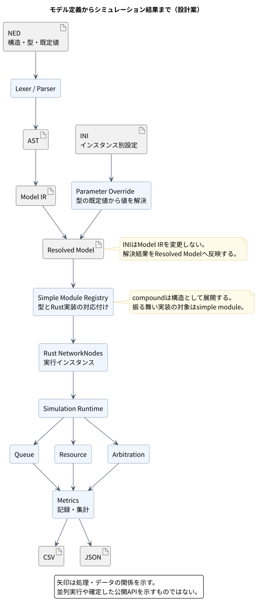
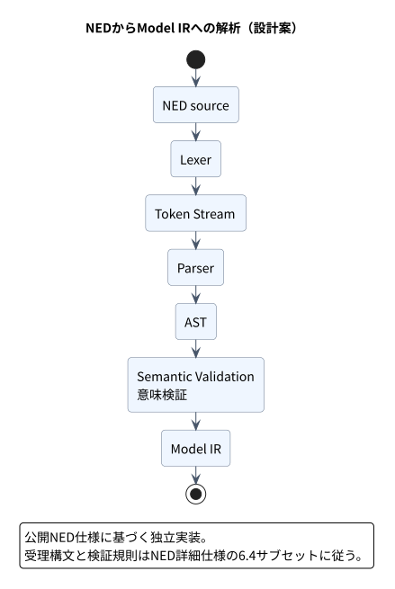
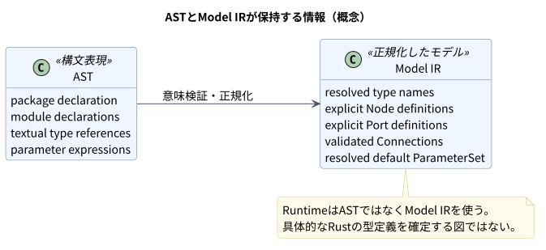
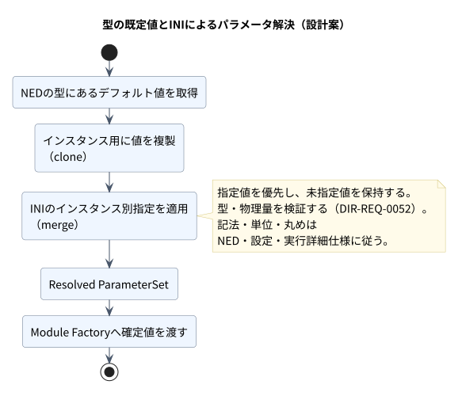
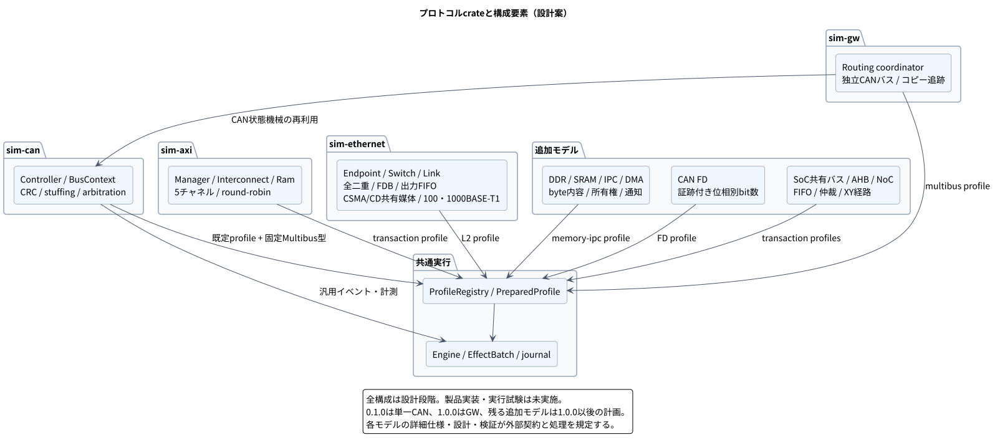
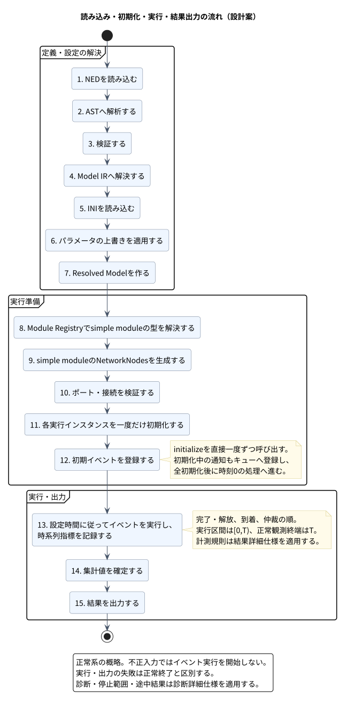

# アーキテクチャ設計書

文書バージョン：`1.1.2`
対象GitHubバージョン：`main @ 7bb9bfc`
予定公開版：`v1.1.2`（本PR。対象コミットは公開済みmainの基準）

### 更新履歴

| 文書バージョン | 更新日 | 更新内容 |
| --- | --- | --- |
| `1.1.2` | `2026-10-04` | 媒体対とCAN FDの専用input/runtime/output・prepared/snapshotを現行配置へ反映し、公開拡張APIの境界を保持 |
| `1.1.1` | `2026-10-04` | Port policy、copy別wire/class、VLAN別FDB・group交換とprofile別schemaの所有境界を追加し、v1.1.1向け文書版を更新 |
| `1.1.0` | `2026-10-04` | Ethernet payload・snapshot、入力・実行・観測・viewerの所有境界とQoS設計参照を追加 |
| `1.0.2` | `2026-10-04` | NED editor追加に伴うGitHub版v1.0.1を対象に更新。GitHubのPATCH変更のため文書版は維持 |
| `1.0.2` | `2026-10-04` | PR6の診断・仲裁・提供状態とOMNeT由来成果物削除を保持し、mainのNEDエディタ・保存復旧を統合。分岐して公開した履歴を両方保持 |
| `1.0.1` | `2026-10-03` | レビュー修正：目標構成と現行実装を区別し、診断保持APIと再現情報の未対応範囲を追記 |
| `1.0.1` | `2026-10-04` | NEDエディタの7ブロック、共通parse／prepare境界、UIのmodule組立・設定・保存／復旧の実装配置と文書参照を反映 |
| `1.0.0` | `2026-10-03` | 入力・実行・結果・ビューアのソース配置とGWのRX保持・転送責務を反映。文書版を1.0.0、対象タグをv1.0.0に統一 |
| `0.1.1` | `2026-10-03` | 作業内容を集約：CANへの対象限定と要件の詳細化、番号付きIDの4桁化を反映。抽象CANコントローラ・フレーム単位の時間計算・単一バスと次版GW接続の方針を反映。CAN評価モデルの方針確定に伴い、調停の未確定事項の参照を個別TBDへ更新。NEDサブセット、ディレクトリ探索、完全修飾名、境界接続とRust側ポート情報の採用方針を反映。channel型・接続上の適用を採用し、接続構造・経路特性・BUS等の動作の分担を更新。全TBDの決定を詳細仕様へ接続し、時刻・イベント・登録・channel・バッファの採用設計を整合。詳細仕様を正本として責務・所有権・CAN詳細設計の対応を確定し、概念API例を整理。GW・AXI・Ethernetとprofile統合の責務・上流仕様を追加。Ethernet半二重・1000BASE-T1の13要件・3機能・4受け入れ条件と媒体設計を追加。CAN FD・100BASE-T1、SoC・AHB・NoC、メモリ・IPCの構成責務と詳細設計への接続を追加。v0.1公開に合わせ、文書版を0.1.1へ統一し対象タグを確定 |
| `0.1.0` | `2026-09-27` | 文書バージョン、対象GitHubバージョン、更新履歴を追加 |

分岐中にPR6とmainで同じ版番号を別々に公開したため、過去の更新履歴は両方保持している。

文書ID：`architecture`

| 項目 | 内容 |
| --- | --- |
| 状態 | 初期仕様の責務分担を規定済み。共通実行・CAN・GW・AXI・Ethernet・profile統合は詳細設計・検証仕様へ展開済み。CANとGW・複数CAN、Ethernet全二重L2・QoS・VLANに加え、媒体v2・100BASE-T1・CAN FDの内部実装・製品試験を実施。各検証記録に実施範囲を保存。公開拡張API・他モデルの製品適合は未完了 |
| 正本 | 振る舞いは[分野別詳細仕様](機能仕様書.md#1-正本と分担)、内部アルゴリズムは[実行詳細設計](design/実行詳細設計書.md)と[CAN詳細設計](design/CANモデル詳細設計書.md)を正とする |
| 既存API例の移行 | 旧版の未コンパイルRust型・trait例は本書の責務表と詳細設計への参照へ整理。実装後の正確なRust宣言はソース／生成API文書へ対応付ける |
| 目標設計の拡張 | コアの時刻・予約・journalをプロトコル非依存とし、CANを独立crateでRegistryに登録する。複数bus/GW/AXI/Ethernetの状態はモデル側へ追加する。現行の提供状態は下記のソース配置と公開APIを正とする |
| trace状態 | confirmedは当該設計判断の確定を示す。下流未割当・検証未実行とは別に管理する。全要件の経路の充足は生成トレーサビリティ一覧を参照 |

## 全体構成と依存方向

以下の`sim-core`等は責務を分ける目標設計であり、現在配布しているcrate一覧ではない。現行のCAN/GW実装は[単一crateの配置](#source-layout)と[公開API](#公開apiと互換性)を参照する。以降のRegistry・Envelope・Context契約は未提供部分を含む設計目標として読み、実装済み・製品適合済みとは区別する。入力の元位置・値の採用元を含む完全な再現情報も現行の未対応範囲であり、将来モデルだけの課題ではない。

| 実装単位 | 所有する責務 | 依存先 |
| --- | --- | --- |
| sim-core | ID、整数時刻、schema識別、エラー等の共通値 | 基本ライブラリ |
| sim-model | descriptor、正規モデル、接続、Registry契約 | sim-core |
| ned-parser / sim-config | AST、参照・階層・接続の解決／INI・量の厳密換算 | sim-core、sim-model |
| sim-runtime | イベントヒープ、Context、効果batch、モデル実行、確定journal | sim-core、sim-model |
| sim-result | 登録計測の集計とJSON/CSV公開 | sim-core、確定journalの読取契約 |
| sim-can | CRC・仲裁・負荷・BusContext・CAN codecs | 共通契約、汎用資源操作 |
| dir-simulator | 公開CLIとdir_simulatorライブラリ、組込み登録集合 | 入力・runtime・result・canの公開操作 |



[図のソース](diagrams/architecture/architecture--simulation-pipeline--component.puml)

### 要件の責務から読む構成と受け渡し

[要件定義書](要件定義書.md)の順序に沿い、構造・条件の準備、実行・資源、モデル固有処理、観測・出力を次の境界で接続する。要件の主親は能力の分解、以下の構成はその実現責務であり、一つの親要件を一つのモジュールへ機械的に対応付けるものではない。

| 要件群 | 担当する構成 | 境界で維持する内容 |
| --- | --- | --- |
| [構造定義](要件定義書.md#dir-req-0005) | [モデル読込](#arch-model-loading)、[モデル・ポート](#arch-node-model) | 型・展開インスタンス・接続の識別と元位置を保持し、構造検証済みのモデルを値解決へ渡す |
| [実験条件の初期化](要件定義書.md#dir-req-0006) | [設定](#arch-configuration)、[正規値](#arch-parameters)、[Registry](#arch-registry)、[ライフサイクル](#arch-lifecycle) | 値の優先順位・型・単位・登録を検証した後に生成・初期化する。prepareの成功とinitializeの成功を区別する |
| [実行と資源](要件定義書.md#dir-req-0007) | [時刻](#arch-time)、[scheduler](#arch-scheduler)、[Context](#arch-model-api)、[資源](#arch-resources) | モデル固有状態の更新とイベント・記録の確定を対応付ける。待ち・転送・伝搬の担当を分け、時間の二重算入を防ぐ |
| [結果取得](要件定義書.md#dir-req-0008) | [計測・結果公開](#arch-results)、[ライフサイクル](#arch-lifecycle) | 確定journalと終了時状態から時系列・集計・再現情報を生成する。出力失敗はモデル上の破棄や未完了と区別する |
| [CAN評価](要件定義書.md#dir-req-0001) | [CANモデル](#arch-domain-models)と共通基盤 | コントローラ候補選出、バス仲裁、転送時間・占有、受信の責務を連携させ、モデル状態と観測結果を同じ要求へ対応付ける |
| [拡張契約](要件定義書.md#dir-req-0122)・[追加モデル選択](要件定義書.md#dir-req-0157) | [Registry](#arch-registry)、[拡張モデル共通](#arch-model-extension)と各profileのcontext | 共通の時刻・journal・診断契約を使い、モデル固有の検証・仲裁・状態・codecを登録する。profileの選択と異なるprofileの同一実行内混成は区別する |

入力失敗の診断、同時刻の再現性、計測値の意味付けは各境界に横断して適用する。親要件の受け入れでは、子の局所規則だけでなく入力から結果への連携を確認する。本文の説明によって未割当の下流経路が埋まるわけではなく、実際の割当は各項目の`trace`と生成一覧で確認する。

### 現行モデルと将来モデルの設計参照

0.1.0の対象はClassical CANである。以下の将来モデルは設計契約として管理し、要件の階層への配置と製品への提供時期を分ける。既存の内部設計への入口を示し、新しいcrateやAPIをここで追加定義しない。

| 提供段階・分野 | 構成上の責務 | 詳細設計 |
| --- | --- | --- |
| 共通基盤 | 時刻・予約・確定journal・終了と失敗 | [実行詳細設計](design/実行詳細設計書.md) |
| 0.1.0 Classical CAN | [CANモデル](#arch-domain-models) | [CAN詳細設計](design/CANモデル詳細設計書.md) |
| 将来モデルの共通契約 | [profile選択とモデル別記録](#arch-model-extension) | [複数モデル統合詳細設計](design/複数モデル統合詳細設計書.md) |
| 1.0.0 GW・複数CAN | [GWの独立バスと転送](#arch-gateway) | [GW詳細設計](design/GWモデル詳細設計書.md) |
| CAN FD・100BASE-T1（開発中実装） | [独立通信profile](#arch-original-network) | [CAN FD・100BASE-T1詳細設計](design/CANFD・100BASE-T1詳細設計書.md) |
| Ethernet L2・QoS・VLAN・媒体（開発実装） | [L2転送](#arch-ethernet)、[媒体状態](#arch-ethernet-media) | [Ethernet詳細設計](design/Ethernetモデル詳細設計書.md)、[媒体拡張詳細設計](design/Ethernet媒体拡張詳細設計書.md) |
| 将来 SoC・AXI・AHB・NoC | [共有バス・NoC](#arch-soc-models)、[AXI](#arch-axi) | [SoC・AHB・NoC詳細設計](design/SoC・AHB・NoC詳細設計書.md)、[AXI詳細設計](design/AXIモデル詳細設計書.md) |
| 将来 メモリ・IPC | [メモリサービス・所有権・通知](#arch-memory-ipc) | [メモリ・IPC詳細設計](design/メモリ・IPC詳細設計書.md) |

## 現行ソースの配置と共有データ

<a id="source-layout"></a>

現行のCAN／CAN間Gateway実装は単一crate内で次の責務へ分割する。`src/lib.rs`は公開入口と再export、`src/lib/`は複数の処理層が利用するデータ契約を持つ。各処理層から共有データへ依存し、共有データから入力・Engine・出力・ツールへは依存しない。

```text
crates/dir-simulator/src/
├── lib.rs                         公開API・互換用再export
├── main.rs                        CLI
├── run.rs                         出力予約→実行→結果公開、RunReport
├── lib/
│   ├── types.rs                   入力データ型の公開入口
│   ├── types/
│   │   ├── common.rs              実行条件、入力snapshot、Schedule、Diagnostic
│   │   ├── prepared.rs            PreparedSimulationの構成
│   │   ├── can.rs                 Frame、Bus、Controller、Generator、PreparedCan
│   │   └── gateway.rs             Route、Gateway、PreparedGateway
│   ├── snapshot.rs                確定結果型の公開入口・Snapshot
│   └── snapshot/
│       ├── common.rs              終了状態、計数、Point、診断
│       ├── can.rs                 要求・受信・バス状態
│       └── gateway.rs             転送記録と要求ID別の転送系譜
├── input.rs                       prepare・共通入力処理
├── input/
│   ├── tests.rs
│   ├── ned.rs                     NED共通処理
│   ├── ned/tests.rs
│   ├── can.rs                     CAN入力アダプター
│   ├── can/tests.rs
│   └── gateway.rs                 CAN間Gateway構成検証
├── runtime.rs                     simulateの公開入口
├── runtime/
│   ├── engine.rs                  実行状態の所有、配送、実行ループ、終了
│   ├── scheduler.rs               予約順序、事前検査、予約公開、dirty
│   ├── can.rs                     CAN初期化・生成・仲裁・送受信
│   ├── can/protocol.rs            CRC・stuff・frame・フィルタ・時間計算
│   ├── can/tests.rs
│   ├── gateway.rs                 経路照合・転送・fanout
│   └── tests.rs                   モデル間の確定状態・失敗境界
├── output.rs                      結果処理の統括
├── output/
│   ├── reservation.rs             出力先検証と排他予約
│   ├── aggregate.rs               型付きレコードの集計
│   ├── model_records.rs           CAN／Gateway結果のschema変換
│   ├── metadata.rs                再現情報
│   ├── json.rs                    JSON／JSONL
│   ├── csv.rs                     CSV
│   ├── publish.rs                 保存・hash・manifest最終公開
│   └── tests.rs
├── tool.rs                        補助ツールの公開入口
└── tool/
    ├── viewer.rs                  ビューア生成
    ├── viewer/
    │   ├── tests.rs
    │   └── assets/                index.html、style.css、model.js、app.js
    └── ned-editor/                ローカルNEDエディタ
        ├── mod.rs、server.rs      CLI入口・loopback HTTP
        ├── input.rs、analysis.rs  snapshot取得・共通parse/prepare
        ├── model.rs、commands.rs  原文と履歴・構造操作
        ├── composition.rs         module・境界ポート・gateの組立
        ├── template.rs、builtin.rs 内部テンプレート・全標準部品
        ├── settings.rs            INI・Gateway・送信設定フォーム
        ├── output.rs              一式保存・競合確認・復旧
        ├── controller.rs、view.rs  操作統括・画面投影
        ├── templates/             バイナリに埋め込むNED・INI・JSON
        └── assets/                index.html、style.css、input.js、view.js
```

Rustの外部結合試験は`crates/dir-simulator/tests/`、ビューアとNEDエディタのJavaScript／ブラウザ試験はルートの`tests/`へ置く。NEDエディタは`tool/ned-editor/`に実装する。独自文法を設けず、共通入力の`inspect_config`・`parse_ned`・`prepare_with_source`を内部snapshotへ適用する。原文・構造・配置・履歴を内部モデルに保持し、共有型変更と実体別設定を区別する。保存前の正式検証、版付き確認、単一writer、保存競合・復旧はエディタ側で統括する。[NED-editor仕様書](tools/ned-editor/NED-editor仕様書.md)と[取扱説明書](tools/ned-editor/NED-editor取扱説明書.md)に責務・操作・検証条件を記載する。

| 構成 | 共通部分 | モデル固有部分 |
| --- | --- | --- |
| `PreparedSimulation` | `common: PreparedCommon`にprofile選択、network、module_paths、時間・イベント上限、計測窓、channel数、入力パスと取得内容 | `can: PreparedCan`にBus／Controller／Generator・所属表・ビットレート。`gateway: PreparedGateway`にCAN間Gateway／RouteとController所有表。`ethernet: Option<PreparedEthernet>`にdevice・方向・generator・class・媒体設定。`canfd: Option<PreparedCanFd>`に専用Bus・二速度・Controller・証跡付きframe cache |
| `Snapshot` | `common: CommonSnapshot`に終了状態、時刻、成功・未処理イベント数、観測点、診断 | `can: CanSnapshot`に要求・受信・バス状態。`gateway: GatewaySnapshot`にForwardRecordと`request_lineage`。`ethernet: Option<EthernetSnapshot>`に元frame・hop transfer・reception・媒体attempt。`canfd: Option<CanFdSnapshot>`に専用要求・受信・Bus状態 |

`request_lineage`は要求IDをキーとし、元要求ID・親要求ID・GWホップ数をGateway側で所有する。通常の生成要求にも初期の系譜を登録し、転送コピーはその系譜を引き継ぐ。CANの`Request`へGatewayフィールドを混在させず、要求の並べ替えに依存しない対応を保つ。runtime内のヒープ、cursor、WireFrame、キュー、active状態はEngineが所有し、共有データへ移さない。`Snapshot`は確定結果であり、実行再開用の完全なcheckpointではない。

### 公開APIと互換性

`dir_simulator::{prepare, run, RunReport, Diagnostic, PreparedSimulation}`、`types`、`snapshot`、`can::{serialize, accepts, end_time, WireFrame}`、`viewer::write`の公開パスを維持する。`run_with_diagnostics`と`RunFailure`は追加の公開APIとする。`types`／`snapshot`は`#[path]`で共有データの入口へ対応付け、`can`／`viewer`は実装先から再exportする。

現行の`prepare(&Path)`は組込みCAN/GW/Ethernetの入力を準備する一引数の操作であり、Registryを受け取る目標APIとは異なる。`run`は従来どおり`Diagnostic`をエラーとして返し、結果公開前に実行診断があれば最後の診断メッセージへ残す。診断を構造化して扱う呼出し側は[run_with_diagnostics](../crates/dir-simulator/src/run.rs)を使用する。失敗時の`RunFailure`は終了コードを決める最後の`diagnostic`、それより前の`prior_diagnostics`、公開失敗直前のシミュレーション終了状態`original_termination`を保持する。実行前の出力予約等で失敗した場合は先行診断が空で元終了状態は`None`となる。CLIもこの追加APIを使い、例えば実行上限超過後の保存失敗ではE-0004、E-0003の順に診断し、終了コード4とする。正確なRust宣言は[公開入口](../crates/dir-simulator/src/lib.rs)と実装先を正とする。

共有データのフィールド配置はRust APIの変更となる。呼出し側は例えば`prepared.controllers`を`prepared.can.controllers`、`prepared.time_limit_ps`を`prepared.common.time_limit_ps`、`snapshot.requests`を`snapshot.can.requests`、`snapshot.termination`を`snapshot.common.termination`へ変更する。要求の転送系譜は`request.origin_request_id`等から`snapshot.gateway.request_lineage[&request.request_id]`へ変更する。公開名の再exportだけで旧フィールド参照を互換にできるものではない。

JSON／CSVのschema、項目、表記、ソート順、CLIの契約は維持し、内部の型構成をそのままserializeしない。今回の分離は現行モデルのデータと処理の所有を明確にするものであり、以降に記す公開Registry・汎用実行arena・追加通信モデルの実装完了を意味しない。[構成変更の検証記録](verification/results/source-layout-2026-10-03.json)で実施範囲を管理する。

## 時刻と正確算術

<a id="arch-time"></a>

```trace
{
  "id": "architecture#arch-time",
  "stage": "architecture",
  "requirements": [
    "DIR-REQ-0007",
    "DIR-REQ-0024",
    "DIR-REQ-0031",
    "DIR-REQ-0036",
    "DIR-REQ-0037",
    "DIR-REQ-0045",
    "DIR-REQ-0046",
    "DIR-REQ-0052",
    "DIR-REQ-0055"
  ],
  "upstream": [
    "spec-runtime#time",
    "spec-runtime#termination",
    "spec-resources#delay",
    "spec-runtime#event-order"
  ],
  "state": "confirmed",
  "pending": []
}
```

設定の時間・単位（DIR-REQ-0024・0052）を整数psへ正確換算し、量と帯域からの転送時間（0036）と時刻反映（0037）へ同じchecked算術を適用する。入力値の所有は[入力・設定詳細設計](design/入力・設定詳細設計書.md)、実行時の加算・丸めは[実行詳細設計](design/実行詳細設計書.md#scheduler)が担当する。

| 責務 | 採用する構成・判断 |
| --- | --- |
| 表現 | SimTimeとDurationはu64 ps。入力十進数は有理数として正確換算し、算出期間だけceilする。 |
| 所有 | Engineが現在時刻を持ち、モデルはContextから参照する。時刻進行は最小有効イベントに従う。 |
| 計算境界 | ビット数からEOF・releaseへの変換はCANが行い、汎用側は検査済み予約時刻を扱う。 |
| 正本 | [詳細機能仕様](specs/実行詳細機能仕様書.md#time)、[詳細設計](design/実行詳細設計書.md#scheduler) |

## イベントと型付き配送

<a id="arch-events"></a>

```trace
{
  "id": "architecture#arch-events",
  "stage": "architecture",
  "requirements": [
    "DIR-REQ-0007",
    "DIR-REQ-0031",
    "DIR-REQ-0032",
    "DIR-REQ-0033",
    "DIR-REQ-0045",
    "DIR-REQ-0046"
  ],
  "upstream": [
    "spec-runtime#event-order",
    "spec-runtime#delivery",
    "spec-interfaces#extension-contract"
  ],
  "state": "confirmed",
  "pending": []
}
```

| 責務 | 採用する構成・判断 |
| --- | --- |
| Envelope | イベントID、送信元・宛先、要求ID、時刻とschema名・版・bytes。受信port又はTimerTokenを種別ごとに持つ。 |
| 拡張 | payloadの復号はRegistryに登録したcodecへ委譲。コアがCAN ID・CRCを解釈することは範囲注釈上の対象外。 |
| 完了と到着 | phase0は完了／解放、phase1は生成／到着／Timer、phase2はdirty資源の仲裁。 |
| 正本 | [詳細機能仕様](specs/実行詳細機能仕様書.md#delivery)、[詳細設計](design/実行詳細設計書.md#dispatch) |

## スケジューラと停止

<a id="arch-scheduler"></a>

```trace
{
  "id": "architecture#arch-scheduler",
  "stage": "architecture",
  "requirements": [
    "DIR-REQ-0007",
    "DIR-REQ-0024",
    "DIR-REQ-0031",
    "DIR-REQ-0042",
    "DIR-REQ-0045",
    "DIR-REQ-0046",
    "DIR-REQ-0055",
    "DIR-REQ-0095",
    "DIR-REQ-0096",
    "DIR-REQ-0119",
    "DIR-REQ-0120"
  ],
  "upstream": [
    "spec-runtime#event-order",
    "spec-runtime#termination",
    "spec-runtime#time",
    "spec-runtime#examples"
  ],
  "state": "confirmed",
  "pending": []
}
```

実行条件（DIR-REQ-0024）のTと観測区間を確定し、時系列（0042）が正常終了時のTまたは失敗時の確定境界Hまでの状態を記録できるよう、凍結snapshotへ終了理由・H・最後の成功時刻を渡す。[実行詳細設計](design/実行詳細設計書.md#scheduler)と[結果処理詳細設計](design/結果処理詳細設計書.md)の間で同じ境界を共有する。

| 責務 | 採用する構成・判断 |
| --- | --- |
| 順序 | (time,delta,phase,sequence)の昇順。dirty集合をphase1固定点で封じ、資源パス順にphase2を予約する。 |
| 予約 | 成功batchで順序付き予約、取消しはtoken表で管理。無効ヒープ要素は時刻・件数から除く。 |
| 停止 | [0,T)で処理し、正常終端はT。上限と失敗はコミットprefixを凍結。論理generator将来予定を終了理由へ算入。 |
| 正本 | [詳細機能仕様](specs/実行詳細機能仕様書.md#event-order)、[詳細設計](design/実行詳細設計書.md#scheduler) |

## モデル・ポート・channelの所有

<a id="arch-node-model"></a>

```trace
{
  "id": "architecture#arch-node-model",
  "stage": "architecture",
  "requirements": [
    "DIR-REQ-0019",
    "DIR-REQ-0020",
    "DIR-REQ-0021",
    "DIR-REQ-0023",
    "DIR-REQ-0030",
    "DIR-REQ-0033",
    "DIR-REQ-0051",
    "DIR-REQ-0073",
    "DIR-REQ-0074",
    "DIR-REQ-0075",
    "DIR-REQ-0076"
  ],
  "upstream": [
    "spec-ned#implementation",
    "spec-ned#connections",
    "spec-interfaces#extension-contract",
    "spec-diagnostics#lifecycle"
  ],
  "state": "confirmed",
  "pending": []
}
```

| 責務 | 採用する構成・判断 |
| --- | --- |
| 構造と実行 | compound/networkは静的構造として展開し、simpleだけをfactoryで実体化する。正規インスタンスパスから安定IDを与える。 |
| ポート | 名前・方向・protocol・message・schema版をdescriptorで照合。compound境界の内外接続を解決してsimple間経路を作る。 |
| channel | NED型と辺ごとのインスタンスを分離。初期FixedDelayはpropagation-delay能力を提供し、適用時刻はモデルの責務。 |
| 正本 | [詳細機能仕様](specs/NED詳細機能仕様書.md#implementation)、[詳細設計](design/実行詳細設計書.md#registry) |

## 正規値とパラメータ

<a id="arch-parameters"></a>

```trace
{
  "id": "architecture#arch-parameters",
  "stage": "architecture",
  "requirements": [
    "DIR-REQ-0006",
    "DIR-REQ-0018",
    "DIR-REQ-0024",
    "DIR-REQ-0025",
    "DIR-REQ-0026",
    "DIR-REQ-0027",
    "DIR-REQ-0052",
    "DIR-REQ-0053",
    "DIR-REQ-0079",
    "DIR-REQ-0080",
    "DIR-REQ-0081",
    "DIR-REQ-0119"
  ],
  "upstream": [
    "spec-configuration#values",
    "spec-configuration#ini",
    "spec-ned#syntax",
    "spec-configuration#diagnostics",
    "spec-diagnostics#diagnostic-schema"
  ],
  "state": "confirmed",
  "pending": []
}
```

値域と正確換算（DIR-REQ-0119）は、入力の数値表記、物理量、u64等の格納範囲を段階ごとに検査する。[入力・設定詳細設計](design/入力・設定詳細設計書.md#values)へ元位置・採用元を含めて割り当て、暗黙の単位丸めやオーバーフローによる値の変化を防ぐ。

| 責務 | 採用する構成・判断 |
| --- | --- |
| 値 | dimensionless整数・binary64・bool・stringと、時間ps／bitrateの正確整数を区別。生リテラルと位置は診断用に保持。 |
| 優先 | 型のdefault又はリテラルへインスタンスINIを適用し、descriptorの型・物理量・値域・必須性を検査。 |
| 実装境界 | 一般のパーサ／値解決の内部データ構造は[入力・設定詳細設計](design/入力・設定詳細設計書.md)へ展開。受理・拒否の外部判断は設定仕様で確定。 |
| 正本 | [詳細機能仕様](specs/設定詳細機能仕様書.md#values) |

## 登録と実装選択

<a id="arch-registry"></a>

```trace
{
  "id": "architecture#arch-registry",
  "stage": "architecture",
  "requirements": [
    "DIR-REQ-0006",
    "DIR-REQ-0028",
    "DIR-REQ-0029",
    "DIR-REQ-0030",
    "DIR-REQ-0053",
    "DIR-REQ-0078",
    "DIR-REQ-0122",
    "DIR-REQ-0015",
    "DIR-REQ-0017",
    "DIR-REQ-0058",
    "DIR-REQ-0117",
    "DIR-REQ-0118"
  ],
  "upstream": [
    "spec-ned#implementation",
    "spec-interfaces#operation",
    "spec-interfaces#extension-contract",
    "spec-diagnostics#lifecycle",
    "spec-diagnostics#diagnostic-schema"
  ],
  "state": "confirmed",
  "pending": []
}
```

| 責務 | 採用する構成・判断 |
| --- | --- |
| 二段解決 | NED型の完全修飾名から@class実装キーへ、次にmodule/channel factoryへ解決する。 |
| 凍結 | prepareで登録集合を固定し、全入力照合後にモデルを構築。異なるprofile/schema/policyの追加は別の登録として扱う。 |
| 既定方式 | 初期CAN、FixedDelay、drop-newest、固定優先度とCAN仲裁、周期／明示負荷、JSON/CSVを登録する。 |
| 正本 | [詳細機能仕様](specs/インタフェース詳細機能仕様書.md#extension-contract)、[詳細設計](design/実行詳細設計書.md#registry) |

## Contextとコミット境界

<a id="arch-model-api"></a>

```trace
{
  "id": "architecture#arch-model-api",
  "stage": "architecture",
  "requirements": [
    "DIR-REQ-0007",
    "DIR-REQ-0030",
    "DIR-REQ-0031",
    "DIR-REQ-0032",
    "DIR-REQ-0033",
    "DIR-REQ-0045",
    "DIR-REQ-0046",
    "DIR-REQ-0055",
    "DIR-REQ-0056",
    "DIR-REQ-0122",
    "DIR-REQ-0034",
    "DIR-REQ-0037",
    "DIR-REQ-0118",
    "DIR-REQ-0120"
  ],
  "upstream": [
    "spec-interfaces#extension-contract",
    "spec-runtime#delivery",
    "spec-runtime#event-order",
    "spec-diagnostics#lifecycle",
    "spec-diagnostics#termination"
  ],
  "state": "confirmed",
  "pending": []
}
```

| 責務 | 採用する構成・判断 |
| --- | --- |
| 操作 | schedule/send/cancel/request_arbitration/observeを一callbackのEffectBatchへ蓄積する。 |
| 公開 | 全コマンドを検査後FES・dirty・token・journalへ一括公開。CANも同じコミット境界に参加する。 |
| 失敗 | 未公開batchを破棄し実行停止。結果はjournalから取得する。注：任意モデル内部の全状態複製・ロールバックは対象外。 |
| 正本 | [詳細機能仕様](specs/インタフェース詳細機能仕様書.md#extension-contract)、[詳細設計](design/実行詳細設計書.md#dispatch) |

## キュー・遅延・占有

<a id="arch-resources"></a>

```trace
{
  "id": "architecture#arch-resources",
  "stage": "architecture",
  "requirements": [
    "DIR-REQ-0007",
    "DIR-REQ-0034",
    "DIR-REQ-0035",
    "DIR-REQ-0036",
    "DIR-REQ-0037",
    "DIR-REQ-0038",
    "DIR-REQ-0039",
    "DIR-REQ-0040",
    "DIR-REQ-0041",
    "DIR-REQ-0042",
    "DIR-REQ-0043",
    "DIR-REQ-0083",
    "DIR-REQ-0084",
    "DIR-REQ-0085",
    "DIR-REQ-0086",
    "DIR-REQ-0087",
    "DIR-REQ-0088",
    "DIR-REQ-0089",
    "DIR-REQ-0090",
    "DIR-REQ-0091"
  ],
  "upstream": [
    "spec-resources#queue",
    "spec-resources#resource",
    "spec-resources#delay",
    "spec-results#measurement-points",
    "spec-results#aggregation",
    "spec-can-models#arbitration",
    "spec-runtime#event-order"
  ],
  "state": "confirmed",
  "pending": []
}
```

[実行詳細設計の資源](design/実行詳細設計書.md#resources)が容量、候補、選出、占有と時間成分を所有し、成功更新時に観測を確定journalへ渡す。[結果処理詳細設計](design/結果処理詳細設計書.md)はその観測から標本・積分・集計を計算する。資源状態の更新と計測値の確定を別の責務として双方検証する。

| 責務 | 採用する構成・判断 |
| --- | --- |
| 汎用操作 | 有界offer/peek/takeとowner・解放時刻を提供。選出policyと溢れpolicyは登録境界で分離。 |
| CAN所有 | 一BusContextがcontroller別待機キューとbus占有を持ち、SOFの勝者取出しと占有を一遷移で確定。 |
| 計測 | 内部コンテナから直接終了結果を組み立てず、確定した観測差分をjournalへ反映する。 |
| 正本 | [詳細機能仕様](specs/資源詳細機能仕様書.md)、[詳細設計](design/CANモデル詳細設計書.md#state-machine) |

## NEDの読込みと構造検証

<a id="arch-model-loading"></a>

```trace
{
  "id": "architecture#arch-model-loading",
  "stage": "architecture",
  "requirements": [
    "DIR-REQ-0005",
    "DIR-REQ-0015",
    "DIR-REQ-0016",
    "DIR-REQ-0017",
    "DIR-REQ-0018",
    "DIR-REQ-0019",
    "DIR-REQ-0020",
    "DIR-REQ-0021",
    "DIR-REQ-0022",
    "DIR-REQ-0023",
    "DIR-REQ-0053",
    "DIR-REQ-0073",
    "DIR-REQ-0074",
    "DIR-REQ-0075",
    "DIR-REQ-0076",
    "DIR-REQ-0077",
    "DIR-REQ-0078",
    "DIR-REQ-0082"
  ],
  "upstream": [
    "spec-ned#syntax",
    "spec-ned#implementation",
    "spec-ned#connections",
    "spec-ned#examples",
    "spec-configuration#diagnostics",
    "spec-diagnostics#diagnostic-schema"
  ],
  "state": "confirmed",
  "pending": []
}
```

| 責務 | 採用する構成・判断 |
| --- | --- |
| 処理順 | 再帰探索→package整合→字句／構文→型表→全宣言検査→選択network展開→接続検証。詳細な順序はNED・診断仕様を正とする。 |
| AST/IR | ASTは元位置と表記、IRは解決済み完全名・ノード・端点・接続・defaultを保持する。INIの変更はResolvedModelへ置く。 |
| 継続 | [入力・設定詳細設計](design/入力・設定詳細設計書.md)でAST・IR・展開・元位置・接続の内部処理を規定し、[入力・設定検証](verification/cases/入力・設定検証仕様書.md)で正常・境界・異常を確認する。製品試験は未実施。 |
| 正本 | [詳細機能仕様](specs/NED詳細機能仕様書.md) |

## INIと実験条件

<a id="arch-configuration"></a>

```trace
{
  "id": "architecture#arch-configuration",
  "stage": "architecture",
  "requirements": [
    "DIR-REQ-0006",
    "DIR-REQ-0024",
    "DIR-REQ-0025",
    "DIR-REQ-0026",
    "DIR-REQ-0027",
    "DIR-REQ-0052",
    "DIR-REQ-0053",
    "DIR-REQ-0055",
    "DIR-REQ-0057",
    "DIR-REQ-0079",
    "DIR-REQ-0080",
    "DIR-REQ-0081",
    "DIR-REQ-0119",
    "DIR-REQ-0121"
  ],
  "upstream": [
    "spec-configuration#ini",
    "spec-configuration#values",
    "spec-configuration#diagnostics",
    "spec-interfaces#operation",
    "spec-diagnostics#diagnostic-schema"
  ],
  "state": "confirmed",
  "pending": []
}
```

読取り不能（DIR-REQ-0121）と型・単位・値域違反（0119）は、入力snapshotを確定する前にファイル／キーの元位置と共通診断を対応付ける。[入力・設定詳細設計](design/入力・設定詳細設計書.md)が取得・解決を、ライフサイクルが実行callback開始前の停止を担当する。

| 責務 | 採用する構成・判断 |
| --- | --- |
| 役割 | Generalの実行値・インスタンス値、Channel節の辺別値を区別し、正確換算後にResolvedModelへ渡す。 |
| 再現入力 | NED/INI/workloadの取得bytesと確定値をsnapshotへ保存し、結果メタデータのhashと対応付ける。 |
| 入力不正 | 未知・重複・欠落・単位違反を準備段階で診断し、対象モデルをinitializeする前に終了する。 |
| 正本 | [詳細機能仕様](specs/設定詳細機能仕様書.md) |

## 計測と結果公開

<a id="arch-results"></a>

```trace
{
  "id": "architecture#arch-results",
  "stage": "architecture",
  "requirements": [
    "DIR-REQ-0008",
    "DIR-REQ-0042",
    "DIR-REQ-0043",
    "DIR-REQ-0044",
    "DIR-REQ-0054",
    "DIR-REQ-0056",
    "DIR-REQ-0083",
    "DIR-REQ-0084",
    "DIR-REQ-0085",
    "DIR-REQ-0086",
    "DIR-REQ-0087",
    "DIR-REQ-0088",
    "DIR-REQ-0089",
    "DIR-REQ-0090",
    "DIR-REQ-0091",
    "DIR-REQ-0092",
    "DIR-REQ-0093",
    "DIR-REQ-0094",
    "DIR-REQ-0095",
    "DIR-REQ-0096",
    "DIR-REQ-0117",
    "DIR-REQ-0120"
  ],
  "upstream": [
    "spec-results#measurement-points",
    "spec-results#aggregation",
    "spec-results#result-schema",
    "spec-results#atomic-output",
    "spec-diagnostics#termination",
    "spec-interfaces#operation",
    "spec-results#experiment-metadata"
  ],
  "state": "confirmed",
  "pending": []
}
```

実験条件の識別（DIR-REQ-0117）は取得済み入力bytesのhash、確定値、profile・登録版・モデル前提をmetadataへ対応付ける。終了時の未完了（0120）は予定値で補完せず、同じ確定snapshotと[部分公開契約](specs/結果詳細機能仕様書.md#atomic-output)を[結果処理詳細設計](design/結果処理詳細設計書.md)へ割り当てる。

| 責務 | 採用する構成・判断 |
| --- | --- |
| 入力 | コミット済みjournalとmetadata・診断集合を受け取る。event_seqとeffect_seqを保持し、出力seqは保存順として別採番。 |
| 集計 | 37登録指標の観測点・母数・対象・窓・丸めを結果仕様どおり適用。モデル別台帳はprofile/schema版で解釈。 |
| 公開 | 5ファイルを一時dirへ書きhash検査し、manifestを最後に公開。完全schemaと生成例は結果仕様を参照。 |
| 継続 | [結果処理詳細設計](design/結果処理詳細設計書.md)と[結果処理検証](verification/cases/結果処理検証仕様書.md)で集計・schema・メタデータ・公開失敗を具体化。製品I/O試験は未実施。 |
| 正本 | [詳細機能仕様](specs/結果詳細機能仕様書.md) |

## CANモデルと将来モデル

<a id="arch-domain-models"></a>

```trace
{
  "id": "architecture#arch-domain-models",
  "stage": "architecture",
  "requirements": [
    "DIR-REQ-0001",
    "DIR-REQ-0006",
    "DIR-REQ-0007",
    "DIR-REQ-0019",
    "DIR-REQ-0024",
    "DIR-REQ-0033",
    "DIR-REQ-0034",
    "DIR-REQ-0035",
    "DIR-REQ-0036",
    "DIR-REQ-0037",
    "DIR-REQ-0038",
    "DIR-REQ-0039",
    "DIR-REQ-0040",
    "DIR-REQ-0041",
    "DIR-REQ-0045",
    "DIR-REQ-0046",
    "DIR-REQ-0051",
    "DIR-REQ-0058",
    "DIR-REQ-0097",
    "DIR-REQ-0098",
    "DIR-REQ-0099",
    "DIR-REQ-0100",
    "DIR-REQ-0101",
    "DIR-REQ-0102",
    "DIR-REQ-0103",
    "DIR-REQ-0104",
    "DIR-REQ-0105",
    "DIR-REQ-0106",
    "DIR-REQ-0107",
    "DIR-REQ-0108",
    "DIR-REQ-0109",
    "DIR-REQ-0110",
    "DIR-REQ-0111",
    "DIR-REQ-0112",
    "DIR-REQ-0113",
    "DIR-REQ-0114",
    "DIR-REQ-0115",
    "DIR-REQ-0116",
    "DIR-REQ-0120",
    "DIR-REQ-0122"
  ],
  "upstream": [
    "spec-can-models#profile",
    "spec-can-models#frame-input",
    "spec-can-models#arbitration",
    "spec-can-models#wire-time",
    "spec-can-models#ack-errors",
    "spec-can-models#workload",
    "spec-can-models#controller",
    "spec-can-models#examples",
    "spec-interfaces#extension-contract",
    "spec-resources#resource",
    "spec-resources#delay",
    "spec-ned#implementation",
    "spec-ned#connections",
    "spec-interfaces#operation",
    "spec-resources#queue",
    "spec-runtime#event-order",
    "spec-runtime#delivery",
    "spec-runtime#examples",
    "spec-results#measurement-points",
    "spec-results#aggregation",
    "spec-results#experiment-metadata",
    "spec-results#result-schema"
  ],
  "state": "confirmed",
  "pending": []
}
```

負荷の準備・実行（DIR-REQ-0006・0007・0024）は、設定snapshotを検証済みgenerator定義へ渡し、全入力を検査した後にT未満の発火だけを生成する責務である。[CAN詳細設計](design/CANモデル詳細設計書.md#workload-validation)で、同じNEDに異なる実験条件を与えた際の初期化・発火・記録を対応付ける。共通能力の組合せと拡張契約（0019・0051・0122）は[Registry設計](design/実行詳細設計書.md#registry)が担当する。

| 責務 | 採用する構成・判断 |
| --- | --- |
| プロファイル | can.cc.ideal.v1は11/29bitデータ、理想ACK、単一共有bus、content依存CRC/stuff/EOF/release計算を提供。 |
| 所有状態 | BusContext、controller別queue、RequestState、ReceiverState、dispatcher。状態遷移とpayload codecはCAN詳細設計を正とする。 |
| 検証 | bit列・CRC・stuff位置の固定vectors、三ControllerのNED/INI/workloadと期待値をCAN検証仕様へ接続。 |
| 追加モデル | GW／独立複数bus、AXI／Ethernetは同じ登録境界へ追加。本書後半の各モデル構成と詳細設計に責務を規定 |
| 正本 | [詳細機能仕様](specs/models/CANモデル詳細機能仕様書.md)、[詳細設計](design/CANモデル詳細設計書.md) |

## 準備・実行・終了・診断

<a id="arch-lifecycle"></a>

```trace
{
  "id": "architecture#arch-lifecycle",
  "stage": "architecture",
  "requirements": [
    "DIR-REQ-0005",
    "DIR-REQ-0006",
    "DIR-REQ-0007",
    "DIR-REQ-0008",
    "DIR-REQ-0024",
    "DIR-REQ-0030",
    "DIR-REQ-0031",
    "DIR-REQ-0032",
    "DIR-REQ-0033",
    "DIR-REQ-0044",
    "DIR-REQ-0045",
    "DIR-REQ-0046",
    "DIR-REQ-0053",
    "DIR-REQ-0055",
    "DIR-REQ-0056",
    "DIR-REQ-0118",
    "DIR-REQ-0119",
    "DIR-REQ-0120",
    "DIR-REQ-0121"
  ],
  "upstream": [
    "spec-interfaces#operation",
    "spec-diagnostics#lifecycle",
    "spec-diagnostics#termination",
    "spec-runtime#termination",
    "spec-runtime#event-order",
    "spec-runtime#delivery",
    "spec-diagnostics#failure-examples",
    "spec-diagnostics#diagnostic-schema"
  ],
  "state": "confirmed",
  "pending": []
}
```

正常例・失敗例を公開操作へ接続し、入力取得・値域違反（DIR-REQ-0119・0121）、初期化、実行、finish、出力（0044・0056）の各境界でRunReportとCLI終了コードを確定する。停止時の未完了（0120）は成功journalから保存する。[ライフサイクル詳細設計](design/実行詳細設計書.md#lifecycle)と[利用フロー・品質検証](verification/cases/利用フロー・品質検証仕様書.md)で各工程の連携と失敗注入を規定する。

| 責務 | 採用する構成・判断 |
| --- | --- |
| 準備 | validateは入力と登録・構成検証まで。runは出力先確認、準備、factory、initialize、実行、snapshot、finish、出力を担当。 |
| 失敗 | 一次診断と二次診断、準備／実行／出力の優先を共通契約へ集約。RunReportをCLIとライブラリの共通結果とする。 |
| 検証 | 共通実行検証仕様のbatch失敗・finish失敗・I/O失敗のケースへ対応。 |
| 正本 | [詳細機能仕様](specs/診断詳細機能仕様書.md)、[詳細設計](design/実行詳細設計書.md#dispatch) |

## 構造・ライフサイクルの図

| 図 | ソース |
| --- | --- |
|  | [PlantUML](diagrams/architecture/architecture--ned-parsing--activity.puml) |
|  | [PlantUML](diagrams/architecture/architecture--ast-model-ir--class.puml) |
|  | [PlantUML](diagrams/architecture/architecture--parameter-resolution--activity.puml) |
|  | [PlantUML](diagrams/architecture/architecture--protocol-models--component.puml) |
|  | [PlantUML](diagrams/architecture/architecture--runtime-lifecycle--activity.puml) |

## 実装と確認の順序

| 段階 | 成果と確認先 |
| --- | --- |
| 共通値・Registry・入力 | 型／量／schemaの検査を実装し、NED/INIの完全例をprepareで受理する |
| スケジューラ・journal | 共通実行検証仕様で時刻・同時刻・取消し・失敗prefixを確認する |
| CAN serializer・BusContext | CAN検証仕様の独立vectorsと状態遷移ケースを照合する |
| 結果・CLI統合 | 5ファイルschema、読み戻し、診断・exit codeを確認する |
| 性能・拡張適合 | [品質方針](品質・配布方針.md)とDIR-AC-0027を検証し、結果を実測記録として追加する |

## GWの構成

<a id="arch-gateway"></a>

```trace
{
  "id": "architecture#arch-gateway",
  "stage": "architecture",
  "requirements": [
    "DIR-REQ-0123",
    "DIR-REQ-0124",
    "DIR-REQ-0125",
    "DIR-REQ-0126",
    "DIR-REQ-0127",
    "DIR-REQ-0128",
    "DIR-REQ-0129",
    "DIR-REQ-0130",
    "DIR-REQ-0131",
    "DIR-REQ-0132"
  ],
  "upstream": [
    "spec-gw-models#configuration",
    "spec-gw-models#forwarding",
    "spec-gw-models#payload-results"
  ],
  "state": "confirmed",
  "pending": []
}
```

| 責務 | 内容 |
| --- | --- |
| 所有・依存 | sim-gwはNED compoundに紐付くrouting coordinatorを全simple構築後に生成する。dir.can.MultibusController/Busの固定descriptorは既存CANコードを再利用し、BusContextはバスごとに独立する。coordinatorは静的経路・区間所有者・非循環を準備検査し、受信通知時にingressの有限RX枠を受理し、copyとegress CAN要求を原子batchで連携する。正容量TX満杯はRX保持とwaiting_txで待ち、全枝の受理又は終端後にRXを解放する。RX満杯破棄は元CAN成功・受信とは別に記録する。WireFrameはnative準備計算から不変共有する。共通核は汎用Envelope/時刻/効果とModelRecordを扱い、GW固有fieldを解釈しない。詳細設計はdesign-gw#validation、#routing-state、#payload-exportへ割り当てる。 |
| 正本 | [仕様](specs/models/GWモデル詳細機能仕様書.md)、[詳細設計](design/GWモデル詳細設計書.md)、[検証](verification/cases/GWモデル検証仕様書.md) |
| 互換性 | 既定CANの構成・codec・結果schema1を保持し、追加profileとschema2で分離 |

## AXIの構成

<a id="arch-axi"></a>

```trace
{
  "id": "architecture#arch-axi",
  "stage": "architecture",
  "requirements": [
    "DIR-REQ-0133",
    "DIR-REQ-0134",
    "DIR-REQ-0135",
    "DIR-REQ-0136",
    "DIR-REQ-0137",
    "DIR-REQ-0138",
    "DIR-REQ-0139",
    "DIR-REQ-0140",
    "DIR-REQ-0141",
    "DIR-REQ-0142",
    "DIR-REQ-0143",
    "DIR-REQ-0144"
  ],
  "upstream": [
    "spec-axi-models#profile",
    "spec-axi-models#transactions",
    "spec-axi-models#channels",
    "spec-axi-models#memory",
    "spec-axi-models#records"
  ],
  "state": "confirmed",
  "pending": []
}
```

| 責務 | 内容 |
| --- | --- |
| 所有・依存 | sim-axiはManager/Interconnect/Ramのadapterとinterconnect単位AxiContextを所有する。AxiContextが待機列、round-robin cursor、五チャネル段階、RAM byte列を管理し、汎用schedulerへ時刻・型付きpayload・計測効果だけを渡す。採用範囲・外部型はAXIモデル詳細機能仕様書、内部状態と所有権はAXIモデル詳細設計書、6ケースはAXIモデル検証仕様書を正本とする。 |
| 正本 | [仕様](specs/models/AXIモデル詳細機能仕様書.md)、[詳細設計](design/AXIモデル詳細設計書.md)、[検証](verification/cases/AXIモデル検証仕様書.md) |
| 互換性 | 既定CANの構成・codec・結果schema1を保持し、追加profileとschema2で分離 |

## Ethernetの構成

<a id="arch-ethernet"></a>

```trace
{
  "id": "architecture#arch-ethernet",
  "stage": "architecture",
  "requirements": [
    "DIR-REQ-0145",
    "DIR-REQ-0146",
    "DIR-REQ-0147",
    "DIR-REQ-0148",
    "DIR-REQ-0149",
    "DIR-REQ-0150",
    "DIR-REQ-0151",
    "DIR-REQ-0152",
    "DIR-REQ-0153",
    "DIR-REQ-0154",
    "DIR-REQ-0155",
    "DIR-REQ-0156"
  ],
  "upstream": [
    "spec-ethernet-models#profile",
    "spec-ethernet-models#wire",
    "spec-ethernet-models#switch",
    "spec-ethernet-models#outputs"
  ],
  "state": "confirmed",
  "pending": []
}
```

| 責務 | 内容 |
| --- | --- |
| 所有・依存 | EthernetProfileが型・codec・負荷・結果schemaを登録し、EthernetFabricContextが各出力FIFO/方向資源・静的FDB・hop関連を所有する。runtimeのphase0完了/phase1入力/phase2送信開始、確定journal、汎用exporterを利用する。CRCとMAC表はモデル内へ閉じ、CAN既定profileと独立に構築する。 |
| 正本 | [仕様](specs/models/Ethernetモデル詳細機能仕様書.md)、[詳細設計](design/Ethernetモデル詳細設計書.md)、[検証](verification/cases/Ethernetモデル検証仕様書.md) |
| 互換性 | 既定CANの構成・codec・結果schema1を保持し、追加profileとschema2で分離 |

## 拡張モデル共通の構成

<a id="arch-model-extension"></a>

```trace
{
  "id": "architecture#arch-model-extension",
  "stage": "architecture",
  "requirements": [
    "DIR-REQ-0157",
    "DIR-REQ-0158",
    "DIR-REQ-0159",
    "DIR-REQ-0160"
  ],
  "upstream": [
    "spec-model-extension#selection",
    "spec-model-extension#inputs",
    "spec-model-extension#results"
  ],
  "state": "confirmed",
  "pending": []
}
```

| 責務 | 内容 |
| --- | --- |
| 所有・依存 | ProfileRegistryが入力・構成validator・負荷・codec・metric・結果schemaを選択し、PreparedProfileへ固定する。各モデルcontextは資源状態を所有し、Engineへ汎用イベントとjournal差分を提示する。既定CANはschema1、追加モデルはschema2を使用し、各recordの意味は登録されたモデルschemaに属する。 |
| 正本 | [仕様](specs/拡張モデル共通詳細機能仕様書.md)、[詳細設計](design/複数モデル統合詳細設計書.md)、[検証](verification/cases/拡張モデル統合検証仕様書.md) |
| 互換性 | 既定CANの構成・codec・結果schema1を保持し、追加profileとschema2で分離 |

## Ethernet媒体拡張の構成

<a id="arch-ethernet-media"></a>

```trace
{
  "id": "architecture#arch-ethernet-media",
  "stage": "architecture",
  "requirements": [
    "DIR-REQ-0145",
    "DIR-REQ-0161",
    "DIR-REQ-0162",
    "DIR-REQ-0163",
    "DIR-REQ-0164",
    "DIR-REQ-0165",
    "DIR-REQ-0166",
    "DIR-REQ-0167",
    "DIR-REQ-0168",
    "DIR-REQ-0169",
    "DIR-REQ-0170",
    "DIR-REQ-0171",
    "DIR-REQ-0172",
    "DIR-REQ-0173"
  ],
  "upstream": [
    "spec-ethernet-media#half-config",
    "spec-ethernet-media#csma",
    "spec-ethernet-media#t1",
    "spec-ethernet-media#records"
  ],
  "state": "confirmed",
  "pending": []
}
```

| 責務 | 内容 |
| --- | --- |
| 所有・処理 | sim-ethernetのv2 FabricContextは物理対ごとのMediaPairと出力MACを所有する。固定EndpointV2/SwitchV2/LinkV2 descriptorが新codecを選び、halfは伝搬carrier・衝突・jam・再送を同一媒体で原子的に連携、full/T1は方向別MACと固定PHY遅延を計算する。serializer/FDB/tree/有限FIFOは既存責務を再利用し、成功frameだけSwitch処理へ配送する。試行token世代とjournalで衝突した到達を無効化し、共通核は型付きイベントとschema2 recordを運搬する。design-ethernet-media#half-state/#t1-state/#journalへ詳細を割り当てる。 |
| 正本 | [媒体仕様](specs/models/Ethernet媒体拡張詳細機能仕様書.md)、[媒体設計](design/Ethernet媒体拡張詳細設計書.md)、[媒体検証](verification/cases/Ethernet媒体拡張検証仕様書.md) |
| 拡張境界 | PHY種別・duplex・deference/backoffは版付きモデル契約。既定CAN・Ethernet v1の登録と意味を保持 |

## CAN FD・100BASE-T1の責務分担

<a id="arch-original-network"></a>

```trace
{
  "id": "architecture#arch-original-network",
  "stage": "architecture",
  "requirements": [
    "DIR-REQ-0174",
    "DIR-REQ-0175",
    "DIR-REQ-0176",
    "DIR-REQ-0177",
    "DIR-REQ-0178",
    "DIR-REQ-0179",
    "DIR-REQ-0180",
    "DIR-REQ-0181",
    "DIR-REQ-0182",
    "DIR-REQ-0183",
    "DIR-REQ-0184",
    "DIR-REQ-0185"
  ],
  "upstream": [
    "spec-original-network#canfd",
    "spec-original-network#t1"
  ],
  "state": "confirmed",
  "pending": []
}
```

| 責務 | 採用する構成・判断 |
| --- | --- |
| 所有と実行 | FD用登録型と100BASE-T1用profileを別版で追加し、共通runtime/journalへ型付き通知を接続する。既存CC v1・Ethernet v1/v2を維持する。FD位相長は証跡付き外部入力であり規格適合bitstreamを生成したとはみなさない。 |
| 正本 | [詳細仕様](specs/models/CANFD・100BASE-T1詳細機能仕様書.md)、[詳細設計](design/CANFD・100BASE-T1詳細設計書.md)、[検証](verification/cases/CANFD・100BASE-T1検証仕様書.md) |

## SoC・AHB・NoCの責務分担

<a id="arch-soc-models"></a>

```trace
{
  "id": "architecture#arch-soc-models",
  "stage": "architecture",
  "requirements": [
    "DIR-REQ-0186",
    "DIR-REQ-0187",
    "DIR-REQ-0188",
    "DIR-REQ-0189",
    "DIR-REQ-0190",
    "DIR-REQ-0191",
    "DIR-REQ-0192",
    "DIR-REQ-0193",
    "DIR-REQ-0194",
    "DIR-REQ-0195",
    "DIR-REQ-0196",
    "DIR-REQ-0197"
  ],
  "upstream": [
    "spec-soc-models#soc",
    "spec-soc-models#ahb",
    "spec-soc-models#noc"
  ],
  "state": "confirmed",
  "pending": []
}
```

| 責務 | 採用する構成・判断 |
| --- | --- |
| 所有と実行 | SoC共有バス・AHB相当・NoCを独立profile/contextへ実装し、共通DESのphase、effect batch、journalと結果集計へ接続する。 |
| 正本 | [詳細仕様](specs/models/SoC・AHB・NoC詳細機能仕様書.md)、[詳細設計](design/SoC・AHB・NoC詳細設計書.md)、[検証](verification/cases/SoC・AHB・NoC検証仕様書.md) |

## メモリ・IPCの責務分担

<a id="arch-memory-ipc"></a>

```trace
{
  "id": "architecture#arch-memory-ipc",
  "stage": "architecture",
  "requirements": [
    "DIR-REQ-0198",
    "DIR-REQ-0199",
    "DIR-REQ-0200",
    "DIR-REQ-0201",
    "DIR-REQ-0202",
    "DIR-REQ-0203",
    "DIR-REQ-0204",
    "DIR-REQ-0205",
    "DIR-REQ-0206",
    "DIR-REQ-0207",
    "DIR-REQ-0208",
    "DIR-REQ-0209",
    "DIR-REQ-0210",
    "DIR-REQ-0211",
    "DIR-REQ-0212",
    "DIR-REQ-0213",
    "DIR-REQ-0214",
    "DIR-REQ-0215",
    "DIR-REQ-0216",
    "DIR-REQ-0217"
  ],
  "upstream": [
    "spec-memory-ipc#ddr",
    "spec-memory-ipc#sram",
    "spec-memory-ipc#shared",
    "spec-memory-ipc#dma",
    "spec-memory-ipc#mailbox"
  ],
  "state": "confirmed",
  "pending": []
}
```

| 責務 | 採用する構成・判断 |
| --- | --- |
| 所有と実行 | memory.ipc.transaction.v1は一つのcoordinatorからDDR/SRAMの資源handleとIPC/DMA状態機械を管理し、共通u64 ps・phase・journalに接続する。DMAは同profile内のDDR/SRAMサービスを共有し、共有メモリslotとmailboxは独立した有限領域を持つ。 |
| 正本 | [詳細仕様](specs/models/メモリ・IPC詳細機能仕様書.md)、[詳細設計](design/メモリ・IPC詳細設計書.md)、[検証](verification/cases/メモリ・IPC検証仕様書.md) |

<a id="arch-ethernet-qos"></a>

## Ethernet負荷・QoSの実行と観測

```trace
{
  "id": "architecture#arch-ethernet-qos",
  "stage": "architecture",
  "requirements": [
    "DIR-REQ-0218",
    "DIR-REQ-0219",
    "DIR-REQ-0220",
    "DIR-REQ-0221",
    "DIR-REQ-0222",
    "DIR-REQ-0223"
  ],
  "upstream": [
    "spec-ethernet-qos#workload",
    "spec-ethernet-qos#queues",
    "spec-ethernet-qos#observations"
  ],
  "state": "confirmed",
  "pending": []
}
```

[追加仕様](specs/models/Ethernet負荷・QoS詳細機能仕様書.md)のprofileで、準備済みEthernet payloadを既存のCAN/GWと独立に所有する。入力は共通NED構文と厳密JSON検証、実行は方向別送信器・classキュー・lazy generator、結果は確定Frame/Transfer/Receptionと共通Pointを担当する。共通の時刻順・半開停止・canonical CSV/JSON・原子的公開を再利用する。

[詳細設計](design/Ethernet負荷・QoS詳細設計書.md)は生成cursor、容量・送信選択、フローprojectionへ責務を分ける。viewerは専用pure replayモデルで実績時刻を復元し、parent transferから経路を追跡する。profile別schemaとmetric登録により、既存CANとEthernet基本v1の意味・出力を維持する。

<a id="arch-ethernet-vlan"></a>

## Ethernet VLAN・静的マルチキャストの追加構成

```trace
{
  "id": "architecture#arch-ethernet-vlan",
  "stage": "architecture",
  "requirements": [
    "DIR-REQ-0224",
    "DIR-REQ-0225",
    "DIR-REQ-0226",
    "DIR-REQ-0227",
    "DIR-REQ-0228",
    "DIR-REQ-0229"
  ],
  "upstream": [
    "spec-ethernet-vlan#ports-codec",
    "spec-ethernet-vlan#forwarding",
    "spec-ethernet-vlan#observations"
  ],
  "state": "confirmed",
  "pending": []
}
```

[詳細仕様](specs/models/EthernetVLAN・マルチキャスト詳細機能仕様書.md)の独立profileは、既存Ethernet Engine・方向別classキュー・tree・共通journalを拡張する設計。Port policyが到達wireからVID/classを分類し、Switchの(VID,MAC)表が候補を決定する。各copyのtag変換済みwireを容量判定前に所有させ、FCS・MAC長・送信時間・量を同じwireへ結び付ける。元frameのwire/priorityはsourceの不変値として保持する。

[詳細設計](design/EthernetVLAN・マルチキャスト詳細設計書.md)はprepare/codec、原子的VLAN/group交換、結果/viewerへ責務を分ける。frame/3・transfer/3・reception/2を新profileだけへ登録し、sourceとhopの分類、filterとcopy dropの母数を分けて保存する。[検証手順](verification/cases/EthernetVLAN・マルチキャスト検証仕様書.md)は独立wire算術、経路・停止境界、既存CAN/L2/QoS回帰を規定する。本VLAN profileの開発実装・製品試験を追加し、実施範囲は検証記録で管理する。媒体v2・動的制御・Gateway変換は別契約である。
